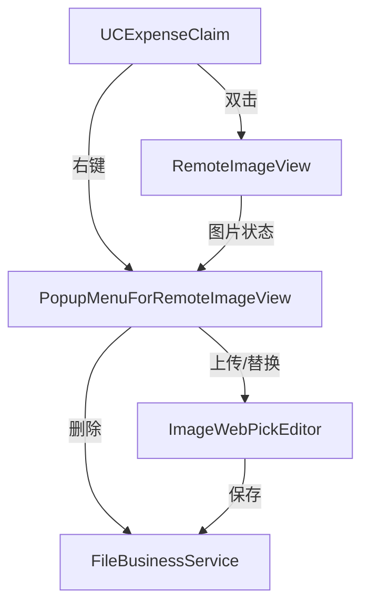

## 产品概述

优化费用报销单明细中的图片功能，提升用户体验和操作效率。

## 核心功能需求

1. **图片右键菜单修复**：图片保存成功后，预览时应正确显示右键菜单（当前缺失）
2. **双击查看大图**：双击图片单元格应直接查看大图，而非进入编辑界面
3. **右键菜单优化**：提供上传、删除、替换图片的清晰操作选项
4. **多图场景支持**：允许多张图片上传和管理
5. **单图场景优化**：单图场景下自动替换旧图片（删除旧图+上传新图）

## 技术栈

- **框架**：.NET WinForms + C#
- **UI组件库**：Krypton Toolkit + SourceGrid
- **数据访问**：SqlSugar ORM
- **图片处理**：自定义ImageProcessor + 文件服务

## 实现策略

基于现有图片架构（RemoteImageView + ImageWebPickEditor + PopupMenuForRemoteImageView）进行优化，修复右键菜单显示逻辑，重构双击事件处理，统一上传/替换操作。

## 核心问题分析

1. **右键菜单显示异常**：`CheckConditionToShowMenu()`方法在图片加载后未能正确识别图片状态
2. **双击行为不当**：`Grid1_MouseDoubleClick`默认触发编辑而非预览
3. **菜单功能冗余**："上传"和"更新"功能重复，未区分多图/单图场景

## 架构设计

### 组件交互



## 目录结构变更

```
RUINORERP.UI/FM/
├── UCExpenseClaim.cs                  # [MODIFY] 修复双击事件，优化图片交互逻辑
└── UCExpenseClaim.designer.cs         # [MODIFY] 添加必要的事件绑定

SourceGrid/SourceGrid/Cells/Views/
├── RemoteImageView.cs                 # [MODIFY] 修复图片状态管理

RUINORERP.UI/UCSourceGrid/
└── PopupMenu.cs                       # [MODIFY] 重构右键菜单逻辑，支持多图/单图场景
```

## 关键代码变更点

- `PopupMenuForRemoteImageView.CheckConditionToShowMenu()`：修复图片状态检测
- `PopupMenuForRemoteImageView.OnMouseUp()`：优化菜单显示时机
- `UCExpenseClaim.Grid1_MouseDoubleClick()`：改为直接查看大图
- `PopupMenuForRemoteImageView`菜单项：合并上传/替换逻辑