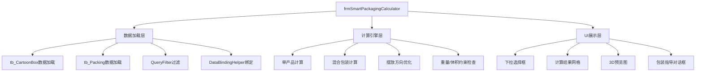

## 产品概述

优化RUINORERP系统中的智能包装计算器功能，实现标准化的数据绑定和更智能的计算逻辑。

## 核心功能

1. **外箱数据加载与选择**：从tb_CartoonBox表加载可用外箱规格，通过标准下拉框组件提供选择，自动带出长宽高数据，保留手动输入功能
2. **成品数据绑定**：从tb_Packing表加载包装规格数据，使用系统标准下拉选择组件，选择后自动带出产品长宽高和毛重信息
3. **智能计算功能**：

- 计算模式一：已知成品数量→计算推荐外箱规格
- 计算模式二：已知外箱规格→计算可容纳成品数量
- 支持混合包装计算，自动生成最优摆放方案

4. **特殊功能**：混合包装支持多种成品组合，提供3D可视化包装预览，保存常用包装规则到tb_BoxRules表
5. **数据绑定标准化**：使用DataBindingHelper.BindData4Cmb等系统标准方法替换手动数据绑定

## 技术栈

- **框架**：.NET Windows Forms + Krypton Toolkit
- **数据库**：SqlSugar ORM
- **数据绑定**：RUINORERP自定义DataBindingHelper
- **实体模型**：tb_CartoonBox、tb_Packing、tb_BoxRules

## 实现方案

### 数据绑定架构改进

1. **标准化数据绑定**：替换frmSmartPackagingCalculator中的手动数据绑定为DataBindingHelper标准方法

- 外箱选择：使用`DataBindingHelper.BindData4Cmb<tb_CartoonBox>`加载tb_CartoonBox数据
- 产品选择：使用`DataBindingHelper.BindData4Cmb<tb_Packing>`加载tb_Packing数据（带条件过滤）
- 自动联动：通过PropertyChanged事件实现选择后自动填充尺寸数据

2. **查询优化**：

- 使用QueryFilter实现数据过滤（仅加载Is_enabled=true的记录）
- 使用Includes预加载关联数据（tb_proddetail、tb_prod）
- 利用实体缓存提升性能

### 核心计算逻辑

1. **包装算法优化**：

- 实现6种摆放方向计算（长×宽×高、宽×长×高、高×宽×长等）
- 考虑产品间隙和缓冲空间
- 重量和体积双重约束检查
- 空间利用率计算

2. **混合包装算法**：

- 基于体积比例分配空间
- 按产品尺寸和重量分层摆放
- 生成最优产品组合方案

3. **3D可视化**：

- 使用GDI+绘制包装预览图
- 分层展示产品摆放位置
- 实时更新预览效果

### 架构设计



### 目录结构

```
RUINORERP.UI/ProductEAV/
├── frmSmartPackagingCalculator.cs          # [MODIFY] 智能包装计算器主窗体
├── frmSmartPackagingCalculator.Designer.cs # [MODIFY] 设计器文件
├── frmPackingInstructions.cs               # [EXISTING] 包装指导对话框
├── UCPacking.cs                            # [EXISTING] 包装信息编辑
```

### 关键代码结构

```
// 数据绑定示例
DataBindingHelper.BindData4Cmb<tb_CartoonBox>(
    entity, 
    t => t.CartonID, 
    t => t.CartonName, 
    cmbBoxSelect,
    expCondition: t => t.Is_enabled == true
);

// 联动事件处理
entity.PropertyChanged += (sender, e) => {
    if (e.PropertyName == "CartonID" && cmbBoxSelect.SelectedItem is tb_CartoonBox box)
    {
        numBoxLength.Value = box.Length;
        numBoxWidth.Value = box.Width;
        numBoxHeight.Value = box.Height;
        numMaxWeight.Value = box.MaxLoad * 1000;
    }
};
```

## Agent Extensions

### SubAgent

- **code-explorer**：用于探索现有代码库中的数据绑定模式和包装计算逻辑，确保新实现与现有架构一致
- 用途：分析DataBindingHelper使用模式、tb_CartoonBox/tb_Packing实体关联关系
- 预期结果：提取可复用的数据绑定和事件联动模式