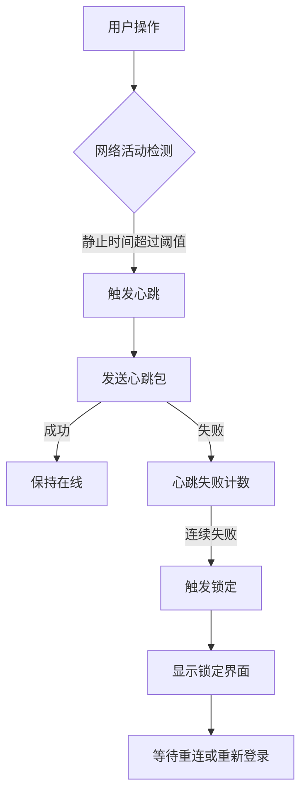

## 产品概述

优化RUINORERP系统的网络连接管理功能，移除心跳失败导致的强制锁定，改进重连机制，提升用户体验和系统稳定性。

## 核心功能

- 心跳失败仅发送通知提醒，不再强制锁定用户界面
- 优化自动重连逻辑，网络恢复后自动恢复工作会话
- 保留静止时间检测功能用于心跳触发
- 增强登录流程的健壮性和错误处理能力
- 确保长时间工作的稳定性和连续性

## 技术栈分析

- **开发平台**: .NET Framework / .NET Core (C#)
- **UI框架**: WinForms (基于Krypton组件库)
- **网络通信**: SuperSocket客户端
- **项目结构**: 分层架构 (UI层, 业务逻辑层, 网络服务层)

## 系统架构

### 当前架构分析

现有系统采用分层架构，主要涉及以下关键组件：

- **ConnectionManager**: 管理网络连接生命周期和心跳
- **SuperSocketClient**: 底层Socket通信实现
- **UserLoginService**: 处理用户认证和登录流程
- **FrmMain**: 主界面，包含锁定逻辑

### 数据流分析



### 需要修改的核心模块

1. **ConnectionManager.cs**: 移除心跳失败锁定逻辑，改为通知模式
2. **SuperSocketClient.cs**: 优化重连机制，增加自动恢复功能
3. **UserLoginService.cs**: 增强登录流程健壮性
4. **FrmMain.cs**: 移除或禁用锁定相关的UI逻辑

## 实现方案

### 核心代码结构

```
RUINORERP.UI/Network/
├── ConnectionManager.cs          # 修改：移除锁定逻辑，增加通知机制
├── SuperSocketClient.cs          # 修改：优化重连逻辑
└── Services/
    └── UserLoginService.cs       # 修改：增强登录健壮性

RUINORERP.UI/
└── MainForm/FrmMain.cs           # 修改：移除锁定UI逻辑
```

### 关键技术点

1. **心跳机制改造**: 保留静止时间检测，心跳失败仅记录日志和发送通知
2. **重连机制优化**: 实现指数退避算法，增加重连状态管理
3. **登录流程增强**: 增加Token刷新机制，优化异常处理
4. **UI线程解耦**: 确保网络操作不阻塞UI线程