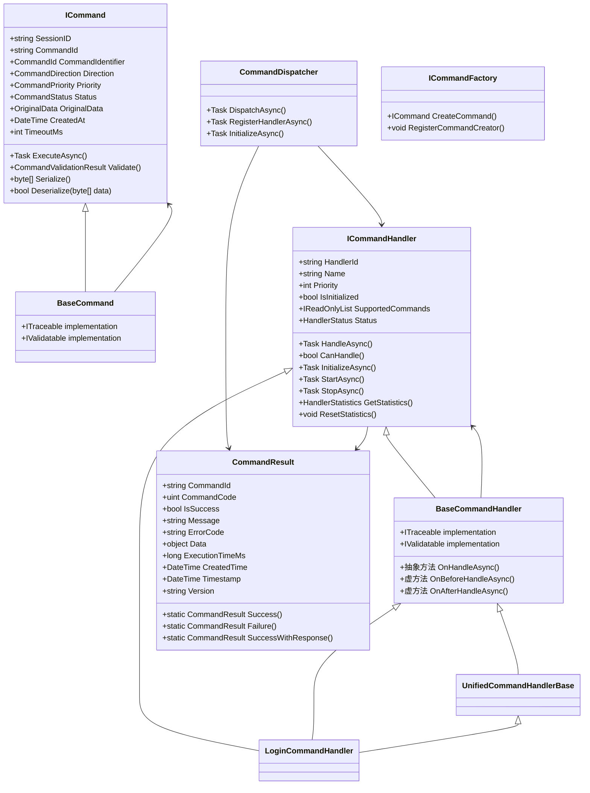

# PacketSpec项目指令系统分析与优化方案

## 1. 指令系统整体架构分析

PacketSpec项目的指令系统采用了命令模式与责任链模式相结合的设计，实现了请求-处理-响应的完整闭环。系统通过抽象接口和基类实现了高度的可扩展性和灵活性。

### 1.1 核心组件结构



### 1.2 指令系统工作流程

指令系统的完整工作流程如下：

1. **请求接收与解析**
   - SuperSocket接收客户端请求数据包
   - SuperSocketCommandAdapter将数据包转换为PacketModel
   - 通过CommandFactory创建对应的ICommand对象

2. **命令分发与处理**
   - CommandDispatcher根据命令类型查找适合的ICommandHandler
   - 对命令执行并发控制和超时处理
   - 调用处理器的HandleAsync方法执行命令
   - 记录命令执行状态和统计信息

3. **结果生成与响应**
   - 处理器执行命令并生成CommandResult
   - CommandDispatcher返回处理结果
   - SuperSocketCommandAdapter将结果序列化并发送给客户端

## 2. 关键组件详细分析

### 2.1 命令系统基础 - ICommand接口

ICommand接口是指令系统的核心，定义了所有命令必须实现的方法和属性：
- 包含命令标识、会话信息、优先级等基本属性
- 提供验证、执行、序列化等核心功能
- 支持命令的状态管理和生命周期控制

### 2.2 命令处理器 - ICommandHandler和BaseCommandHandler

命令处理器负责具体命令的业务逻辑实现：
- BaseCommandHandler提供了处理器的通用实现，包括生命周期管理、统计信息收集等
- 采用模板方法模式，通过抽象方法OnHandleAsync和虚方法OnBeforeHandleAsync/OnAfterHandleAsync提供扩展点
- 支持处理器的优先级控制、状态管理和资源释放

### 2.3 命令调度器 - CommandDispatcher

CommandDispatcher是指令系统的中枢，实现了命令的统一分发和处理：
- 自动发现和注册命令处理器
- 根据命令类型和处理器优先级选择最佳处理器
- 实现细粒度的并发控制，支持按命令类型限制并发数
- 提供命令执行历史记录和清理机制
- 处理异常和超时情况

### 2.4 命令工厂 - ICommandFactory

命令工厂负责创建命令对象：
- 支持从PacketModel创建命令
- 提供命令创建器注册机制，实现松耦合的命令创建
- 支持异步命令创建

### 2.5 数据包模型 - PacketModel

PacketModel作为统一的数据包格式，连接了网络层和命令系统：
- 实现ITraceable和IValidatable接口
- 包含数据包ID、命令类型、优先级等属性
- 支持JSON数据处理、二进制序列化/反序列化

## 3. 登录命令处理流程详解

LoginCommandHandler实现了完整的登录流程处理，包括多种登录相关命令的处理逻辑：

### 3.1 支持的登录相关命令
- **PrepareLogin**：登录前的准备工作，检查服务器容量
- **LoginRequest**：用户登录请求，包含身份验证和会话创建
- **LoginValidation**：登录验证流程
- **ValidateToken**：验证用户Token的有效性
- **RefreshToken**：刷新用户Token
- **Logout**：用户登出流程

### 3.2 登录命令执行流程

以LoginRequest命令为例，完整的处理流程如下：

1. **请求接收与解析**
   ```csharp
   private async Task<CommandResult> HandleLoginRequestAsync(ICommand command, CancellationToken cancellationToken)
   {
       try
       {
           // 解析登录数据
           var loginData = ParseLoginData(command.OriginalData);
           if (loginData == null)
           {
               return CommandResult.Failure("登录数据格式错误", "INVALID_LOGIN_DATA");
           }
   ```

2. **安全检查流程**
   ```csharp
           // 检查重复登录
           if (IsUserAlreadyLoggedIn(loginData.Username))
           {
               return CommandResult.Failure("用户已登录", "ALREADY_LOGGED_IN");
           }

           // 检查黑名单
           if (await IsUserBlacklistedAsync(loginData.Username, loginData.ClientInfo))
           {
               return CommandResult.Failure("用户或IP在黑名单中", "BLACKLISTED");
           }

           // 检查登录尝试次数
           if (GetLoginAttempts(loginData.Username) >= MaxLoginAttempts)
           {
               return CommandResult.Failure("登录尝试次数过多", "TOO_MANY_ATTEMPTS");
           }
   ```

3. **用户身份验证**
   ```csharp
           // 验证用户凭据
           var validationResult = await ValidateUserCredentialsAsync(loginData, cancellationToken);
           if (!validationResult.IsValid)
           {
               IncrementLoginAttempts(loginData.Username);
               return CommandResult.Failure(validationResult.ErrorMessage, "LOGIN_FAILED");
           }
   ```

4. **会话创建与管理**
   ```csharp
           // 重置登录尝试次数
           ResetLoginAttempts(loginData.Username);

           // 获取或创建会话信息
           var sessionInfo = SessionService.GetSession(command.SessionID);
           if (sessionInfo == null)
           {
               // 如果会话不存在，创建新会话
               sessionInfo = SessionService.CreateSession(command.SessionID, "127.0.0.1");
               if (sessionInfo == null)
               {
                   return CommandResult.Failure("创建会话失败", "SESSION_CREATION_FAILED");
               }
           }

           // 更新会话信息
           UpdateSessionInfo(sessionInfo, validationResult.UserInfo);
           SessionService.UpdateSession(sessionInfo);

           // 记录活跃会话
           AddActiveSession(command.SessionID);
   ```

5. **Token生成与响应**
   ```csharp
           // 生成Token
           var tokenInfo = GenerateTokenInfo(validationResult.UserInfo);

           // 创建登录成功响应
           var responseData = CreateLoginSuccessResponse(validationResult.UserInfo, tokenInfo);

           return CommandResult.SuccessWithResponse(
               responseData,
               data: new { UserInfo = validationResult.UserInfo, TokenInfo = tokenInfo },
               message: "登录成功"
           );
       }
       catch (Exception ex)
       {
           LogError($"处理登录请求异常: {ex.Message}