```mermaid
graph LR
    A[开始] --> B[处理]
    B --> C[结束]
```

# RUINOR ERP 在线帮助系统

> 基于 MkDocs + Material 主题的现代帮助文档系统

## 🎯 系统特点

- ✅ **在线优先**：用户F1键打开帮助网站，体验现代Web界面
- ✅ **本地备用**：网络断开时自动切换到本地缓存
- ✅ **实时更新**：修改Markdown后即时生效，无需重新部署
- ✅ **智能搜索**：全文搜索，快速定位帮助内容
- ✅ **响应式设计**：支持PC、平板、手机访问
- ✅ **美观主题**：Material Design设计风格

## 📁 项目结构

```
RUINORERP.HelpSite/
├── mkdocs.yml              # MkDocs配置文件
├── docs/                   # 文档源文件
│   ├── index.md           # 首页
│   ├── quickstart/        # 快速入门
│   │   ├── index.md
│   │   ├── login.md
│   │   ├── interface.md
│   │   ├── basic-operations.md
│   │   └── shortcuts.md
│   ├── modules/           # 模块文档
│   │   ├── sales/
│   │   ├── purchase/
│   │   ├── inventory/
│   │   └── finance/
│   ├── forms/             # 窗体帮助
│   │   ├── UCSaleOrder.md
│   │   ├── UCSaleOut.md
│   │   └── ...
│   ├── fields/            # 字段帮助
│   └── images/            # 截图目录
├── site/                  # 生成的网站（自动创建）
├── deploy.bat            # 部署脚本
└── start.bat             # 启动脚本
```

## 🚀 快速开始

### 1. 安装依赖

确保已安装 Python 3.8+，然后运行：

```bash
pip install mkdocs mkdocs-material mkdocs-minify-plugin pymdown-extensions
```

### 2. 启动本地预览

```bash
# 方式1：使用脚本（推荐）
start.bat

# 方式2：手动启动
mkdocs serve
```

访问 http://127.0.0.1:8000 预览网站

### 3. 构建部署

```bash
# 方式1：使用脚本（推荐）
deploy.bat

# 方式2：手动构建
mkdocs build
```

构建后的网站在 `site/` 目录

## 📝 内容编写规范

### Markdown 扩展语法

本系统支持丰富的 Markdown 扩展：

#### 1. 提示框 (Admonition)

```markdown
!!! info "提示"
    这是信息提示框

!!! warning "警告"
    这是警告提示框

!!! danger "危险"
    这是危险提示框

!!! success "成功"
    这是成功提示框

!!! example "示例"
    这是示例提示框
```

#### 2. 代码块

```markdown
```csharp
public void Hello()
{
    Console.WriteLine("Hello World");
}
```

#### 3. 表格

```markdown
| 列1 | 列2 | 列3 |
|-----|-----|-----|
| 内容1 | 内容2 | 内容3 |
```

#### 4. 任务列表

```markdown
- [x] 已完成任务
- [ ] 未完成任务
```

#### 5. 图表 (Mermaid)

```markdown

```

#### 6. 卡片布局

```markdown
<div class="grid cards" markdown>

-   :material-rocket:{ .lg .middle } __标题__

    ---

    内容描述

    [:octicons-arrow-right-24: 链接](#)

</div>
```

## 🖼️ 添加截图指南

### 截图存放位置

```
docs/images/
├── UCSaleOrder/          # 销售订单截图
│   ├── main-interface.png
│   ├── customer-select.png
│   └── ...
├── UCSaleOut/            # 销售出库截图
├── login/                # 登录界面截图
└── common/               # 通用截图
```

### 截图命名规范

- 使用小写字母和连字符
- 格式：`功能-描述.png`
- 示例：
  - `main-interface.png`（主界面）
  - `create-order.png`（创建订单）
  - `approve-dialog.png`（审核对话框）

### 截图尺寸建议

- 宽度：1280px 或 1920px
- 格式：PNG（推荐）或 JPG
- 大小：单张不超过 300KB
- 分辨率：96 DPI

### 在文档中引用截图

```markdown

*图片说明文字（可选）*
```

### 截图添加清单

#### 销售订单（UCSaleOrder）

- [ ] `main-interface.png` - 主界面整体
- [ ] `main-info-area.png` - 主信息区
- [ ] `detail-grid.png` - 明细表格
- [ ] `summary-area.png` - 汇总区
- [ ] `create-order.png` - 创建订单流程
- [ ] `approve-order.png` - 审核操作
- [ ] `platform-order.png` - 平台订单设置
- [ ] `customized-order.png` - 定制订单设置
- [ ] `foreign-order.png` - 外贸订单设置
- [ ] `customer-select.png` - 客户选择窗口

#### 快速入门

- [ ] `login-screen.png` - 登录界面
- [ ] `main-interface.png` - 主界面
- [ ] `navigation-panel.png` - 导航栏
- [ ] `operation-add.png` - 新增操作
- [ ] `operation-query.png` - 查询操作

## 🔌 集成到ERP系统

### 1. 部署帮助网站

#### 方式A：内网部署（推荐）

```bash
# 构建网站
mkdocs build

# 复制到IIS目录
xcopy site\* C:\inetpub\wwwroot\erp-help\ /s /e

# 或复制到ERP服务器
xcopy site\* \\erp-server\HelpSite\ /s /e
```

#### 方式B：公网部署

使用 Vercel、Netlify 或 GitHub Pages 免费托管

### 2. 配置ERP系统

在 `RUINORERP.UI` 项目中：

```csharp
// 在程序启动时初始化
HelpLauncher.Initialize(
    baseUrl: "http://your-server/help/",  // 帮助网站URL
    cacheDirectory: @".\HelpContent"       // 本地缓存目录
);

// 在UCSaleOrder窗体中（已有）
FormHelpKey = "UCSaleOrder";
EnableSmartHelp = true;
```

### 3. F1帮助调用流程

```
用户按F1
    ↓
HelpManager.ShowHelp()
    ↓
SmartHelpResolver 解析 HelpKey
    ↓
EnhancedCompositeHelpProvider
    ↓
检查网络
    ↓
在线 → 打开 WebView2/Web浏览器
离线 → 显示本地缓存
```

## 🎨 自定义主题

### 修改颜色

编辑 `mkdocs.yml`：

```yaml
theme:
  palette:
    - scheme: default
      primary: indigo    # 主色：indigo, blue, teal, green 等
      accent: indigo     # 强调色
```

### 添加自定义CSS

创建 `docs/stylesheets/extra.css`：

```css
/* 自定义样式 */
.custom-class {
    color: #0078d4;
}
```

在 `mkdocs.yml` 中引用：

```yaml
extra_css:
  - stylesheets/extra.css
```

## 📚 更多资源

- [MkDocs 官方文档](https://www.mkdocs.org/)
- [Material for MkDocs](https://squidfunk.github.io/mkdocs-material/)
- [Markdown 语法](https://www.markdownguide.org/)

## 🐛 常见问题

### Q1: 构建失败，提示找不到模块？

```bash
# 重新安装依赖
pip install --upgrade mkdocs mkdocs-material
```

### Q2: 中文搜索不正常？

检查 `mkdocs.yml` 中的搜索配置：

```yaml
plugins:
  - search:
      lang: zh
      separator: '[\s\u200b\-]'
```

### Q3: 图片显示不出来？

- 检查图片路径是否正确
- 确保图片在 `docs/images/` 目录下
- 使用相对路径：`./images/xxx.png`

### Q4: 本地预览正常，部署后样式丢失？

检查 `site_url` 配置：

```yaml
site_url: http://your-domain.com/help/
```

## 📝 更新记录

- 2024-01-15: 初始版本，创建基础架构
- 2024-01-16: 添加销售订单帮助文档
- 2024-01-17: 集成到ERP系统

---

**需要帮助？** 联系系统管理员或发送邮件至 support@ruinor.com
