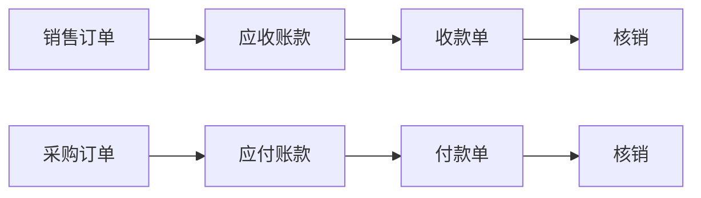

# 财务管理

!!! info "模块说明"
    财务管理模块负责处理企业财务业务，包括应收应付、收付款、财务核算等功能。

## 🎯 功能概览

-   :material-cash-plus: __应收管理__

    ---

    管理销售产生的应收账款

    [:octicons-arrow-right-24: 查看详情](../forms/UCARReceivable.md)

-   :material-cash-minus: __应付管理__

    ---

    管理采购产生的应付账款

    [:octicons-arrow-right-24: 查看详情](../forms/UCAPPayable.md)

-   :material-cash-check: __收款单__

    ---

    记录客户付款，核销应收

    [:octicons-arrow-right-24: 查看详情](../forms/UCReceipt.md)

-   :material-cash-remove: __付款单__

    ---

    记录供应商付款，核销应付

    [:octicons-arrow-right-24: 查看详情](../forms/UCPayment.md)

## 🔄 业务流程

## 📋 使用说明

### 应收管理

1. 系统自动生成应收
2. 查看应收明细
3. 生成收款单
4. 核销应收

### 应付管理

1. 系统自动生成应付
2. 查看应付明细
3. 生成付款单
4. 核销应付

## 💡 使用技巧

- 及时核销保证账龄准确
- 关注超期应收提醒
- 支持部分收款/付款

---

*文档编写中...*
