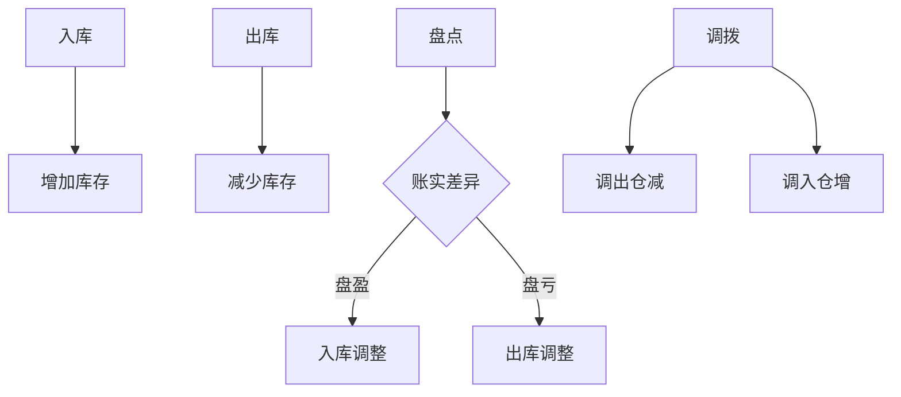

# 库存管理

!!! info "模块说明"
    库存管理模块负责处理企业库存业务，包括库存查询、入库、出库、盘点、调拨等功能。

## 🎯 功能概览

-   :material-magnify: __库存查询__

    ---

    实时查询库存数量、分布、成本等信息

    [:octicons-arrow-right-24: 查看详情](../forms/UCStockQuery.md)

-   :material-clipboard-check: __库存盘点__

    ---

    定期盘点库存，核对账实差异

    [:octicons-arrow-right-24: 查看详情](../forms/UCStockCheck.md)

-   :material-swap-horizontal: __库存调拨__

    ---

    在不同仓库之间调拨库存

    [:octicons-arrow-right-24: 查看详情](../forms/UCStockTransfer.md)

-   :material-package-variant: __出入库管理__

    ---

    管理产品的入库和出库记录

    [:octicons-arrow-right-24: 查看详情](../forms/UCStockInOut.md)

## 🔄 业务流程

## 📋 使用说明

### 库存查询

- 支持按产品、仓库、批次查询
- 可查看库存明细和汇总
- 支持库存预警设置

### 库存盘点

1. 创建盘点单
2. 实地盘点录入
3. 生成盘盈盘亏单
4. 调整库存

## 💡 使用技巧

- 设置库存上下限预警
- 定期盘点确保账实相符
- 关注呆滞库存提醒

---

*文档编写中...*
