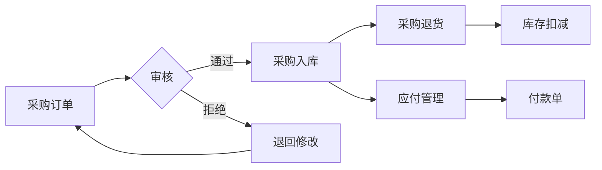

# 采购管理

!!! info "模块说明"
    采购管理模块负责处理企业采购业务的全流程，包括采购订单、采购入库、采购退货、供应商管理等功能。

## 🎯 功能概览

-   :material-file-document: __采购订单__

    ---

    创建和管理采购订单，向供应商采购商品

    [:octicons-arrow-right-24: 查看详情](../forms/UCPurchaseOrder.md)

-   :material-warehouse: __采购入库__

    ---

    根据采购订单办理入库，增加库存

    [:octicons-arrow-right-24: 查看详情](../forms/UCStockIn.md)

-   :material-keyboard-return: __采购退货__

    ---

    处理向供应商退货业务

    [:octicons-arrow-right-24: 查看详情](../forms/UCPurchaseReturn.md)

-   :material-account-tie: __供应商管理__

    ---

    维护供应商档案，管理供应商信用、价格等

    [:octicons-arrow-right-24: 查看详情](../forms/UCSupplier.md)

## 🔄 业务流程

## 📋 使用说明

### 创建采购订单

1. 选择供应商
2. 添加采购商品
3. 设置采购价格和交期
4. 保存并提交审核

### 采购入库

1. 根据采购订单生成入库单
2. 核对实物数量
3. 确认入库
4. 更新库存和应付

## 💡 使用技巧

- 支持从销售订单自动生成采购建议
- 可以设置最低采购量提醒
- 支持多币种采购

---

*文档编写中...*
