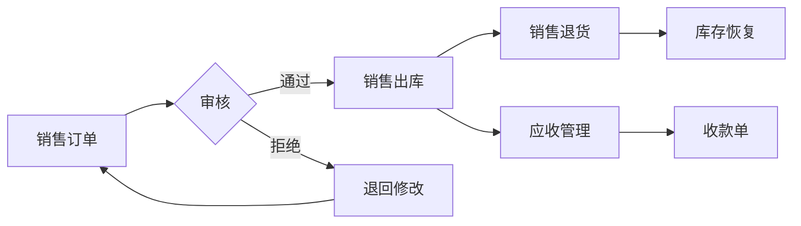

# 销售管理

!!! info "模块说明"
    销售管理模块负责处理企业销售业务的全流程，包括销售订单、销售出库、销售退货、客户管理等功能。

## 🎯 功能概览

<div class="grid cards" markdown>

-   :material-file-document: __销售订单__

    ---

    创建和管理销售订单，支持普通订单、平台订单、定制订单、外贸订单

    [:octicons-arrow-right-24: 查看详情](../forms/UCSaleOrder.md)

-   :material-truck-delivery: __销售出库__

    ---

    根据销售订单生成出库单，管理产品出库流程

    [:octicons-arrow-right-24: 查看详情](../forms/UCSaleOut.md)

-   :material-keyboard-return: __销售退货__

    ---

    处理客户退货业务，生成退货单并关联原订单

    [:octicons-arrow-right-24: 查看详情](../forms/UCSaleReturn.md)

-   :material-account-group: __客户管理__

    ---

    维护客户档案，管理客户信用额度、价目表等

    [:octicons-arrow-right-24: 查看详情](../forms/UCCustomer.md)

</div>

## 🔄 业务流程



## 📊 业务场景

### 标准销售流程

1. **创建销售订单**
   - 选择客户
   - 添加产品明细
   - 设置交期和价格

2. **订单审核**
   - 检查订单信息
   - 占用库存
   - 生成应收

3. **销售出库**
   - 根据订单出库
   - 扣减库存
   - 更新订单状态

4. **收款结算**
   - 生成收款单
   - 核销应收账款
   - 完成订单

### 特殊业务场景

- **平台订单**：电商平台接单，不计入信用额度
- **定制订单**：特殊需求订单，生成生产工单
- **外贸订单**：外币结算，汇率自动计算
- **分期收款**：支持多次收款，灵活结算

## 💡 使用技巧

### 快速创建订单

```
快捷键：
- Ctrl + N：新建订单
- Ctrl + S：保存订单
- F1：查看帮助
```

### 批量操作

- **批量审核**：在查询界面选择多个订单批量审核
- **批量打印**：选中多个订单批量打印
- **批量导出**：导出选中订单到Excel

### 快捷查询

```
查询技巧：
- 客户名称：张% （姓张的客户）
- 日期范围：2024-01-01 至 2024-01-31
- 订单状态：已审核
- 金额范围：> 10000
```

## ⚠️ 注意事项

1. **信用控制**：客户信用额度不足时无法保存订单
2. **库存检查**：库存不足时会提示，但允许继续保存
3. **价格控制**：超出价格浮动范围需要审批
4. **交期管理**：超期订单会标红提醒

## 📈 相关报表

- 销售订单统计表
- 销售出库明细表
- 客户销售分析表
- 产品销售排名表
- 业务员业绩统计表

---

*需要帮助？按 F1 键查看当前界面的详细说明*
