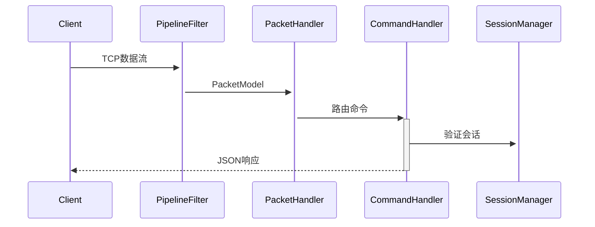
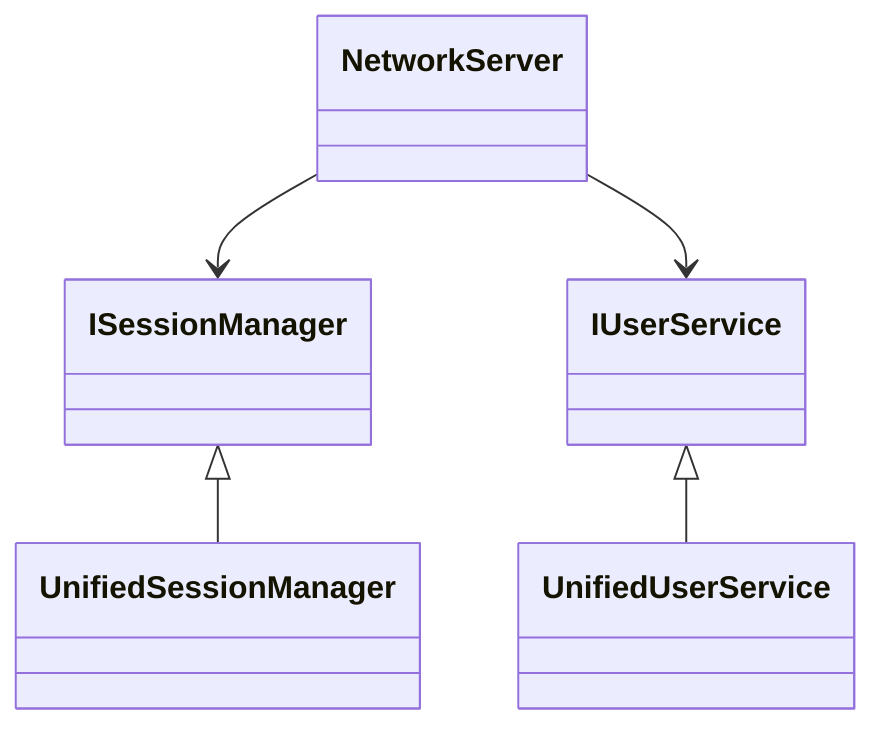

# RUINORERP Network 模块架构文档

## 目录
1. [核心组件](#核心组件)
2. [架构设计](#架构设计)
3. [数据处理流程](#数据处理流程)  
4. [服务依赖](#服务依赖)
5. [接口定义](#接口定义)
6. [测试策略](#测试策略)

## 核心组件

### NetworkServer.cs
```csharp
public class NetworkServer {
    public Task<bool> StartAsync(int port = 8009) { ... }
    public Task StopAsync() { ... }
}
```
- **功能**：主服务器入口
- **配置项**：
  - 监听端口
  - 最大连接数(默认1000)
  - 数据包大小限制(1MB)

### UnifiedSessionManager.cs
```csharp
public class UnifiedSessionManager : ISessionManager {
    public int ActiveSessionCount { get; }
    public Task AddSessionAsync(IAppSession session) { ... }
}
```
- **会话存储**：`ConcurrentDictionary<string, SessionInfo>`
- **统计指标**：
  - 活跃会话数
  - 历史连接数
  - 消息吞吐量

## 架构设计

### 分层架构
```
┌───────────────────────┐
│       Commands        │  # 业务命令处理
├───────────────────────┤
│        Services       │  # 核心服务实现
├───────────────────────┤
│         Core          │  # 网络核心层
├───────────────────────┤
│      Interfaces       │  # 服务接口定义
└───────────────────────┘
```

## 数据处理流程

### 时序图


## 服务依赖



## 接口定义

### ISessionManager
```csharp
public interface ISessionManager {
    Task AddSessionAsync(IAppSession session);
    Task RemoveSessionAsync(string sessionId); 
    Task BroadcastAsync(PacketModel packet);
}
```

## 测试策略

### 测试分类
1. **单元测试**：
   - 命令处理器逻辑
   - 会话状态管理
2. **集成测试**：
   - 服务依赖解析
   - 端到端消息处理
3. **压力测试**：
   - 并发连接测试
   - 消息吞吐量测试