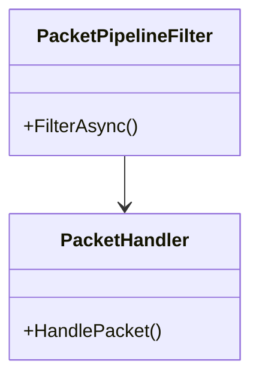
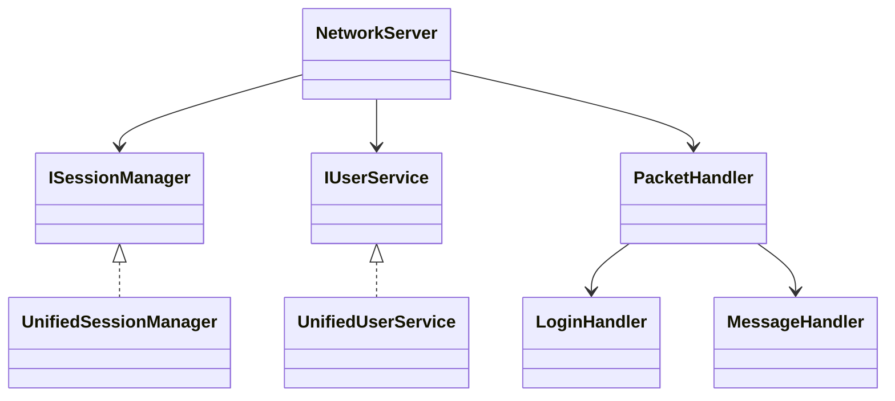
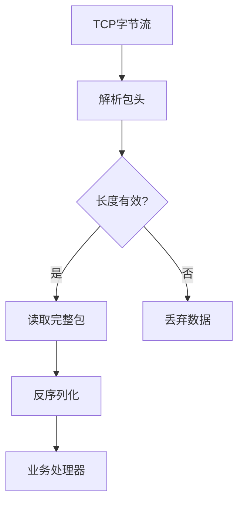
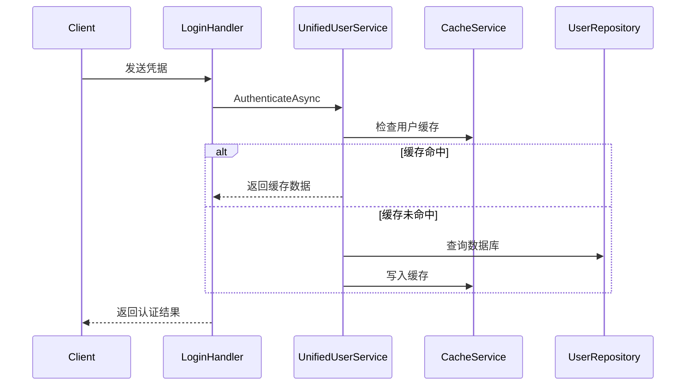
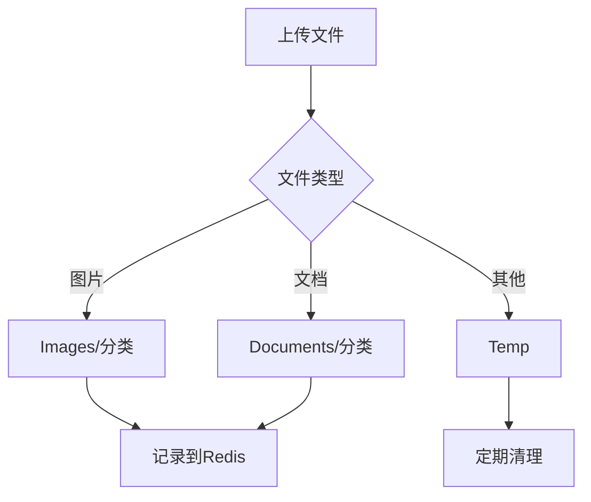
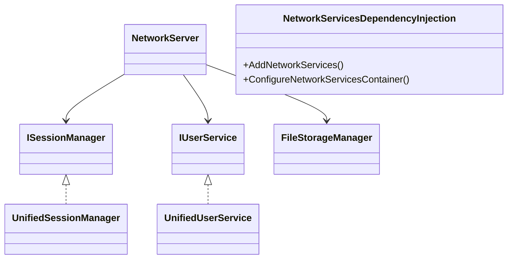

# RUINORERP Network 模块架构文档 (深度分析版)

## 1. 核心组件详解

### 1.1 NetworkServer (核心服务器类)
```csharp
public class NetworkServer {
    // 关键字段
    private readonly ISessionManager _sessionManager;
    private IHost _host;

    // 核心方法
    public async Task<bool> StartAsync(int port = 8009) {
        // 配置SuperSocket服务器
        var hostBuilder = SuperSocketHostBuilder.Create<PacketModel, PacketPipelineFilter>()
            .ConfigureServices(services => {
                services.AddSingleton<ISessionManager>(_sessionManager);
                // 其他服务注册...
            });
    }
}
```

## 2. 关键设计模式

### 2.1 管道过滤器模式


## 3. 完整类关系图



## 4. 关键数据流

### 4.1 登录流程
```mermaid
sequenceDiagram
    Client->>+NetworkServer: TCP连接
    NetworkServer->>+UnifiedSessionManager: 创建会话
    UnifiedSessionManager-->>-Client: 会话ID
    Client->>+LoginHandler: 发送凭据
    LoginHandler->>UnifiedUserService: 验证用户
    UnifiedUserService-->>-LoginHandler: 验证结果
    LoginHandler-->>-Client: 认证响应
```

## 5. 性能关键点

1. **会话管理**：
   - 使用`ConcurrentDictionary`保证线程安全
   - 会话清理定时器配置

2. **网络配置**：
   ```csharp
   options.MaxPackageLength = 1024 * 1024; // 1MB
   options.ReceiveBufferSize = 4096;
   options.ReceiveTimeout = 120000; // 2分钟
   ```

## 6. 数据包处理子系统

### 6.1 PacketPipelineFilter (核心过滤器)
```csharp
public class PacketPipelineFilter : FixedHeaderPipelineFilter<PacketModel> {
    // 固定头长度18字节
    protected override int GetBodyLengthFromHeader(ref ReadOnlySequence<byte> buffer) {
        // 1. 跳过命令ID (4字节)
        // 2. 读取数据长度 (4字节)
        // 3. 计算预估包体长度
    }
}
```

**关键设计**：
- 使用SuperSocket原生管道过滤器
- 精确控制内存缓冲区
- 与PacketSpec序列化器深度集成

### 6.2 处理流程图


## 7. 用户认证服务 (UnifiedUserService)

### 7.1 核心功能
```csharp
public class UnifiedUserService : IUserService {
    // 依赖注入
    private readonly IUserRepository _userRepository;
    private readonly ICacheService _cacheService;
    
    // 核心方法
    public async Task<AuthenticationResult> AuthenticateAsync(string username, string password) {
        // 1. 验证用户状态
        // 2. 检查密码哈希
        // 3. 生成JWT令牌
        // 4. 返回用户角色和权限
    }
}
```

**功能矩阵**：
| 功能 | 方法 | 缓存策略 |
|------|------|----------|
| 用户认证 | AuthenticateAsync | 用户信息缓存15分钟 |
| 密码管理 | ResetPasswordAsync | 立即失效缓存 |
| 会话控制 | ForceUserOfflineAsync | 实时生效 |

### 7.2 认证流程


### 7.3 安全设计
1. **密码哈希**：
   ```csharp
   private string HashPassword(string password, string salt) {
       using (var sha256 = SHA256.Create()) {
           var saltedPassword = password + salt;
           var bytes = Encoding.UTF8.GetBytes(saltedPassword);
           var hash = sha256.ComputeHash(bytes);
           return Convert.ToBase64String(hash);
       }
   }
   ```

2. **账户保护**：
   - 失败尝试限制（默认5次）
   - 自动账户锁定
   - 密码强制重置

## 8. 文件存储服务 (FileStorageManager)

### 8.1 核心架构
```csharp
public class FileStorageManager {
    private readonly string _storageRoot; // 文件系统存储
    private readonly IDatabase _redisDb;  // 元数据存储
    
    // 关键方法
    public async Task CheckConsistencyAsync() {
        // 1. 检查文件系统与Redis记录的一致性
        // 2. 自动修复不一致记录
    }
}
```

**存储设计**：
| 存储类型 | 用途 | 技术实现 |
|----------|------|----------|
| 文件系统 | 存储实际文件 | 本地磁盘/NAS |
| Redis | 存储文件元数据 | 哈希表+集合 |

### 8.2 文件分类管理


### 8.3 关键操作流程

1. **文件上传**：
   - 写入临时目录
   - 验证后移动到正式目录
   - 记录元数据到Redis

2. **文件检索**：
   ```csharp
   // 从Redis获取文件信息
   var fileInfo = await _redisDb.StringGetAsync($"file:{fileId}");
   // 组合物理路径
   var filePath = Path.Combine(_storageRoot, categoryPath, fileId);
   ```

3. **备份恢复**：
   - 全量备份文件系统
   - 导出Redis快照
   - 支持时间点恢复

## 9. 依赖注入配置

### 9.1 核心服务注册
```csharp
public static void AddNetworkServices(this IServiceCollection services) {
    // 核心服务
    services.AddSingleton<ISessionManager, UnifiedSessionManager>();
    services.AddSingleton<IUserService, UserService>();
    
    // 基础设施
    services.AddSingleton<FileStorageManager>();
    services.AddSingleton<CacheService>();
}
```

**注册策略**：
- 所有服务均为单例模式
- 接口与实现分离注册
- 支持Autofac和原生DI容器

### 9.2 自动注册机制
```csharp
// 自动注册所有命令处理器
builder.RegisterAssemblyTypes(assembly)
    .Where(t => t.GetInterfaces().Any(i => 
        i.IsGenericType && 
        i.GetGenericTypeDefinition() == typeof(ICommandHandler<>)))
    .AsImplementedInterfaces();
```

### 9.3 依赖关系图


## 10. 扩展接口

### 10.1 ISessionManager 完整定义
```csharp
public interface ISessionManager : IDisposable {
    Task AddSessionAsync(IAppSession session);
    Task RemoveSessionAsync(string sessionId);
    Task<int> BroadcastPacketAsync(PacketModel packet);
    SessionStatistics GetStats();
    // ...其他方法
}
```

## 11. 统一请求响应处理框架

### 11.1 框架概述

统一请求响应处理框架是一个通用的请求处理架构，旨在为服务器端和客户端提供一致的请求处理方式。该框架基于以下核心概念：

1. **请求处理器模式**：定义了标准的请求处理接口和基类
2. **类型安全**：使用泛型确保请求和响应类型的正确性
3. **异步处理**：所有操作都支持异步处理
4. **统一错误处理**：提供标准的错误响应格式
5. **可扩展性**：易于扩展和自定义

### 11.2 核心组件

#### IRequestHandler<TRequest, TResponse>
定义请求处理的通用接口：
```csharp
public interface IRequestHandler<TRequest, TResponse>
{
    Task<ApiResponse<TResponse>> HandleAsync(TRequest request, CancellationToken cancellationToken = default);
}
```

#### RequestHandlerBase<TRequest, TResponse>
请求处理器基类，提供通用的处理逻辑：
```csharp
public abstract class RequestHandlerBase<TRequest, TResponse> : IRequestHandler<TRequest, TResponse>
{
    public async Task<ApiResponse<TResponse>> HandleAsync(TRequest request, CancellationToken cancellationToken = default)
    {
        // 验证请求
        var validationResult = await ValidateRequestAsync(request, cancellationToken);
        if (!validationResult.IsValid)
        {
            return ApiResponse<TResponse>.Failure(validationResult.ErrorMessage, 400);
        }

        // 执行业务逻辑
        var result = await ProcessRequestAsync(request, cancellationToken);
        
        // 返回成功响应
        return ApiResponse<TResponse>.CreateSuccess(result.Data, result.Message);
    }

    protected virtual async Task<RequestValidationResult> ValidateRequestAsync(TRequest request, CancellationToken cancellationToken)
    {
        // 默认实现
        await Task.CompletedTask;
        return RequestValidationResult.Success();
    }

    protected abstract Task<RequestProcessResult<TResponse>> ProcessRequestAsync(TRequest request, CancellationToken cancellationToken);
}
```

#### ApiResponse<T>
统一的API响应模型：
```csharp
public class ApiResponse<T>
{
    public bool Success { get; set; }
    public string Message { get; set; }
    public T Data { get; set; }
    public int Code { get; set; }
    // ... 其他属性和方法
}
```

### 11.3 使用示例

#### 服务器端实现
```csharp
// 创建请求处理器
public class ServerLoginRequestHandler : RequestHandlerBase<LoginRequest, LoginResult>
{
    protected override async Task<RequestProcessResult<LoginResult>> ProcessRequestAsync(LoginRequest request, CancellationToken cancellationToken)
    {
        // 处理登录逻辑
        var userInfo = await ValidateUserCredentialsAsync(request.Username, request.Password, cancellationToken);
        
        // 生成登录结果
        var loginResult = new LoginResult
        {
            UserId = userInfo.UserId,
            Username = userInfo.Username,
            // ... 其他属性
        };

        return RequestProcessResult<LoginResult>.Create(loginResult, "登录成功");
    }
}

// 创建命令处理器
[CommandHandler("UnifiedLoginCommandHandler", priority: 100)]
public class UnifiedLoginCommandHandler : UnifiedCommandHandlerBase
{
    private readonly ServerLoginRequestHandler _loginRequestHandler;

    protected override async Task<CommandResult> ProcessCommandAsync(ICommand command, CancellationToken cancellationToken)
    {
        var loginRequest = ParseLoginRequest(command.OriginalData);
        
        // 使用通用请求处理器处理登录请求
        var response = await _loginRequestHandler.HandleAsync(loginRequest, cancellationToken);

        if (response.IsSuccess())
        {
            var responseData = CreateLoginSuccessResponse(response.Data);
            return CommandResult.SuccessWithResponse(responseData, response.Data, response.Message);
        }
        else
        {
            return CommandResult.Failure(response.Message, "LOGIN_FAILED");
        }
    }
}
```

#### 客户端实现
```csharp
// 创建命令类
[Command(0x0100, "Login", CommandCategory.Authentication, Description = "用户登录命令")]
public class LoginCommand : BaseCommand
{
    public override CommandId CommandIdentifier => AuthenticationCommands.Login;
    
    public LoginRequest LoginRequest { get; set; }
}

// 使用通信管理器发送请求
public class UnifiedLoginExample
{
    private readonly CommunicationManager _communicationManager;

    public async Task<bool> LoginAsync(string username, string password)
    {
        // 创建登录请求数据
        var loginRequest = LoginRequest.Create(username, password, "Windows Client");

        // 发送登录请求并等待响应
        var response = await _communicationManager.SendCommandAsync<LoginRequest, LoginResult>(
            AuthenticationCommands.Login,
            loginRequest,
            CancellationToken.None,
            30000);

        if (response.IsSuccess())
        {
            Console.WriteLine("用户登录成功");
            return true;
        }
        else
        {
            Console.WriteLine($"用户登录失败: {response.Message}");
            return false;
        }
    }
}
```

### 11.4 优势

1. **代码复用**：服务器端和客户端可以共享相同的请求/响应模型
2. **类型安全**：编译时检查请求和响应类型
3. **统一错误处理**：标准化的错误响应格式
4. **易于测试**：请求处理器可以独立测试
5. **可扩展性**：易于添加新的请求类型和处理器
6. **异步支持**：完全支持异步操作

详细文档请参见 [UNIFIED_REQUEST_RESPONSE_FRAMEWORK.md](UNIFIED_REQUEST_RESPONSE_FRAMEWORK.md)