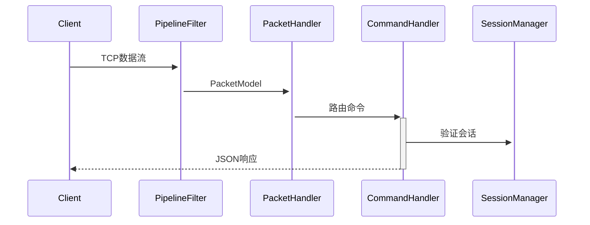
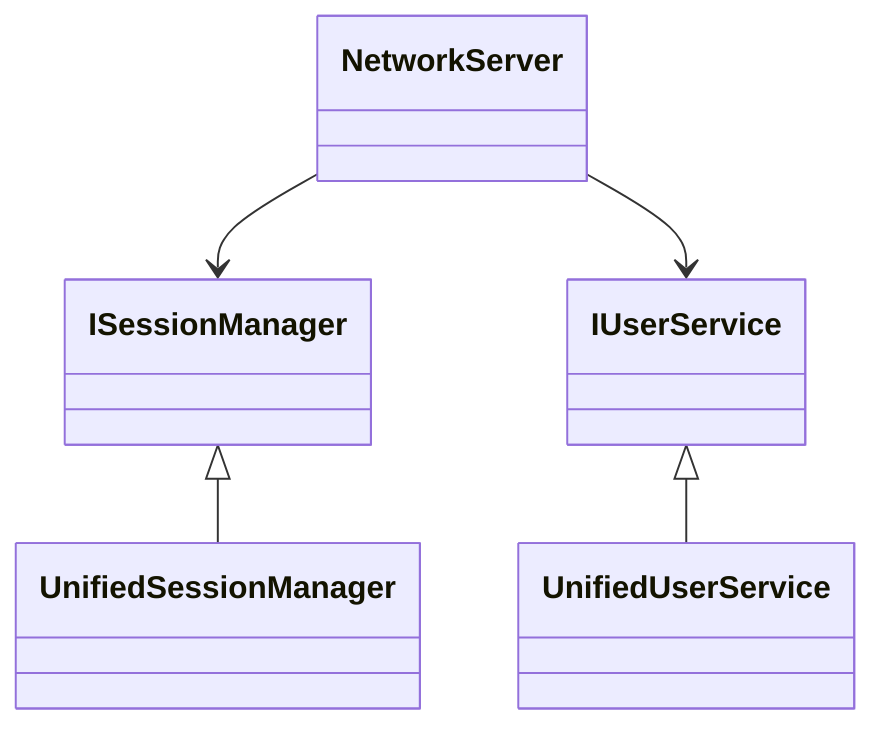

# RUINORERP Network 模块架构文档

## 目录
1. [核心组件](#核心组件)
2. [架构设计](#架构设计)
3. [数据处理流程](#数据处理流程)  
4. [服务依赖](#服务依赖)
5. [接口定义](#接口定义)
6. [测试策略](#测试策略)
7. [统一请求响应处理框架](#统一请求响应处理框架)

## 核心组件

### NetworkServer.cs
```csharp
public class NetworkServer {
    public Task<bool> StartAsync(int port = 8009) { ... }
    public Task StopAsync() { ... }
}
```
- **功能**：主服务器入口
- **配置项**：
  - 监听端口
  - 最大连接数(默认1000)
  - 数据包大小限制(1MB)

### UnifiedSessionManager.cs
```csharp
public class UnifiedSessionManager : ISessionManager {
    public int ActiveSessionCount { get; }
    public Task AddSessionAsync(IAppSession session) { ... }
}
```
- **会话存储**：`ConcurrentDictionary<string, SessionInfo>`
- **统计指标**：
  - 活跃会话数
  - 历史连接数
  - 消息吞吐量

## 架构设计

### 分层架构
```
┌───────────────────────┐
│       Commands        │  # 业务命令处理
├───────────────────────┤
│        Services       │  # 核心服务实现
├───────────────────────┤
│         Core          │  # 网络核心层
├───────────────────────┤
│      Interfaces       │  # 服务接口定义
└───────────────────────┘
```

## 数据处理流程

### 时序图


## 服务依赖



## 接口定义

### ISessionManager
```csharp
public interface ISessionManager {
    Task AddSessionAsync(IAppSession session);
    Task RemoveSessionAsync(string sessionId); 
    Task BroadcastAsync(PacketModel packet);
}
```

## 测试策略

### 测试分类
1. **单元测试**：
   - 命令处理器逻辑
   - 会话状态管理
2. **集成测试**：
   - 服务依赖解析
   - 端到端消息处理
3. **压力测试**：
   - 并发连接测试
   - 消息吞吐量测试

## 统一请求响应处理框架

### 框架概述

统一请求响应处理框架是一个通用的请求处理架构，旨在为服务器端和客户端提供一致的请求处理方式。该框架基于以下核心概念：

1. **请求处理器模式**：定义了标准的请求处理接口和基类
2. **类型安全**：使用泛型确保请求和响应类型的正确性
3. **异步处理**：所有操作都支持异步处理
4. **统一错误处理**：提供标准的错误响应格式
5. **可扩展性**：易于扩展和自定义

### 核心组件

#### IRequestHandler<TRequest, TResponse>
定义请求处理的通用接口：
```csharp
public interface IRequestHandler<TRequest, TResponse>
{
    Task<ApiResponse<TResponse>> HandleAsync(TRequest request, CancellationToken cancellationToken = default);
}
```

#### RequestHandlerBase<TRequest, TResponse>
请求处理器基类，提供通用的处理逻辑：
```csharp
public abstract class RequestHandlerBase<TRequest, TResponse> : IRequestHandler<TRequest, TResponse>
{
    public async Task<ApiResponse<TResponse>> HandleAsync(TRequest request, CancellationToken cancellationToken = default)
    {
        // 验证请求
        var validationResult = await ValidateRequestAsync(request, cancellationToken);
        if (!validationResult.IsValid)
        {
            return ApiResponse<TResponse>.Failure(validationResult.ErrorMessage, 400);
        }

        // 执行业务逻辑
        var result = await ProcessRequestAsync(request, cancellationToken);
        
        // 返回成功响应
        return ApiResponse<TResponse>.CreateSuccess(result.Data, result.Message);
    }

    protected virtual async Task<RequestValidationResult> ValidateRequestAsync(TRequest request, CancellationToken cancellationToken)
    {
        // 默认实现
        await Task.CompletedTask;
        return RequestValidationResult.Success();
    }

    protected abstract Task<RequestProcessResult<TResponse>> ProcessRequestAsync(TRequest request, CancellationToken cancellationToken);
}
```

#### ApiResponse<T>
统一的API响应模型：
```csharp
public class ApiResponse<T>
{
    public bool Success { get; set; }
    public string Message { get; set; }
    public T Data { get; set; }
    public int Code { get; set; }
    // ... 其他属性和方法
}
```

### 使用示例

#### 服务器端实现
```csharp
// 创建请求处理器
public class ServerLoginRequestHandler : RequestHandlerBase<LoginRequest, LoginResult>
{
    protected override async Task<RequestProcessResult<LoginResult>> ProcessRequestAsync(LoginRequest request, CancellationToken cancellationToken)
    {
        // 处理登录逻辑
        var userInfo = await ValidateUserCredentialsAsync(request.Username, request.Password, cancellationToken);
        
        // 生成登录结果
        var loginResult = new LoginResult
        {
            UserId = userInfo.UserId,
            Username = userInfo.Username,
            // ... 其他属性
        };

        return RequestProcessResult<LoginResult>.Create(loginResult, "登录成功");
    }
}

// 创建命令处理器
[CommandHandler("UnifiedLoginCommandHandler", priority: 100)]
public class UnifiedLoginCommandHandler : UnifiedCommandHandlerBase
{
    private readonly ServerLoginRequestHandler _loginRequestHandler;

    protected override async Task<CommandResult> ProcessCommandAsync(ICommand command, CancellationToken cancellationToken)
    {
        var loginRequest = ParseLoginRequest(command.OriginalData);
        
        // 使用通用请求处理器处理登录请求
        var response = await _loginRequestHandler.HandleAsync(loginRequest, cancellationToken);

        if (response.IsSuccess())
        {
            var responseData = CreateLoginSuccessResponse(response.Data);
            return CommandResult.SuccessWithResponse(responseData, response.Data, response.Message);
        }
        else
        {
            return CommandResult.Failure(response.Message, "LOGIN_FAILED");
        }
    }
}
```

### 优势

1. **代码复用**：服务器端和客户端可以共享相同的请求/响应模型
2. **类型安全**：编译时检查请求和响应类型
3. **统一错误处理**：标准化的错误响应格式
4. **易于测试**：请求处理器可以独立测试
5. **可扩展性**：易于添加新的请求类型和处理器
6. **异步支持**：完全支持异步操作

详细文档请参见 [UNIFIED_REQUEST_RESPONSE_FRAMEWORK.md](UNIFIED_REQUEST_RESPONSE_FRAMEWORK.md)