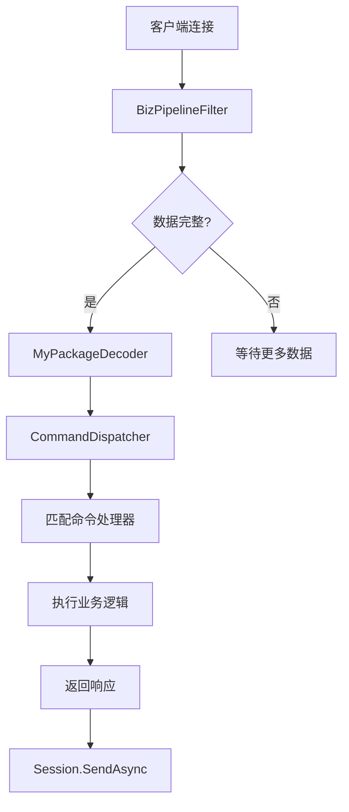
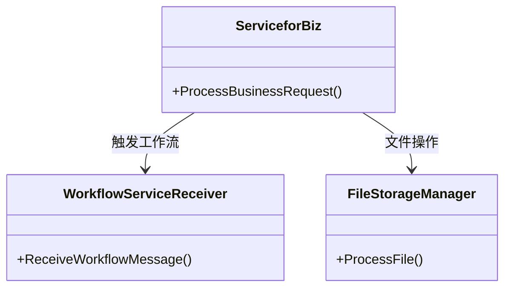

# RUINORERP SuperSocketServices 模块架构文档 (详细版)

## 1. 核心组件深度分析

### 1.1 SuperSocketServerService (主服务)
```csharp
[Obsolete("已迁移到NetworkServer", false)]
public class SuperSocketServerService : BackgroundService {
    private readonly ICommandDispatcher _commandDispatcher;
    
    protected override async Task ExecuteAsync(CancellationToken token) {
        while (!token.IsCancellationRequested) {
            await CheckServerHealthAsync();
            await Task.Delay(TimeSpan.FromMinutes(1), token);
        }
    }
}
```

**迁移路径**：
1. **配置迁移**：
   ```csharp
   // 旧配置
   public class SuperSocketConfig {
       public int Port { get; set; } = 6666;
       //...其他配置
   }
   
   // 新配置
   public class UnifiedServerConfiguration : IOptions<UnifiedServerConfiguration> {
       public int Port { get; set; } = 8009;
       //...统一配置项
   }
   ```

2. **功能替代**：
   - 会话管理 → `UnifiedSessionManager`
   - 命令处理 → `PacketHandler`

### 1.2 会话管理 (SessionforBiz)
```csharp
public class SessionforBiz : AppSession {
    // 用户上下文
    public UserInfo User { get; set; } = new UserInfo();
    
    // 会话状态
    public DateTime 登陆时间 { get; set; }
    public bool 授权状态 { get; set; }
    
    // 业务方法
    public async Task SendPromptMessage(string message) {
        // 实现消息发送
    }
}
```

## 2. 命令处理架构详解

### 2.1 命令分类矩阵

| 类型        | 路径               | 示例命令                | 协议版本 | 状态      |
|-------------|--------------------|-------------------------|----------|-----------|
| 业务命令     | Commands/Business/ | FileStorageCommand      | v2       | ✔️ 活跃   |
| 系统命令     | Commands/System/   | LockManagementCommand   | v2       | ✔️ 活跃   |
| 遗留命令     | Commands/Legacy/   | ServerLoginCommand      | v1       | ⚠️ 已弃用 |

### 2.2 命令处理器实现模式
```csharp
public class FileStorageCommand : IServerCommand {
    public async Task ExecuteAsync(SessionforBiz session) {
        // 1. 验证会话权限
        if (!session.授权状态) {
            await session.SendPromptMessage("未授权访问");
            return;
        }
        
        // 2. 处理文件存储逻辑
        var fileManager = new FileStorageManager();
        await fileManager.ProcessFileAsync(/* 参数 */);
        
        // 3. 返回响应
        await session.SendPromptMessage("文件处理完成");
    }
}
```

## 3. 数据处理管道技术细节

### 3.1 管道过滤器 (BizPipelineFilter)
```csharp
public class BizPipelineFilter : PipelineFilter<PackageInfo> {
    protected override PackageInfo Filter(ref SequenceReader<byte> reader) {
        // 1. 解析包头
        var header = ParseHeader(ref reader);
        
        // 2. 读取包体
        var body = reader.Sequence.Slice(header.HeaderLength, header.BodyLength);
        
        // 3. 构造数据包
        return new PackageInfo {
            Header = header,
            Body = body
        };
    }
}
```

### 3.2 完整数据处理流


## 4. 服务层深度设计

### 4.1 服务交互关系


### 4.2 服务状态详情

| 服务类                 | 核心职责                      | 依赖项                     | 迁移建议                  |
|------------------------|-----------------------------|---------------------------|--------------------------|
| ServiceforBiz          | 处理核心业务逻辑               | WorkflowServiceReceiver   | 保留，后续迁移到Network模块 |
| ServiceforLander       | 旧版登录处理                  | SessionforBiz            | 已废弃，使用UnifiedUserService替代 |
| WorkflowServiceReceiver | 接收和处理工作流消息           | Redis连接                 | 保留并增强                |

## 5. 性能关键点

1. **会话管理优化**：
   ```csharp
   // 使用ConcurrentDictionary管理会话
   private ConcurrentDictionary<string, SessionforBiz> _activeSessions;
   ```

2. **命令处理性能**：
   - 使用预编译的正则表达式匹配命令
   - 采用异步流水线处理模式

3. **内存管理**：
   ```csharp
   // 使用ArrayPool共享内存
   var buffer = ArrayPool<byte>.Shared.Rent(bufferSize);
   ```