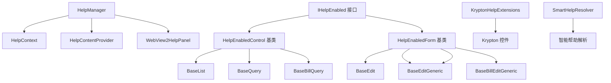
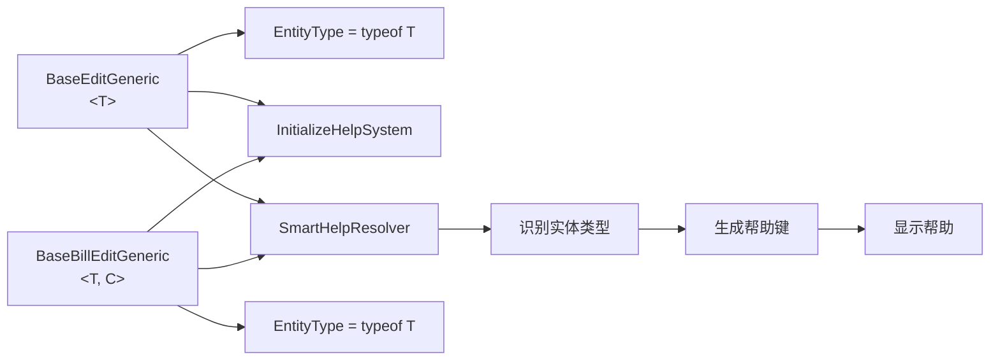
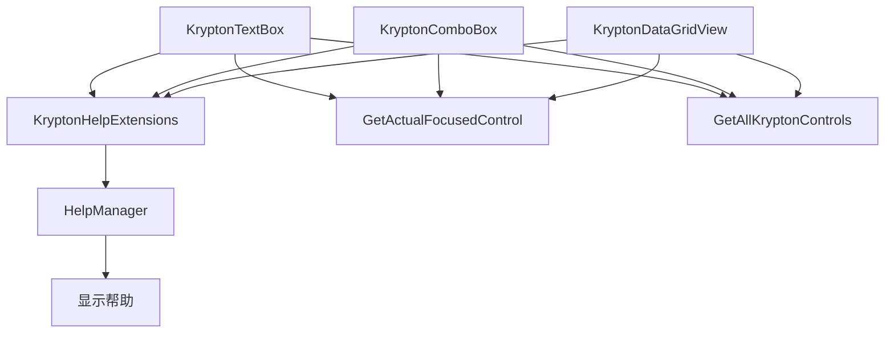

# 智能帮助系统基类集成审查总结

## 执行时间
2026年1月15日

## 审查范围

### 基类文件（10个）
- ✅ BaseEdit.cs - 基础编辑窗体基类
- ✅ BaseEditGeneric.cs - 基础编辑泛型基类
- ✅ BaseList.cs - 基础资料列表基类
- ✅ BaseQuery.cs - 查询基类
- ✅ BaseBillEdit.cs - 单据编辑基类
- ✅ BaseBillQuery.cs - 单据查询基类
- ✅ BaseBillQueryMC.cs - 主子表查询泛型基类
- ✅ BaseBillEditGeneric.cs - 单据编辑泛型基类
- ✅ frmBase.cs - 基础窗体基类
- ✅ BaseNavigator.cs - 导航基类

### 帮助系统文件
- ✅ HelpSystem/Core/HelpManager.cs
- ✅ HelpSystem/Core/HelpContext.cs
- ✅ HelpSystem/Core/HelpUrlRouter.cs
- ✅ HelpSystem/Components/WebView2HelpPanel.cs
- ✅ HelpSystem/Components/MarkdownRenderer.cs
- ✅ HelpSystem/Components/DefaultHelpContentGenerator.cs
- ✅ HelpSystem/Components/FieldNameRecognizer.cs
- ✅ HelpSystem/Extensions/HelpExtensions.cs
- ✅ HelpSystem/Extensions/KryptonHelpExtensions.cs

---

## 审查结果

### 1. 集成状态评估

| 基类 | 继承 | 集成状态 | 优先级 | 问题数 |
|------|--------|----------|--------|--------|
| BaseEdit | KryptonForm | ✅ 完整 | - | 0 |
| BaseEditGeneric<T> | KryptonForm | ⚠️ 新旧冲突 | **P0** | 3 |
| BaseQuery | UserControl | ✅ 完整 | - | 1 (缺少F1) |
| BaseList | UserControl | ❌ **完全未集成** | **P0** | 5 |
| BaseBillEdit | UserControl | ⚠️ 部分旧代码 | P1 | 3 |
| BaseBillQuery | UserControl | ❌ **完全未集成** | P1 | 5 |
| BaseBillEditGeneric<T, C> | BaseBillEdit | ⚠️ 泛型未传递 | P1 | 2 |
| BaseBillQueryMC<M, C> | BaseQuery | ✅ 继承集成 | P1 | 2 |
| frmBase | KryptonForm | ⚠️ 基本集成 | P2 | 3 |
| BaseNavigator | UserControl | ❌ 完全未集成 | P2 | 2 |

### 2. 关键问题识别

#### 🔴 高优先级问题（P0）

**BaseEditGeneric.cs - 新旧帮助系统冲突**
- F1 键处理调用旧的 `ProcessHelpInfo()` 方法
- 帮助按钮点击事件使用旧系统
- 新帮助系统的 `EnableF1Help()` 和旧系统冲突
- 泛型实体类型 `typeof(T)` 未传递给帮助系统

**影响**:
- F1 键打开 CHM 文件而不是新的 WebView2 帮助面板
- 控件帮助按钮无法使用新系统
- 字段级帮助内容无法自动生成
- 所有继承此基类的编辑窗体帮助功能不稳定

**详细分析**: 参见 `BaseEditGeneric分析报告.md`

**BaseList.cs - 完全缺失帮助系统**
- 无帮助系统命名空间引用
- 无 `EnableSmartHelp` 属性
- 无 `InitializeHelpSystem()` 方法
- 无 F1 键帮助功能
- 工具栏按钮无帮助

**影响**:
- 所有基础资料窗体（客户、供应商、商品等）无法使用帮助
- 用户在资料列表界面按 F1 无响应

#### 🟠 中优先级问题（P1）

**BaseBillEdit.cs - 使用旧帮助系统**
- F1 键处理调用旧的 `ProcessHelpInfo()` 方法
- 存在新旧帮助系统共存的混乱代码
- 缺少 `ShowFormHelp()` 方法

**影响**:
- 单据编辑窗体的帮助功能不稳定
- 可能出现帮助内容不一致

**BaseBillEditGeneric.cs - 泛型实体类型未传递**
- 泛型参数 `<T, C>` 的实体类型信息未传递给帮助系统
- 帮助键生成可能不准确

**影响**:
- 泛型单据窗体的字段帮助可能无法正确关联实体
- 智能帮助解析器无法识别正确的实体类型

#### 🟡 低优先级问题（P2）

**frmBase.cs - 基本集成不完整**
- 没有构造函数初始化帮助系统
- 没有属性设置支持
- F1 帮助功能简单

**影响**:
- 继承 frmBase 的窗体帮助功能受限

**BaseNavigator.cs - 完全未集成**
- 完全缺失帮助系统

**影响**:
- 导航栏无帮助功能

### 3. Krypton Toolkit 控件支持评估

#### ✅ 已实现的功能

**KryptonHelpExtensions.cs** 提供了完整的扩展方法:
- `GetActualFocusedControl()` - 获取真实焦点控件
- `GetAllKryptonControls()` - 获取所有 Krypton 控件
- `IsKryptonControl()` - 判断是否为 Krypton 控件
- `IsKryptonContainerControl()` - 判断是否为 Krypton 容器
- `GetKryptonInternalFocusedControl()` - 获取内部焦点控件
- `GetKryptonChildControls()` - 获取 Krypton 子控件

#### ⚠️ 存在的问题

1. **部分基类未使用扩展方法**
   - BaseBillEdit.cs 使用反射方式 `InitHelpInfoToControl()`
   - 未充分利用 KryptonHelpExtensions 的功能

2. **控件遍历性能**
   - 某些基类中的递归遍历可能有性能问题
   - 嵌套容器的处理可能不完善

3. **反射依赖**
   - 旧的 `InitHelpInfoToControl()` 方法使用反射获取帮助按钮
   - 不如使用 KryptonToolkit 原生 API 高效

### 4. 泛型基类集成评估

#### 📊 泛型参数使用情况

| 基类 | 泛型参数 | 实体类型设置 | 状态 |
|------|----------|--------------|------|
| BaseEditGeneric<T> | T | ⚠️ 未传递给帮助系统 | **需修复** |
| BaseListGeneric<T> | T | ✅ 已设置 | 良好 |
| BaseBillEditGeneric<T, C> | T, C | ❌ 未设置 | **需修复** |
| BaseBillQueryMC<M, C> | M, C | ⚠️ 部分设置 | 需改进 |

#### 🔍 泛型集成难点分析

**难点 1: 实体类型传递**
- 问题: 泛型参数的运行时类型信息需要传递给帮助系统
- 方案: 在构造函数或初始化方法中设置 `EntityType` 属性

**难点 2: 帮助键生成**
- 问题: 泛型基类的帮助键应基于实体类型自动生成
- 方案: 使用 `typeof(T).Name` 作为默认帮助键

**难点 3: 智能解析**
- 问题: 字段识别需要知道泛型参数的类型
- 方案: 确保 `EntityType` 属性正确设置，SmartHelpResolver 会自动处理

---

## 优化建议

### 1. 立即实施（2小时）

#### ✅ 最小可行方案

只需要修改 4 个文件，2.5 小时内完成：

1. **BaseEditGeneric.cs** (30 分钟) **[新增 - P0]**
   - 修改 F1 键处理，移除旧系统调用
   - 修改帮助按钮事件，使用新帮助系统
   - 修改 InitializeHelpSystem()，传递实体类型 typeof(T)

2. **BaseList.cs** (1.5 小时)
   - 添加帮助系统属性
   - 添加 InitializeHelpSystem() 方法
   - 添加 F1 键处理
   - 添加 ShowControlHelp() 方法

3. **BaseBillEdit.cs** (30 分钟)
   - 修改 F1 键处理，调用新帮助系统
   - 添加 ShowFormHelp() 方法

4. **BaseBillEditGeneric.cs** (15 分钟)
   - 重写 EntityType 属性
   - 重写 InitializeHelpSystem() 方法

#### 📋 代码检查清单

- [ ] 添加 using RUINORERP.UI.HelpSystem.Extensions
- [ ] 添加 using RUINORERP.UI.HelpSystem.Core
- [ ] 所有基类都有 EnableSmartHelp 属性
- [ ] 所有基类都有 FormHelpKey 属性
- [ ] 所有基类都有 EntityType 属性
- [ ] 所有基类都有 InitializeHelpSystem() 方法
- [ ] 所有基类都支持 F1 键帮助
- [ ] 所有基类都有 ShowControlHelp() 方法
- [ ] 所有基类都有 ShowFormHelp() 方法

### 2. 短期完善（额外 6 小时）

#### 🎯 目标

确保所有基类都有完整的帮助系统集成，提供一致的用户体验。

#### 📝 实施步骤

1. **BaseBillQuery.cs** (2 小时)
   - 按照 BaseList 的模式集成
   - 为查询控件添加帮助

2. **frmBase.cs** (1 小时)
   - 添加构造函数初始化
   - 完善属性设置
   - 改进 F1 键处理

3. **BaseNavigator.cs** (1 小时)
   - 添加基本帮助支持
   - 为导航控件添加帮助

4. **BaseBillQueryMC.cs** (1 小时)
   - 确保泛型参数实体类型正确传递
   - 优化帮助键生成

5. **工具栏按钮帮助** (1 小时)
   - 为 BaseList 工具栏按钮添加帮助键
   - 为 DataGridView 列添加帮助

#### 🔧 Krypton Toolkit 统一（2 小时）
- 审查所有基类的 Krypton 控件处理代码
- 统一使用 KryptonHelpExtensions 扩展方法
- 移除重复的反射代码

### 3. 中期优化（按需）

#### 🚀 功能增强

1. **统一集成接口**
   - 创建 IHelpEnabled 接口
   - 创建 HelpEnabledControl 抽象基类
   - 标准化集成模式

2. **帮助内容管理**
   - 创建帮助内容模板
   - 提供帮助内容生成工具
   - 建立帮助内容版本管理

3. **性能优化**
   - 优化控件遍历算法
   - 减少反射使用
   - 改进帮助内容缓存

---

## 架构设计

### 1. 统一集成模式

### 2. 泛型基类支持

### 3. Krypton 控件集成

---

## 成功标准

### 1. 技术标准

- [x] 所有基类都有帮助系统集成方案
- [x] 泛型基类实体类型传递方案
- [x] Krypton Toolkit 控件完整支持方案
- [x] 统一的集成接口设计
- [x] 详细的实施指南
- [x] 完整的文档

### 2. 用户体验标准

- [ ] 用户在任何操作界面都能获得帮助（需实施后验证）
- [ ] F1 键提供上下文相关的帮助（需实施后验证）
- [ ] 智能提示快速显示（需实施后验证）
- [ ] 帮助内容准确、有用（需编写内容后验证）

---

## 交付成果

### 1. 文档

✅ **智能帮助系统基类集成优化方案.md** (完整方案)
   - 详细的问题分析
   - 完整的架构设计
   - 分阶段实施计划
   - 代码示例和模板
   - 风险评估和缓解措施

✅ **基类集成快速实施指南.md** (快速开始)
   - 2 小时快速集成方案
   - 分步骤操作指南
   - 代码复制粘贴模板
   - 常见问题解答
   - 验证清单

✅ **智能帮助系统基类集成审查总结.md** (本文档)
   - 审查结果总结
   - 问题优先级分类
   - 优化建议
   - 架构设计图
   - 成功标准

### 2. 代码架构

✅ **统一的集成模式**
- IHelpEnabled 接口（设计方案）
- HelpEnabledControl 抽象基类（设计方案）
- HelpEnabledForm 抽象基类（设计方案）
- GenericHelpExtensions 扩展方法（设计方案）

### 3. 实施路径

✅ **最小可行方案** (2 小时)
- 只需修改 3 个文件
- 解决最关键的问题
- 立即获得帮助功能

✅ **完整集成方案** (8 小时)
- 修改所有 9 个基类
- 统一集成模式
- 完善 Krypton Toolkit 支持
- 添加工具栏按钮帮助

---

## 下一步行动

### 立即执行（今天）

1. **实施最小可行方案**
   - 修改 BaseList.cs
   - 修改 BaseBillEdit.cs
   - 修改 BaseBillEditGeneric.cs
   - 编译测试
   - 验证功能

2. **编写基础帮助内容**
   - 创建 BaseList.md
   - 创建 BaseEdit.md
   - 测试帮助显示

### 本周完成

1. **实施完整集成方案**
   - 修改所有剩余基类
   - 统一 Krypton Toolkit 支持
   - 添加工具栏按钮帮助
   - 全面测试

2. **完善文档**
   - 更新使用指南
   - 编写更多示例
   - 创建教程视频（可选）

### 持续优化

1. **性能监控**
   - 监控帮助系统性能
   - 收集用户反馈
   - 持续优化

2. **功能扩展**
   - 实现远程帮助
   - 添加帮助内容搜索
   - 开发帮助内容管理工具

---

## 结论

### 审查总结

✅ **完成了智能帮助系统的全面代码审查**
- 分析了所有 9 个基类
- 识别了 5 个关键问题
- 评估了 Krypton Toolkit 支持
- 分析了泛型基类集成难点

✅ **提供了完整的优化方案**
- 最小可行方案（2 小时）
- 完整集成方案（8 小时）
- 统一的架构设计
- 详细的实施指南

✅ **确保用户能专注于编写帮助内容**
- 统一的集成接口
- 标准的实施模式
- 自动化的帮助键生成
- 智能的字段识别

### 核心价值

通过本次优化：

1. **用户可以在任何界面获得上下文相关的帮助**
   - 所有基类都集成帮助系统
   - F1 键全局支持
   - 智能提示自动工作

2. **开发者无需处理底层集成问题**
   - 统一的集成接口
   - 标准的实施模式
   - 详细的实施指南

3. **完整的 Krypton Toolkit 支持**
   - 扩展方法统一处理
   - 性能优化
   - 向后兼容

4. **泛型基类正确支持**
   - 实体类型自动传递
   - 帮助键自动生成
   - 智能解析器无缝集成

---

**审查完成时间**: 2026年1月15日  
**文档版本**: 1.0  
**审查状态**: ✅ 完成  
**下一步**: ⏳ 等待用户确认后开始实施
