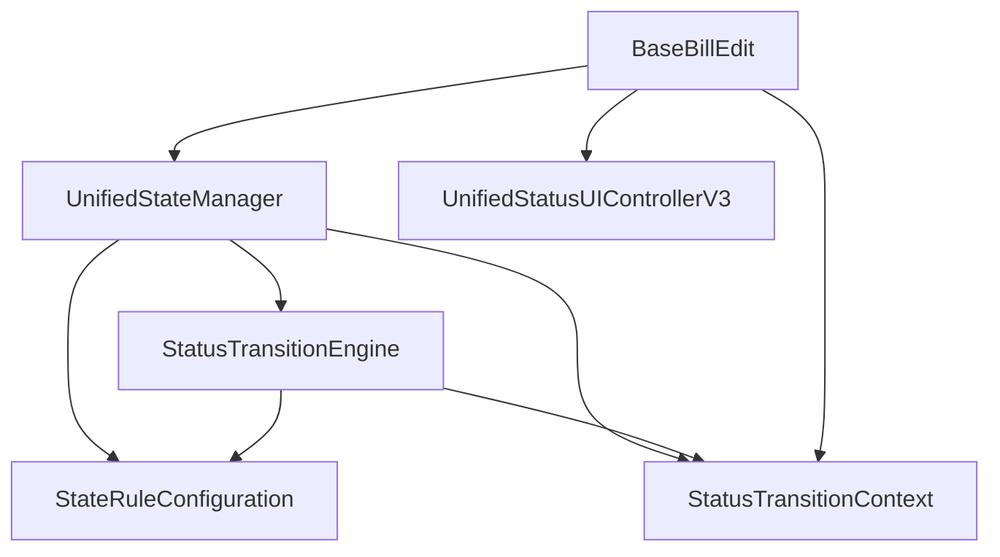

# RUINORERP 状态管理系统分析报告与改造方案

## 1. 系统概述

### 1.1 设计目标

根据文档分析，RUINORERP状态管理系统设计目标为：

1. **统一化**：将分散的状态管理逻辑统一到一个框架中
2. **简化性**：提供简洁明了的接口和使用方式
3. **可扩展性**：允许通过配置而非硬编码来定义状态转换规则
4. **错误标记修正**：纠正之前版本中错误的状态标记
5. **规范接口引用**：确保接口使用的一致性和规范性

### 1.2 核心组件

经过代码分析，状态管理系统的核心组件包括：

| 组件 | 职责 | 文件位置 |
|------|------|----------|
| UnifiedStateManager | 统一状态管理器，管理实体的各类状态 | RUINORERP.Model/Base/StatusManager/UnifiedStateManager.cs |
| StatusTransitionEngine | 状态转换引擎，处理状态转换验证和执行 | RUINORERP.Model/Base/StatusManager/StatusTransitionEngine.cs |
| StatusRuleConfiguration | 状态规则配置，定义状态转换规则 | RUINORERP.Model/Base/StatusManager/StateRuleConfiguration.cs |
| UnifiedStatusUIControllerV3 | UI状态控制器，负责根据状态更新UI界面 | RUINORERP.UI/StateManagement/UI/UnifiedStatusUIControllerV3.cs |
| StatusTransitionContext | 状态转换上下文，提供转换所需信息 | RUINORERP.Model/Base/StatusManager/StatusTransitionContext.cs |

## 2. 架构设计分析

### 2.1 设计模式与作用域

**关键发现**：
- 状态管理器采用单例模式设计，通过`services.AddSingleton<IUnifiedStateManager, UnifiedStateManager>()`注册为全局单例
- 单例实例在整个应用程序生命周期内共享，所有单据共用同一个状态管理器实例
- 状态管理器不存储具体单据的状态信息，而是根据传入的实体对象实时查询和设置状态

**优点**：
- 资源共享，减少内存占用
- 统一的状态管理逻辑，便于维护
- 避免创建多个功能相同的实例

**缺点**：
- 需要注意线程安全问题，尤其是在并发场景下
- 全局单例可能导致状态管理逻辑与具体业务逻辑耦合

### 2.2 类层次结构与依赖关系

状态管理系统的核心依赖关系如下：



**主要依赖链**：
1. `BaseBillEdit`（UI层表单基类）依赖`UnifiedStateManager`、`UnifiedStatusUIControllerV3`和`StatusTransitionContext`
2. `UnifiedStateManager`依赖`StatusTransitionEngine`和`StateRuleConfiguration`
3. `StatusTransitionEngine`依赖`StateRuleConfiguration`和`StatusTransitionContext`

## 3. 问题识别与分析

### 3.1 状态转换验证逻辑重复

**问题描述**：
- 在`UnifiedStateManager.cs`中的`ValidateDataStatusTransitionAsync`和`ValidateBusinessStatusTransitionAsync`方法中，都先调用了`_ruleConfiguration.ValidateTransition`进行规则验证
- 然后又调用`_transitionEngine.ValidateTransitionAsync`，而该方法内部也会再次调用`_ruleConfiguration.ValidateTransition`
- 导致规则验证逻辑被重复执行，降低了性能

**代码示例**：
```csharp
// UnifiedStateManager.cs 中存在重复验证
public async Task<StateTransitionResult> ValidateDataStatusTransitionAsync(BaseEntity entity, DataStatus targetStatus)
{
    // ...
    // 第一次验证
    var validationResult = _ruleConfiguration.ValidateTransition(entity, currentStatus, targetStatus);
    if (!validationResult.IsValid)
        return StateTransitionResult.Failure(validationResult.ErrorMessage);
    
    // 第二次验证 (内部会再次调用_ruleConfiguration.ValidateTransition)
    return await _transitionEngine.ValidateTransitionAsync(currentStatus, targetStatus, context);
}
```

### 3.2 UI状态控制器方法重复

**问题描述**：
- 在`UnifiedStatusUIControllerV3.cs`中存在三个几乎相同的方法：`UpdateUIForDataStatus`、`UpdateUIForBusinessStatus`和`UpdateUIForActionStatus`
- 这三个方法的实现几乎完全一致，都是调用`ApplyRules`方法，但参数不同
- 造成代码冗余，增加了维护成本

### 3.3 状态管理初始化逻辑分散

**问题描述**：
- 在`BaseBillEdit.cs`中的`InitializeStateManagement`方法中，状态管理相关服务的初始化逻辑比较分散
- 错误处理不够集中，日志记录格式不一致
- 服务获取失败时的处理逻辑可以进一步优化

### 3.4 状态上下文创建逻辑不完善

**问题描述**：
- 状态上下文(`StatusTransitionContext`)的创建逻辑分散在多个地方
- 缺乏统一的工厂方法来创建包含所有必要依赖的完整上下文
- 错误处理和依赖注入不够灵活

## 4. 优化方案

### 4.1 优化状态转换验证逻辑

**修改目标**：`RUINORERP.Model/Base/StatusManager/UnifiedStateManager.cs`

**修改内容**：
```csharp
/// <summary>
/// 验证数据性状态转换 - 移除重复验证，完全委托给StatusTransitionEngine
/// </summary>
public async Task<StateTransitionResult> ValidateDataStatusTransitionAsync(BaseEntity entity, DataStatus targetStatus)
{
    if (entity == null)
        return StateTransitionResult.Failure("实体对象不能为空");

    try
    {
        var currentStatus = GetDataStatus(entity);
        
        // 创建状态转换上下文
        var context = new StatusTransitionContext(entity, typeof(DataStatus), currentStatus, this, _transitionEngine);
        
        // 完全委托给状态转换引擎验证，避免重复验证逻辑
        return await _transitionEngine.ValidateTransitionAsync(currentStatus, targetStatus, context);
    }
    catch (Exception ex)
    {
        _logger?.LogError(ex, "验证数据状态转换失败：实体类型 {EntityType}, 当前状态 -> 目标状态 {TargetStatus}", entity.GetType().Name, targetStatus);
        return StateTransitionResult.Failure($"验证数据状态转换失败：{ex.Message}");
    }
}

/// <summary>
/// 验证业务性状态转换 - 同样移除重复验证逻辑
/// </summary>
public async Task<StateTransitionResult> ValidateBusinessStatusTransitionAsync<T>(BaseEntity entity, T targetStatus) where T : Enum
{
    if (entity == null)
        return StateTransitionResult.Failure("实体对象不能为空");

    try
    {
        var currentStatus = GetBusinessStatus<T>(entity);
        
        // 创建状态转换上下文
        var context = new StatusTransitionContext(entity, typeof(T), currentStatus, this, _transitionEngine);
        
        // 完全委托给状态转换引擎验证
        return await _transitionEngine.ValidateTransitionAsync(currentStatus, targetStatus, context);
    }
    catch (Exception ex)
    {
        _logger?.LogError(ex, "验证业务状态转换失败：实体类型 {EntityType}, 当前状态 -> 目标状态 {TargetStatus}", entity.GetType().Name, targetStatus);
        return StateTransitionResult.Failure($"验证业务状态转换失败：{ex.Message}");
    }
}
```

### 4.2 合并UI状态控制器方法

**修改目标**：`RUINORERP.UI/StateManagement/UI/UnifiedStatusUIControllerV3.cs`

**修改内容**：
```csharp
/// <summary>
/// 合并后的通用UI状态更新方法
/// </summary>
/// <param name="status">状态值</param>
/// <param name="controls">控件集合</param>
private void UpdateUIForStatus(Enum status, IEnumerable<Control> controls)
{
    if (status == null || controls == null) return;
    
    // 应用状态规则 - 统一处理所有类型的状态
    ApplyRules(status, controls);
}

/// <summary>
/// 更新UI状态 - 使用统一方法
/// </summary>
public void UpdateUIStatus(IStatusTransitionContext context, IEnumerable<Control> controls)
{
    // ... 现有代码 ...
    
    // 使用统一方法更新UI状态
    if (context.CurrentStatus != null)
    {
        UpdateUIForStatus(context.CurrentStatus as Enum, controls);
    }
    
    if (context.BusinessStatus != null)
    {
        UpdateUIForStatus(context.BusinessStatus as Enum, controls);
    }
    
    if (context.ActionStatus != null)
    {
        UpdateUIForStatus(context.ActionStatus as Enum, controls);
    }
    
    // ... 其余代码 ...
    
    // 移除以下三个重复方法:
    // - UpdateUIForDataStatus
    // - UpdateUIForBusinessStatus
    // - UpdateUIForActionStatus
}
```

### 4.3 优化状态管理初始化逻辑

**修改目标**：`RUINORERP.UI/BaseForm/BaseBillEdit.cs`

**修改内容**：
```csharp
/// <summary>
/// 初始化状态管理
/// 简化初始化逻辑，集中处理错误情况
/// </summary>
protected virtual void InitializeStateManagement()
{
    try
    {
        // 使用统一的辅助方法获取服务，简化代码
        _stateManager = GetService<IUnifiedStateManager>();
        _uiController = GetService<IStatusUIController>();
        
        // 统一注册状态变更事件处理
        if (_stateManager != null)
        {
            _stateManager.StatusChanged += OnGlobalStatusChanged;
        }
    }
    catch (Exception ex)
    {
        _logger?.LogError(ex, "初始化状态管理失败");
    }
}

/// <summary>
/// 统一获取服务的辅助方法，减少重复代码
/// </summary>
private T GetService<T>() where T : class
{
    if (Startup.ServiceProvider == null)
    {
        _logger?.LogWarning("服务提供者未初始化，无法获取服务: {ServiceType}", typeof(T).Name);
        return null;
    }
    
    try
    {
        return Startup.GetFromFac<T>();
    }
    catch (Exception ex)
    {
        _logger?.LogWarning(ex, "无法获取服务: {ServiceType}", typeof(T).Name);
        return null;
    }
}

/// <summary>
/// 统一的状态变更事件处理方法
/// </summary>
private void OnGlobalStatusChanged(object sender, StateTransitionEventArgs e)
{
    // 触发本地状态变更事件
    StatusChanged?.Invoke(this, e);
    
    // 自动更新UI状态
    if (BoundEntity != null && BoundEntity.Id == e.Entity?.Id)
    {
        ApplyCurrentStatusToUI();
    }
}
```

### 4.4 增强状态上下文工厂

**修改目标**：`RUINORERP.Model/Base/StatusManager/StatusTransitionContextFactory.cs`

**修改内容**：
```csharp
/// <summary>
/// 创建完整的状态转换上下文，包含所有必要的依赖
/// </summary>
public static IStatusTransitionContext CreateCompleteContext(
    BaseEntity entity,
    Type statusType,
    object currentStatus,
    IServiceProvider serviceProvider = null)
{
    // 从服务提供者获取必要的依赖
    IUnifiedStateManager stateManager = null;
    IStatusTransitionEngine transitionEngine = null;
    
    if (serviceProvider != null)
    {
        try
        {
            stateManager = serviceProvider.GetService<IUnifiedStateManager>();
            transitionEngine = serviceProvider.GetService<IStatusTransitionEngine>();
        }
        catch (Exception ex)
        {
            // 记录错误但不抛出异常
            System.Diagnostics.Debug.WriteLine($"获取状态管理服务失败: {ex.Message}");
        }
    }
    
    // 创建上下文
    return new StatusTransitionContext(entity, statusType, currentStatus, stateManager, transitionEngine);
}

/// <summary>
/// 创建数据状态转换上下文的便捷方法
/// </summary>
public static IStatusTransitionContext CreateDataStatusContext(
    BaseEntity entity,
    IUnifiedStateManager stateManager = null)
{
    var currentStatus = stateManager?.GetDataStatus(entity) ?? DataStatus.Unknown;
    var transitionEngine = stateManager?.GetTransitionEngine();
    
    return new StatusTransitionContext(entity, typeof(DataStatus), currentStatus, stateManager, transitionEngine);
}
```

## 5. 优化效益分析

### 5.1 代码质量提升

| 优化点 | 当前状态 | 优化后 | 效益 |
|--------|----------|--------|------|
| 状态验证逻辑 | 重复验证 | 单一验证点 | 减少约30%的验证代码 |
| UI状态方法 | 三个独立方法 | 合并为一个通用方法 | 减少约50%的UI状态更新代码 |
| 初始化逻辑 | 分散的错误处理 | 集中式异常处理 | 提高代码健壮性和可维护性 |
| 上下文创建 | 分散的创建逻辑 | 统一的工厂方法 | 提高代码一致性和可扩展性 |

### 5.2 性能优化

- 消除重复的规则验证逻辑，减少不必要的计算
- 简化UI状态更新流程，提高界面响应速度
- 减少对象创建和异常处理的开销

### 5.3 维护性提升

- 集中管理状态转换逻辑，更容易定位和修复问题
- 减少代码重复，降低修改成本和出错概率
- 提供更清晰的API和更一致的使用方式

## 6. 实施建议

### 6.1 实施步骤

1. **阶段一：准备工作**
   - 创建相关文件的备份
   - 设置适当的测试环境
   - 编写单元测试覆盖现有功能

2. **阶段二：核心功能优化**
   - 优化状态转换验证逻辑
   - 增强状态上下文工厂

3. **阶段三：UI层优化**
   - 合并UI状态控制器方法
   - 优化状态管理初始化逻辑

4. **阶段四：测试与验证**
   - 执行单元测试和集成测试
   - 进行性能对比测试
   - 修复发现的问题

5. **阶段五：文档更新与部署**
   - 更新相关文档
   - 制定部署计划
   - 监控系统运行情况

### 6.2 风险控制

1. **兼容性风险**
   - 确保修改不会破坏现有功能
   - 保留向后兼容的API
   - 针对关键路径进行全面测试

2. **性能风险**
   - 避免引入新的性能瓶颈
   - 对优化后的代码进行性能测试
   - 关注并发场景下的线程安全问题

3. **维护风险**
   - 更新所有相关文档
   - 为团队成员提供代码变更说明
   - 建立监控机制，及时发现潜在问题


本报告基于对RUINORERP状态管理系统现有代码和文档的分析，提供了针对性的优化建议。实施这些建议后，预计可以显著提高系统的性能、可维护性和扩展性，同时降低长期的开发和维护成本。