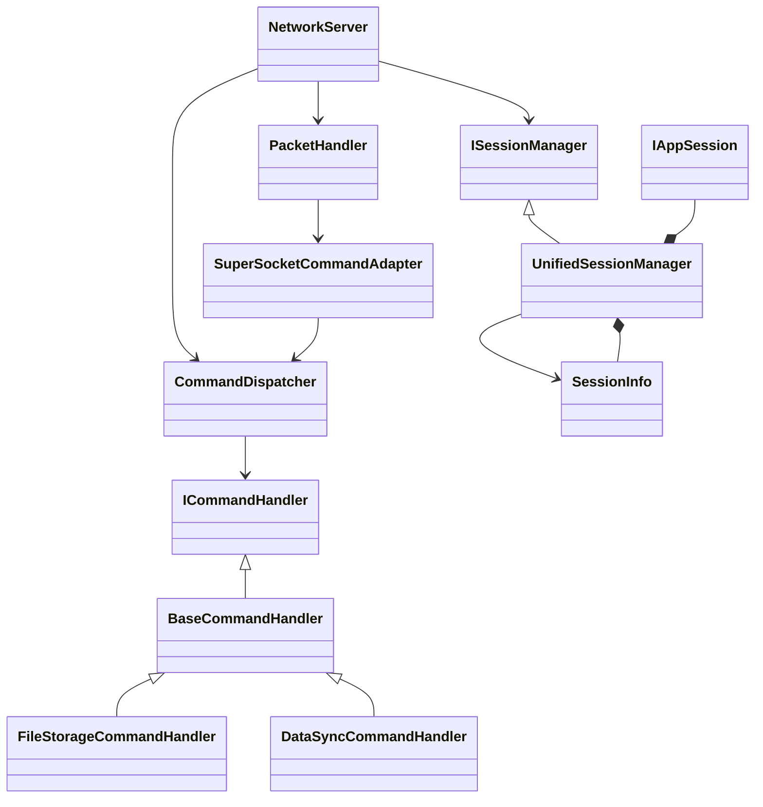
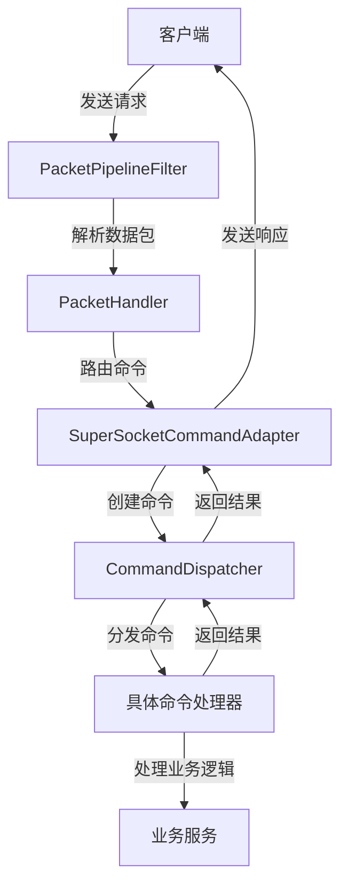

# SuperSocket与PacketSpec指令系统整合重构计划

## 一、项目现状分析

### 1.1 目录结构现状

当前项目中存在两个与SuperSocket相关的主要目录：

1. **RUINORERP.Server.Network** - 新架构
   - 直接集成SuperSocket，实现简洁高效
   - 包含`NetworkServer`核心组件
   - 已实现`UnifiedSessionManager`统一会话管理
   - 提供`SuperSocketCommandAdapter`命令适配器

2. **RUINORERP.Server.SuperSocketServices** - 旧架构
   - 包含已标记为过时的组件（如`SuperSocketServerService`）
   - 实现了业务命令处理（如文件操作、数据同步）
   - 包含遗留的命令处理方式

### 1.2 关键问题

- 两个目录功能重叠，存在重复实现
- 旧架构组件与新架构不兼容
- PacketSpec指令系统与SuperSocket指令系统整合不完整
- 业务代码分布在不同目录，维护困难

## 二、重构目标

1. 统一使用**Network目录**作为SuperSocket集成的主入口
2. 将SuperSocketServices中的业务功能迁移到新架构
3. 完全集成PacketSpec指令系统作为统一命令处理框架
4. 确保所有命令通过PacketSpec的CommandDispatcher分发
5. 提供清晰的业务代码实现规范

## 三、详细重构方案

### 3.1 核心架构整合

#### 3.1.1 服务启动流程重构

修改`NetworkServer.cs`以完全集成PacketSpec的命令调度器：

```csharp
public class NetworkServer
{
    private readonly ILogger<NetworkServer> _logger;
    private readonly ISessionManager _sessionManager;
    private readonly CommandDispatcher _commandDispatcher;
    private IHost _host;

    public NetworkServer(ILogger<NetworkServer> logger = null)
    {
        _logger = logger;
        _sessionManager = new UnifiedSessionManager(_logger as ILogger<UnifiedSessionManager>);
        // 初始化PacketSpec命令调度器
        _commandDispatcher = new CommandDispatcher();
    }

    public async Task<bool> StartAsync(int port = 8009, int maxConnections = 1000)
    {
        try
        {
            LogInfo($"正在启动网络服务器，端口: {port}");

            // 初始化命令调度器
            await _commandDispatcher.InitializeAsync();

            var hostBuilder = SuperSocketHostBuilder.Create<PacketModel, PacketPipelineFilter>()
                .ConfigureServices((context, services) =>
                {
                    // 注册核心服务
                    services.AddSingleton<ISessionManager>(_sessionManager);
                    services.AddSingleton<CommandDispatcher>(_commandDispatcher);
                    services.AddSingleton<IUserService, UnifiedUserService>();
                    services.AddSingleton<CacheService>();
                    
                    // 注册命令适配器
                    services.AddSingleton(typeof(SuperSocketCommandAdapter<>));
                    
                    // 注册日志
                    services.AddLogging(builder =>
                    {
                        builder.AddConsole();
                        builder.SetMinimumLevel(LogLevel.Information);
                    });
                })
                .UseCommand(commandOptions =>
                {
                    // 注册统一的数据包处理器
                    commandOptions.AddCommand<PacketHandler>();
                    // 注册SuperSocket命令适配器，用于处理特定命令
                    commandOptions.AddCommand<SuperSocketCommandAdapter<IAppSession>>();
                })
                // 其他配置保持不变
                .ConfigureSuperSocket(options =>
                {
                    options.Name = "RUINORERP.Network.Server";
                    options.Listeners = new[]
                    {
                        new ListenOptions
                        {
                            Ip = "Any",
                            Port = port
                        }
                    };
                    options.MaxPackageLength = 1024 * 1024; // 1MB
                    options.ReceiveBufferSize = 4096;
                    options.SendBufferSize = 4096;
                    options.ReceiveTimeout = 120000; // 2分钟
                    options.SendTimeout = 60000; // 1分钟
                });

            _host = hostBuilder.Build();
            await _host.StartAsync();
            LogInfo("网络服务器启动成功");
            return true;
        }
        catch (Exception ex)
        {
            LogError($"网络服务器启动失败: {ex.Message}", ex);
            return false;
        }
    }
}
```

#### 3.1.2 命令处理流程优化

增强`SuperSocketCommandAdapter`以支持更灵活的命令创建：

```csharp
public class SuperSocketCommandAdapter<TAppSession> : IAsyncCommand<TAppSession, PacketModel>
    where TAppSession : IAppSession
{
    private readonly CommandDispatcher _commandDispatcher;
    private readonly ILogger _logger;
    private readonly Dictionary<CommandId, Type> _commandTypeMap;

    public SuperSocketCommandAdapter(CommandDispatcher commandDispatcher, ILogger logger = null)
    {
        _commandDispatcher = commandDispatcher;
        _logger = logger;
        _commandTypeMap = new Dictionary<CommandId, Type>();
        InitializeCommandMap();
    }

    private void InitializeCommandMap()
    {
        // 注册业务命令映射
        // 这里可以根据实际需要扩展更多命令类型
        _commandTypeMap[CommandCategories.File.Store] = typeof(FileStoreCommand);
        _commandTypeMap[CommandCategories.Data.Sync] = typeof(DataSyncCommand);
        _commandTypeMap[CommandCategories.Entity.Sync] = typeof(EntitySyncCommand);
        _commandTypeMap[CommandCategories.Workflow.Reminder] = typeof(WorkflowReminderCommand);
    }

    public async ValueTask ExecuteAsync(TAppSession session, PacketModel package, CancellationToken cancellationToken)
    {
        try
        {
            // 创建SuperSocket会话适配器
            var sessionAdapter = new SuperSocketSessionAdapter<TAppSession>(session);

            // 创建命令对象
            var command = CreateCommand(package, sessionAdapter);

            // 通过现有的命令调度器处理命令
            var result = await _commandDispatcher.DispatchAsync(command, cancellationToken);

            // 处理命令执行结果
            await HandleCommandResultAsync(session, package, result, cancellationToken);
        }
        catch (Exception ex)
        {
            _logger?.LogError(ex, "处理SuperSocket命令时发生异常");
            await SendErrorResponseAsync(session, package, ErrorCodes.UnhandledException, "处理命令时发生异常", cancellationToken);
        }
    }

    protected virtual ICommand CreateCommand(PacketModel package, ISessionContext sessionContext)
    {
        // 根据命令ID创建对应的命令对象
        if (_commandTypeMap.TryGetValue(package.Command, out var commandType))
        {
            // 使用反射创建具体的命令实例
            return (ICommand)Activator.CreateInstance(commandType, 
                package.Command, 
                sessionContext as SessionInfo, 
                package.Data);
        }
        
        // 默认创建消息命令
        return new MessageCommand(
            package.Command,
            sessionContext as SessionInfo,
            package.Data);
    }
}
```

### 3.2 业务代码迁移计划

将SuperSocketServices中的业务命令迁移到新架构下的Network目录：

#### 3.2.1 目录结构调整

```
Network/
├── Commands/
│   ├── SuperSocket/         # SuperSocket适配器和基础命令
│   ├── Business/            # 业务命令处理器（从SuperSocketServices迁移）
│   │   ├── FileCommands/
│   │   ├── DataCommands/
│   │   ├── EntityCommands/
│   │   └── WorkflowCommands/
│   └── System/              # 系统命令处理器
```

#### 3.2.2 命令处理器迁移

将以下命令从SuperSocketServices迁移到Network目录下的对应位置：

| 源文件 | 目标位置 | 调整说明 |
|-------|---------|---------|
| SuperSocketServices/Commands/Business/FileStorageCommand.cs | Network/Commands/Business/FileCommands/FileStorageCommand.cs | 调整基类继承，使用PacketSpec的命令接口 |
| SuperSocketServices/Commands/Business/DataSyncCommand.cs | Network/Commands/Business/DataCommands/DataSyncCommand.cs | 调整基类继承，使用PacketSpec的命令接口 |
| SuperSocketServices/Commands/Business/EntitySyncCommand.cs | Network/Commands/Business/EntityCommands/EntitySyncCommand.cs | 调整基类继承，使用PacketSpec的命令接口 |
| SuperSocketServices/Commands/Business/WorkflowReminderCommand.cs | Network/Commands/Business/WorkflowCommands/WorkflowReminderCommand.cs | 调整基类继承，使用PacketSpec的命令接口 |

#### 3.2.3 命令处理器示例实现

迁移后的业务命令处理器应遵循PacketSpec的命令接口规范：

```csharp
[CommandHandler(CommandId = CommandCategories.File.Store)]
public class FileStorageCommandHandler : BaseCommandHandler<FileStorageCommand>
{
    private readonly IFileStorageService _fileStorageService;
    private readonly ILogger<FileStorageCommandHandler> _logger;

    public FileStorageCommandHandler(
        IFileStorageService fileStorageService,
        ILogger<FileStorageCommandHandler> logger = null)
    {
        _fileStorageService = fileStorageService;
        _logger = logger;
    }

    public override async Task<CommandResult> ExecuteAsync(FileStorageCommand command, CancellationToken cancellationToken = default)
    {
        try
        {
            _logger?.LogInformation($"处理文件存储命令: SessionId={command.SessionInfo?.SessionId}");

            // 验证会话
            if (command.SessionInfo == null || !command.SessionInfo.IsAuthenticated)
            {
                return CommandResult.CreateErrorResult(ErrorCodes.Unauthorized, "未授权访问");
            }

            // 解析文件数据
            var fileInfo = ParseFileInfo(command.Data);
            if (fileInfo == null)
            {
                return CommandResult.CreateErrorResult(ErrorCodes.InvalidData, "无效的文件数据");
            }

            // 处理文件存储
            var fileId = await _fileStorageService.StoreFileAsync(
                fileInfo.FileName,
                fileInfo.Content,
                fileInfo.ContentType,
                command.SessionInfo.UserId);

            return CommandResult.CreateSuccessResult(new { FileId = fileId });
        }
        catch (Exception ex)
        {
            _logger?.LogError(ex, "处理文件存储命令时发生异常");
            return CommandResult.CreateErrorResult(ErrorCodes.UnhandledException, "处理文件时发生异常");
        }
    }

    private FileUploadInfo ParseFileInfo(byte[] data)
    {
        // 实现文件数据解析逻辑
        // ...
        return null;
    }
}
```

### 3.3 统一会话管理

完善`UnifiedSessionManager`，确保它能同时支持SuperSocket会话和应用会话：

```csharp
public class UnifiedSessionManager : ISessionManager, IDisposable
{
    // SuperSocket会话存储
    private readonly ConcurrentDictionary<string, IAppSession> _appSessions;
    // 应用会话信息存储
    private readonly ConcurrentDictionary<string, SessionInfo> _sessionInfos;
    
    // 其他成员保持不变
    
    /// <summary>
    /// 获取完整的会话信息
    /// </summary>
    public SessionInfo GetFullSessionInfo(string sessionId)
    {
        if (_sessionInfos.TryGetValue(sessionId, out var sessionInfo))
        {
            // 从SuperSocket会话获取最新状态
            if (_appSessions.TryGetValue(sessionId, out var appSession))
            {
                sessionInfo.RemoteEndPoint = appSession.RemoteEndPoint?.ToString();
                sessionInfo.IsConnected = true; // SuperSocket会话存在则认为已连接
            }
            return sessionInfo;
        }
        return null;
    }

    /// <summary>
    /// 发送数据包到指定会话
    /// </summary>
    public async Task<bool> SendPacketAsync(string sessionId, PacketModel packet)
    {
        if (_appSessions.TryGetValue(sessionId, out var appSession))
        {
            try
            {
                // 使用SuperSocket的会话发送数据
                await appSession.SendAsync(packet);
                return true;
            }
            catch (Exception ex)
            {
                _logger?.LogError(ex, $"向会话 {sessionId} 发送数据失败");
                return false;
            }
        }
        return false;
    }
}
```

### 3.4 数据包处理管道优化

优化`PacketPipelineFilter`以提高性能并支持更多数据包类型：

```csharp
public class PacketPipelineFilter : FixedHeaderPipelineFilter<PacketModel>
{
    // 固定头长度
    protected override int GetBodyLengthFromHeader(ref ReadOnlySequence<byte> buffer)
    {
        // 确保有足够的字节读取头信息
        if (buffer.Length < 18) // 假设头部最小长度为18字节
            return 0;

        var reader = new SequenceReader<byte>(buffer);
        
        // 跳过命令ID (4字节)
        reader.Advance(4);
        
        // 读取数据长度 (4字节)
        if (!reader.TryReadLittleEndian(out int bodyLength))
            return 0;

        return bodyLength;
    }

    protected override PacketModel DecodePackage(ref ReadOnlySequence<byte> buffer)
    {
        var reader = new SequenceReader<byte>(buffer);
        
        // 读取命令ID
        if (!reader.TryReadLittleEndian(out uint commandCode))
            return null;

        // 读取数据长度
        if (!reader.TryReadLittleEndian(out int bodyLength))
            return null;

        // 读取序列号
        if (!reader.TryReadLittleEndian(out int sequence))
            return null;

        // 读取时间戳
        if (!reader.TryReadLittleEndian(out long timestamp))
            return null;

        // 读取会话ID长度
        if (!reader.TryReadLittleEndian(out int sessionIdLength))
            return null;

        // 读取会话ID
        string sessionId = null;
        if (sessionIdLength > 0)
        {
            if (reader.TryReadExact(sessionIdLength, out var sessionIdBytes))
            {
                sessionId = Encoding.UTF8.GetString(sessionIdBytes.Span);
            }
        }

        // 读取包体数据
        byte[] data = null;
        if (bodyLength > 0)
        {
            if (reader.TryReadExact(bodyLength, out var dataBytes))
            {
                data = dataBytes.ToArray();
            }
        }

        // 创建CommandId
        var commandId = new CommandId(commandCode);

        return new PacketModel
        {
            Command = commandId,
            Data = data,
            Sequence = sequence,
            Timestamp = timestamp,
            SessionId = sessionId
        };
    }
}
```

## 四、依赖注入配置

创建统一的依赖注入配置类，简化服务注册：

```csharp
public static class NetworkServicesDependencyInjection
{
    public static IServiceCollection AddNetworkServices(this IServiceCollection services)
    {
        // 注册核心服务
        services.AddSingleton<NetworkServer>();
        services.AddSingleton<ISessionManager, UnifiedSessionManager>();
        services.AddSingleton<IUserService, UnifiedUserService>();
        services.AddSingleton<CacheService>();
        services.AddSingleton<IFileStorageService, FileStorageManager>();
        
        // 注册PacketSpec命令系统
        services.AddSingleton<CommandDispatcher>();
        services.AddSingleton(typeof(SuperSocketCommandAdapter<>));
        services.AddSingleton<PacketHandler>();
        
        // 注册业务命令处理器
        services.AddTransient<FileStorageCommandHandler>();
        services.AddTransient<DataSyncCommandHandler>();
        services.AddTransient<EntitySyncCommandHandler>();
        services.AddTransient<WorkflowReminderCommandHandler>();
        
        // 注册系统命令处理器
        services.AddTransient<LoginHandler>();
        services.AddTransient<MessageCommandHandler>();
        services.AddTransient<SystemHandler>();
        
        return services;
    }
}
```

## 五、测试与验证策略

### 5.1 单元测试

为核心组件编写单元测试，确保功能正确性：

1. **命令调度器测试** - 验证命令正确路由和执行
2. **会话管理测试** - 验证会话创建、更新和销毁
3. **数据包处理测试** - 验证数据包解析和序列化

### 5.2 集成测试

编写集成测试验证系统整体功能：

1. **端到端通信测试** - 验证客户端与服务器的完整通信流程
2. **多会话并发测试** - 验证系统在多并发会话下的稳定性
3. **命令处理测试** - 验证各业务命令的正确处理

### 5.3 性能测试

进行性能测试确保系统满足性能要求：

1. **吞吐量测试** - 验证系统在高负载下的消息处理能力
2. **延迟测试** - 验证命令处理的响应时间
3. **资源占用测试** - 监控系统在不同负载下的资源使用情况

## 六、迁移实施计划

### 6.1 阶段一：准备工作

1. 创建重构计划文档
2. 备份现有代码
3. 安装必要的开发工具和依赖

### 6.2 阶段二：核心架构整合

1. 修改NetworkServer.cs集成PacketSpec命令调度器
2. 增强SuperSocketCommandAdapter支持更多命令类型
3. 优化UnifiedSessionManager支持完整会话管理

### 6.3 阶段三：业务代码迁移

1. 创建新的业务命令目录结构
2. 迁移并调整业务命令处理器
3. 实现命令映射和路由配置

### 6.4 阶段四：测试与验证

1. 编写并执行单元测试
2. 编写并执行集成测试
3. 进行性能测试和优化

### 6.5 阶段五：部署与监控

1. 部署重构后的系统
2. 监控系统运行状态
3. 收集用户反馈并进行必要的调整

## 七、注意事项与风险控制

1. **兼容性风险** - 确保重构不会破坏现有功能
2. **性能风险** - 监控重构后的系统性能
3. **时间风险** - 合理安排重构时间，避免影响项目进度
4. **人员风险** - 确保团队成员理解重构计划和目标

## 八、附录

### 8.1 关键类关系图



### 8.2 命令处理流程图

