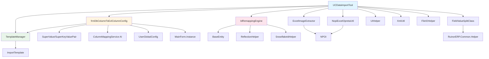

# UCDataImportTool 数据导入体系 - 完整依赖分析报告

**生成时间**: 2026-04-18  
**分析范围**: 
- 第一套：RUINORERP.UI.DevTools.UCDataImportTool 及相关组件
- 第二套：RUINORERP.Business.ImportEngine + RUINORERP.UI.SysConfig.DataMigration
**文档版本**: v2.0（已整合两套体系）

---

## 📋 目录

1. [系统概述](#系统概述)
2. [第一套体系：UCDataImportTool（传统方式）](#第一套体系ucdataimporttool传统方式)
3. [第二套体系：ImportEngine + DataMigration（现代化架构）](#第二套体系importengine--datamigration现代化架构)
4. [两套体系对比分析](#两套体系对比分析)
5. [详细依赖关系](#详细依赖关系)
6. [业务流程分析](#业务流程分析)
7. [架构问题与建议](#架构问题与建议)
8. [清理合并路线图](#清理合并路线图)

---

## 系统概述

### 背景说明
RUINORERP系统目前存在**两套数据导入体系**，分别代表了不同时期的技术选型和架构理念：

- **第一套（UCDataImportTool）**：传统的WinForms交互式导入工具，采用XML配置和窗体驱动
- **第二套（ImportEngine）**：现代化的分层架构导入引擎，采用JSON配置和依赖注入

本分析报告将全面梳理两套体系的依赖关系、优缺点，并提供合并建议。

### 相关文档
- 📘 **本文档**：[UCDataImportTool_依赖分析报告.md](./UCDataImportTool_依赖分析报告.md) - 第一套体系完整分析
- 📗 **配套文档**：[ImportEngine_DataMigration_依赖分析报告.md](./ImportEngine_DataMigration_依赖分析报告.md) - 第二套体系完整分析

---

## 第一套体系：UCDataImportTool（传统方式）

> ⚠️ **注意**：第一套体系的详细组件清单、依赖关系、业务流程请参见上文原始内容。

### 核心特点
- **UI交互**：多窗口切换，ListBox拖拽配置列映射
- **配置方式**：XML文件存储列映射配置
- **导入模式**：同步阻塞式，逐行插入/更新
- **优势功能**：AI智能匹配、图片提取、CSV支持

---

## 第二套体系：ImportEngine + DataMigration（现代化架构）

> 📖 **详细说明**：第二套体系的完整分析已独立成文，请点击查看：
> **[ImportEngine_DataMigration_依赖分析报告.md](./ImportEngine_DataMigration_依赖分析报告.md)**

### 核心特点
- **UI交互**：单窗口集中管理，CheckedListBox多选方案
- **配置方式**：JSON Profile配置驱动
- **导入模式**：异步非阻塞，批量Upsert优化
- **优势功能**：拓扑排序、宽表拆分、短事务优化

---

## 系统概述

### 功能定位
UCDataImportTool 是 RUINORERP 系统的通用数据导入工具，提供以下核心能力：
- Excel/CSV 文件解析与数据预览
- 智能列映射配置（支持手动/AI/模板三种模式）
- 图片提取与关联
- ID 重映射与外键自动修正
- 主子表级联导入
- 数据验证与差异对比

### 技术栈
- **UI框架**: WinForms (.NET Framework / .NET 8)
- **ORM**: SqlSugar
- **Excel处理**: NPOI (通过 HLH.Lib.Office.Excel)
- **AI服务**: 自研 ColumnMappingService
- **ID生成**: SnowflakeIdHelper

---

## 核心组件清单

### 一、UI层组件 (RUINORERP.UI)

#### 1. UCDataImportTool.cs
- **路径**: `RUINORERP.UI/DevTools/UCDataImportTool.cs`
- **类型**: UserControl
- **职责**: 数据导入主界面，协调所有导入流程
- **关联文件**:
  - `UCDataImportTool.Designer.cs` - UI布局定义
  - `UCDataImportTool.resx` - 资源文件

#### 2. frmDbColumnToExlColumnConfig.cs
- **路径**: `RUINORERP.UI/DevTools/frmDbColumnToExlColumnConfig.cs`
- **类型**: Form (对话框)
- **职责**: 列映射配置界面，支持手动拖拽/AI匹配/模板加载
- **关联文件**:
  - `frmDbColumnToExlColumnConfig.designer.cs`
  - `frmDbColumnToExlColumnConfig.resx`

#### 3. UCDataCleanupTool.cs (可选独立模块)
- **路径**: `RUINORERP.UI/DevTools/UCDataCleanupTool.cs`
- **类型**: UserControl
- **职责**: 数据清理工具（与导入体系相对独立）
- **状态**: ⚠️ 建议评估是否保留或迁移

---

### 二、业务逻辑层 (RUINORERP.Business)

#### 1. TemplateManager.cs
```csharp
// 位置: RUINORERP.Business/TemplateManager.cs
public static class TemplateManager
{
    // 管理预定义的导入模板
    public static ImportTemplate GetTemplate(string tableName);
    public static List<string> GetAvailableTemplates();
}
```
**职责**: 
- 集中管理所有表的导入模板配置
- 提供模板注册和查询接口
- 当前实现：硬编码在静态构造函数中

**依赖**:
- `ImportTemplate` - 模板数据结构

---

#### 2. ImportTemplate.cs
```csharp
// 位置: RUINORERP.Business/ImportTemplate.cs
public class ImportTemplate
{
    public string TemplateName { get; set; }
    public string TargetTableName { get; set; }
    public string LogicalKeyField { get; set; }
    public Dictionary<string, string> ColumnMappings { get; set; }
    public Dictionary<string, int> ImageStrategies { get; set; }
    public ChildTableConfig ChildConfig { get; set; }
}
```
**职责**: 
- 定义导入模板的数据结构
- 包含列映射、图片策略、子表配置

**关键字段说明**:
- `LogicalKeyField`: 逻辑主键字段名（用于判断新增/更新）
- `ColumnMappings`: Excel列名 → 数据库字段名的映射
- `ImageStrategies`: 图片列名 → Excel行偏移量的映射
- `ChildConfig`: 主子表级联导入配置

---

#### 3. IdRemappingEngine.cs
```csharp
// 位置: RUINORERP.Business/IdRemappingEngine.cs
public class IdRemappingEngine
{
    public async Task ProcessEntitiesAsync<T>(List<T> entities) where T : BaseEntity;
}
```
**职责**: 
- 解决跨实例/跨环境的ID冲突问题
- 基于逻辑主键进行ID映射（而非物理ID）
- 自动修正外键引用

**核心算法**:
1. **预扫描阶段**: 从目标库加载已存在的逻辑主键→物理ID映射
2. **ID分配阶段**: 
   - 若逻辑主键已存在 → 使用现有ID
   - 若逻辑主键不存在 → 生成新Snowflake ID
3. **外键修正阶段**: 
   - 通过名称查找外键表的ID
   - 替换实体中的外键值

**依赖**:
- `BaseEntity` - 实体基类（提供 LogicalKeyPropertyName, ImportFKRelations）
- `ReflectionHelper` - 反射工具
- `SnowflakeIdHelper` - 分布式ID生成器

---

#### 4. ExcelImageExtractor.cs
```csharp
// 位置: RUINORERP.Business/ExcelImageExtractor.cs
public class ExcelImageExtractor
{
    public static Dictionary<int, byte[]> ExtractImagesFromExcel(string filePath);
    public static Dictionary<string, byte[]> MatchImagesByPattern(List<string> fileNames, string imageDir);
}
```
**职责**: 
- 从Excel文件中提取嵌入的图片
- 支持按文件名规律匹配外部图片文件

**技术实现**:
- 使用 NPOI 的 `XSSFDrawing` API
- 返回 `行号 → 图片字节数组` 的映射

---

#### 5. ColumnMappingService.cs (AI服务)
```csharp
// 位置: RUINORERP.Business/AIServices/DataImport/ColumnMappingService.cs
public class ColumnMappingService : IIntelligentMappingService
{
    public async Task<IntelligentMappingResult> AnalyzeWithMetadataAsync(
        List<string> excelHeaders, 
        List<ImportFieldInfo> dbFields);
}
```
**职责**: 
- 基于语义分析的智能列匹配
- 结合编辑距离和字段描述计算相似度

**依赖**:
- `ImportFieldInfo` - 字段元数据（来自 BaseEntity.ImportableFields）

---

### 三、数据模型层 (RUINORERP.Model)

#### 1. BaseEntity.cs
**关键属性**:
```csharp
public virtual string LogicalKeyPropertyName { get; }  // 逻辑主键属性名
public virtual List<ImportFieldInfo> ImportableFields { get; }  // 可导入字段列表
public virtual List<ImportFKRelation> ImportFKRelations { get; }  // 外键关系列表
```

**关键方法**:
```csharp
public string GetPrimaryKeyColName();  // 获取物理主键列名
```

---

#### 2. ImportFieldInfo.cs
```csharp
public class ImportFieldInfo
{
    public string PropertyName { get; set; }      // 属性名
    public string ColumnName { get; set; }         // 数据库列名
    public string Description { get; set; }        // 中文描述
    public Type ColDataType { get; set; }          // 数据类型
    public bool IsPrimaryKey { get; set; }         // 是否主键
    public SugarColumn SugarCol { get; set; }      // SqlSugar列特性
}
```

---

#### 3. ImportFKRelation.cs
```csharp
public class ImportFKRelation
{
    public string PropertyName { get; set; }       // 外键属性名
    public string FKTableName { get; set; }        // 外键关联表名
    public string FKLogicalKeyField { get; set; }  // 外键表的逻辑主键
}
```

---

### 四、辅助工具层

#### 1. SuperValue / SuperKeyValuePair
```csharp
// 位置: HLH.Lib/Helper/SuperKeyValuePair.cs
public class SuperValue
{
    public string superStrValue { get; set; }
    public string superDataTypeName { get; set; }
    public object Tag { get; set; }
}

public class SuperKeyValuePair
{
    public SuperValue Key { get; set; }    // 数据库字段
    public SuperValue Value { get; set; }  // Excel列名
    public object Tag { get; set; }        // 标记（如是否为主键）
}
```
**用途**: 
- 存储列映射关系
- 支持XML序列化保存到配置文件

**⚠️ 问题**: 
- 命名不规范（super前缀无意义）
- 可用标准 `Dictionary<string, string>` 替代

---

#### 2. ReflectionHelper
```csharp
// 位置: RUINORERP.Common/Helper/ReflectionHelper.cs
public static class ReflectionHelper
{
    public static object GetPropertyValue(object obj, string propertyName);
    public static void SetPropertyValue(object obj, string propertyName, object value);
}
```
**用途**: 
- 动态读写实体属性
- 在ID重映射和外键修正中广泛使用

---

#### 3. UIHelper
```csharp
// 位置: RUINORERP.UI/Common/UIHelper.cs
public static class UIHelper
{
    public static string GetPrimaryKeyColName(Type entityType);
    public static List<BaseDtoField> GetALLFieldInfoList(Type entityType);
}
```
**用途**: 
- 获取实体的主键列名
- 获取所有字段的元数据信息

---

#### 4. UserGlobalConfig
```csharp
// 位置: RUINORERP.UI/UserGlobalConfig.cs
public class UserGlobalConfig
{
    public string MatchColumnsConfigDir { get; set; }  // 列映射配置文件目录
    // ... 其他用户配置
}
```
**用途**: 
- 存储列映射XML配置文件的保存路径
- 默认路径: `%APPDATA%/RUINORERP/MatchColumnsConfig/`

**⚠️ 问题**: 
- 配置文件方式已过时，应迁移到数据库存储（ImportTemplate）

---

#### 5. 第三方库依赖

| 库名 | 命名空间 | 用途 |
|------|---------|------|
| NPOI | `NPOI.SS.UserModel` | Excel文件解析和图片提取 |
| SqlSugar | `SqlSugar` | ORM框架，数据库操作 |
| HLH.Lib | `HLH.Lib.*` | 内部工具库（Excel操作、XML序列化等） |

---

## 详细依赖关系

### 依赖关系图



### 调用链分析

#### 场景1: 导入Excel文件
```
UCDataImportTool.buttonEx1_Click()
  └─> ImportData()
       ├─> OpenFileDialog (选择文件)
       ├─> NopiExcelOpretaUtil.ExcelToTable() [解析Excel]
       ├─> ExcelImageExtractor.ExtractImagesFromExcel() [提取图片]
       └─> dataGridView1.DataSource = dt [显示数据]
```

#### 场景2: 配置列映射
```
UCDataImportTool.buttonEx2_Click()
  └─> new frmDbColumnToExlColumnConfig()
       ├─> TemplateManager.GetTemplate() [尝试加载模板]
       │    └─> frm.ApplyTemplate() [应用模板映射]
       ├─> frm.AutoMatchColumns() [智能匹配]
       │    └─> CalculateSmartSimilarity() [计算相似度]
       └─> frm.Show() [显示配置界面]
            └─> 用户手动调整映射
                 └─> btnSaveMatchResult_Click()
                      └─> XmlUtil.Serializer() [保存为XML]
```

#### 场景3: 执行数据导入
```
UCDataImportTool.btn保存结果_Click()
  └─> UpdateDataToDBForSave()
       ├─> bindingSource结果.DataSource [获取待保存数据]
       ├─> IdRemappingEngine.ProcessEntitiesAsync() [ID重映射]
       │    ├─> LoadExistingLogicalKeysAsync() [预扫描]
       │    ├─> AssignOrMapId() [分配ID]
       │    └─> ResolveForeignKeysByNameAsync() [修正外键]
       ├─> 遍历实体列表
       │    ├─> if ID == 0 → Insertable().ExecuteCommandAsync()
       │    └─> else → Updateable().ExecuteCommandAsync()
       └─> 事务提交
```

---

## 业务流程分析

### 完整导入流程图

```
┌─────────────────────┐
│  1. 选择导入文件     │
│  (Excel/CSV)        │
└──────────┬──────────┘
           │
           ▼
┌─────────────────────┐
│  2. 解析文件内容     │
│  - 读取表格数据      │
│  - 提取嵌入图片      │
│  - 显示到dataGridView1│
└──────────┬──────────┘
           │
           ▼
┌─────────────────────┐
│  3. 选择目标数据表   │
│  cmb导入所属数据表   │
└──────────┬──────────┘
           │
           ▼
┌─────────────────────┐
│  4. 配置列映射       │
│  点击"确定操作数据列"│
└──────────┬──────────┘
           │
           ▼
┌──────────────────────────────┐
│  5. 打开列映射配置窗体        │
│  frmDbColumnToExlColumnConfig │
└──────────┬───────────────────┘
           │
           ├──► 方式A: 加载预定义模板
           │    TemplateManager.GetTemplate()
           │
           ├──► 方式B: AI智能匹配
           │    ColumnMappingService.AnalyzeWithMetadataAsync()
           │
           └──► 方式C: 手动拖拽匹配
                双击 ListBox 项进行配对
           
           │
           ▼
┌─────────────────────┐
│  6. 保存映射配置     │
│  (可选,保存为XML)    │
└──────────┬──────────┘
           │
           ▼
┌─────────────────────┐
│  7. 预览导入结果     │
│  点击"查看结果"      │
│  UpdateDataToDBForView()│
│  - 创建实体对象      │
│  - 类型转换          │
│  - 标记差异行        │
└──────────┬──────────┘
           │
           ▼
┌─────────────────────┐
│  8. 执行数据入库     │
│  点击"保存结果"      │
│  UpdateDataToDBForSave()│
└──────────┬──────────┘
           │
           ▼
┌─────────────────────┐
│  9. ID重映射引擎     │
│  IdRemappingEngine  │
│  - 预扫描逻辑主键    │
│  - 分配/映射ID      │
│  - 修正外键引用      │
└──────────┬──────────┘
           │
           ▼
┌─────────────────────┐
│  10. 批量写入数据库  │
│  - 事务处理          │
│  - 新增/更新判断     │
│  - 异常回滚          │
└──────────┬──────────┘
           │
           ▼
┌─────────────────────┐
│  ✅ 导入完成         │
│  显示影响行数        │
└─────────────────────┘
```

---

## 架构问题与建议

### 🔴 严重问题

#### 1. 配置文件 vs 数据库存储
**现状**: 
- 列映射配置保存为XML文件 (`UserGlobalConfig.MatchColumnsConfigDir`)
- 预定义模板硬编码在 `TemplateManager` 中

**问题**:
- XML文件难以维护和版本控制
- 无法在多用户间共享配置
- 硬编码模板需要重新编译才能修改

**建议**:
```csharp
// 迁移到数据库表 tb_ImportTemplate
public class ImportTemplateService
{
    public async Task<ImportTemplate> GetTemplateAsync(string tableName);
    public async Task SaveTemplateAsync(ImportTemplate template);
    public async Task<List<string>> GetUserTemplatesAsync(string userId);
}
```

---

#### 2. SuperValue/SuperKeyValuePair 设计缺陷
**现状**:
```csharp
public class SuperValue
{
    public string superStrValue { get; set; }  // 命名不规范
    public string superDataTypeName { get; set; }
    public object Tag { get; set; }
}
```

**问题**:
- 命名不符合C#规范（应为 PascalCase）
- 功能可用 `Tuple<string, string>` 或自定义Record替代
- Tag字段类型不安全

**建议**:
```csharp
// 替换为 Record
public record ColumnMapping(
    string DbColumnName,
    string ExcelColumnName,
    string DataType,
    bool IsLogicalKey = false
);

// 使用 Dictionary 替代 List<SuperKeyValuePair>
var mappings = new Dictionary<string, ColumnMapping>();
```

---

#### 3. 窗体耦合度过高
**现状**:
- `UCDataImportTool` 直接实例化 `frmDbColumnToExlColumnConfig`
- 通过公开字段 `frm.dvExcel` 传递数据

**问题**:
- 违反依赖倒置原则
- 难以单元测试
- 窗体间强耦合

**建议**:
```csharp
// 引入接口抽象
public interface IColumnMappingService
{
    Task<Dictionary<string, string>> ConfigureMappingAsync(
        DataTable sourceData, 
        string targetTable);
}

// UCDataImportTool 依赖接口而非具体窗体
private readonly IColumnMappingService _mappingService;

// 实现类封装窗体逻辑
public class WinFormsColumnMappingService : IColumnMappingService
{
    public async Task<Dictionary<string, string>> ConfigureMappingAsync(...)
    {
        var frm = new frmDbColumnToExlColumnConfig();
        // ... 配置并显示
        return result;
    }
}
```

---

### 🟡 中等问题

#### 4. 缺少统一的错误处理
**现状**:
```csharp
try
{
    // 导入逻辑
}
catch (Exception ex)
{
    MessageBox.Show(ex.Message);  // 简单弹窗
}
```

**建议**:
```csharp
public class ImportError
{
    public int RowIndex { get; set; }
    public string ColumnName { get; set; }
    public string ErrorMessage { get; set; }
    public ErrorSeverity Severity { get; set; }
}

public class ImportResult
{
    public int SuccessCount { get; set; }
    public int FailedCount { get; set; }
    public List<ImportError> Errors { get; set; }
}
```

---

#### 5. 性能瓶颈
**现状**:
- 逐行插入/更新数据库
- 每次导入都查询逻辑主键映射

**建议**:
```csharp
// 使用 SqlSugar 批量操作
await _db.Insertable(entities).ExecuteBulkCopyAsync();
await _db.Updateable(entities).ExecuteBatchAsync(1000);

// 缓存逻辑主键映射（带过期策略）
private static MemoryCache _logicalKeyCache = new MemoryCache(
    new MemoryCacheOptions { SizeLimit = 1024 }
);
```

---

#### 6. 日志记录不完善
**现状**:
```csharp
MainForm.Instance.PrintInfoLog("导入操作耗时：" + ts.TotalSeconds);
```

**建议**:
```csharp
// 引入结构化日志
_logger.LogInformation(
    "数据导入完成 | 表:{Table} | 成功:{Success} | 失败:{Failed} | 耗时:{Elapsed}ms",
    tableName, successCount, failedCount, elapsedMs);
```

---

### 🟢 优化建议

#### 7. 引入导入任务队列
**现状**: 同步阻塞式导入

**建议**:
```csharp
public class ImportTaskQueue
{
    private readonly Channel<ImportJob> _queue;
    
    public async Task<Guid> SubmitImportAsync(ImportRequest request)
    {
        var jobId = Guid.NewGuid();
        await _queue.WriteAsync(new ImportJob { Id = jobId, Request = request });
        return jobId;
    }
    
    public async Task<ImportStatus> GetStatusAsync(Guid jobId);
}
```

---

#### 8. 支持导入规则引擎
**现状**: 硬编码的类型转换逻辑

**建议**:
```csharp
public interface IImportRule
{
    bool CanApply(ColumnMapping mapping);
    object Transform(object value);
}

// 示例规则
public class DateTransformRule : IImportRule
{
    public object Transform(object value)
    {
        if (value is string str && str.Length == 5)
            return DateTime.FromOADate(Convert.ToInt32(str));
        return value;
    }
}
```

---

## 清理合并路线图

### 第一阶段：基础设施重构 (1-2周)

#### ✅ 任务1.1: 迁移模板存储到数据库
```sql
CREATE TABLE tb_ImportTemplate (
    ID BIGINT PRIMARY KEY,
    TableName NVARCHAR(100) NOT NULL,
    TemplateName NVARCHAR(200),
    LogicalKeyField NVARCHAR(100),
    ColumnMappings NVARCHAR(MAX),  -- JSON格式
    ImageStrategies NVARCHAR(MAX), -- JSON格式
    ChildConfig NVARCHAR(MAX),     -- JSON格式
    CreatedBy NVARCHAR(50),
    CreatedTime DATETIME,
    IsActive BIT DEFAULT 1
);
```

**实施步骤**:
1. 创建 `ImportTemplateService` 替代 `TemplateManager`
2. 将现有硬编码模板迁移到数据库
3. 添加模板管理UI（增删改查）
4. 删除 `UserGlobalConfig.MatchColumnsConfigDir` 相关代码

---

#### ✅ 任务1.2: 重构 SuperValue/SuperKeyValuePair
**实施步骤**:
1. 定义新的 `ColumnMapping` Record
2. 修改 `frmDbColumnToExlColumnConfig` 使用新类型
3. XML序列化改为JSON序列化
4. 逐步废弃旧类（标记为 `[Obsolete]`）

---

### 第二阶段：架构解耦 (2-3周)

#### ✅ 任务2.1: 引入依赖注入
**实施步骤**:
```csharp
// 注册服务
services.AddScoped<IColumnMappingService, WinFormsColumnMappingService>();
services.AddScoped<IImportExecutor, DefaultImportExecutor>();
services.AddSingleton<IdRemappingEngine>();

// UCDataImportTool 构造函数注入
public partial class UCDataImportTool : UserControl
{
    private readonly IColumnMappingService _mappingService;
    private readonly IImportExecutor _importExecutor;
    
    public UCDataImportTool(
        IColumnMappingService mappingService,
        IImportExecutor importExecutor)
    {
        InitializeComponent();
        _mappingService = mappingService;
        _importExecutor = importExecutor;
    }
}
```

---

#### ✅ 任务2.2: 拆分 frmDbColumnToExlColumnConfig
**目标**: 将窗体拆分为独立的UserControl，嵌入到 UCDataImportTool

**实施步骤**:
1. 创建 `UCColumnMappingConfig : UserControl`
2. 将 `frmDbColumnToExlColumnConfig` 的逻辑迁移到新控件
3. 在 `UCDataImportTool` 中使用 TabControl 或 SplitContainer 嵌入
4. 删除独立的 Form 窗口

**优势**:
- 减少窗口切换
- 更好的用户体验
- 降低耦合度

---

### 第三阶段：功能增强 (2-3周)

#### ✅ 任务3.1: 实现导入任务队列
**实施步骤**:
1. 创建 `ImportTaskQueue` 类
2. 使用 `System.Threading.Channels` 实现异步队列
3. 添加进度反馈机制（Progress<T>）
4. 支持取消操作（CancellationToken）

---

#### ✅ 任务3.2: 增强错误处理
**实施步骤**:
1. 定义 `ImportError` 和 `ImportResult` 类
2. 修改 `UpdateDataToDBForSave()` 返回 `ImportResult`
3. 在UI中显示详细的错误报告
4. 支持导出错误日志为Excel

---

#### ✅ 任务3.3: 性能优化
**实施步骤**:
1. 使用 `ExecuteBulkCopyAsync` 批量插入
2. 实现逻辑主键映射缓存（MemoryCache）
3. 异步加载大数据集（分页预览）
4. 添加性能监控指标

---

### 第四阶段：清理与文档 (1周)

#### ✅ 任务4.1: 删除废弃代码
**待删除文件**:
- [ ] `UCDataCleanupTool.cs` (如果确认不需要)
- [ ] XML配置文件相关逻辑
- [ ] `SuperValue` 和 `SuperKeyValuePair` (标记Obsolete后下个版本删除)

**待重构文件**:
- [ ] `TemplateManager.cs` → 改为从数据库读取
- [ ] `UCDataImportTool.cs` → 移除对 frmDbColumnToExlColumnConfig 的直接依赖

---

#### ✅ 任务4.2: 编写技术文档
**文档清单**:
- [ ] API使用指南
- [ ] 自定义导入规则开发手册
- [ ] 故障排查指南
- [ ] 性能调优最佳实践

---

## 附录

### A. 关键API参考

#### TemplateManager
```csharp
// 获取模板
var template = TemplateManager.GetTemplate("tb_Prod");

// 获取所有可用模板
var templates = TemplateManager.GetAvailableTemplates();
```

#### IdRemappingEngine
```csharp
var engine = new IdRemappingEngine(db);
await engine.ProcessEntitiesAsync(productList);

// 查看ID映射关系
foreach (var mapping in engine.IdMapping)
{
    Console.WriteLine($"Old ID: {mapping.Key} → New ID: {mapping.Value}");
}
```

#### ExcelImageExtractor
```csharp
var images = ExcelImageExtractor.ExtractImagesFromExcel(filePath);
foreach (var kvp in images)
{
    int rowIndex = kvp.Key;
    byte[] imageData = kvp.Value;
    // 保存图片或存储到数据库
}
```

---

### B. 常见问题FAQ

**Q1: 如何处理循环外键引用？**  
A: IdRemappingEngine 会按依赖顺序处理，确保父表先于子表导入。

**Q2: 如何自定义列匹配规则？**  
A: 实现 `IImportRule` 接口并注册到规则引擎。

**Q3: 导入大文件时内存溢出怎么办？**  
A: 启用分页预览模式，并使用流式读取Excel（NPOI Streaming API）。

**Q4: 如何回滚失败的导入？**  
A: 所有导入操作都在事务中执行，失败时自动回滚。

---

### C. 参考资料

- [SqlSugar官方文档](http://www.donet5.com/)
- [NPOI GitHub](https://github.com/nissl-lab/npoi)
- [WinForms最佳实践](https://docs.microsoft.com/en-us/dotnet/desktop/winforms/)

---

## 两套体系对比总结

### 核心差异

| 维度 | 第一套 (UCDataImportTool) | 第二套 (ImportEngine) |
|------|--------------------------|----------------------|
| **架构风格** | 传统WinForms紧耦合 | 分层架构+依赖注入 |
| **配置方式** | XML文件 + 硬编码模板 | JSON Profile配置驱动 |
| **UI交互** | 多窗口切换（Form对话框） | 单窗口集中管理 |
| **导入模式** | 同步阻塞 | 异步非阻塞 (async/await) |
| **事务策略** | 长事务（包含存在性检查） | 短事务优化（分离检查与写入） |
| **多表支持** | 手动配置主子表 | 自动依赖排序+宽表拆分 |
| **错误处理** | MessageBox简单弹窗 | 结构化ImportReport |
| **可测试性** | ❌ 难以单元测试 | ✅ 接口抽象，易于Mock |
| **扩展性** | ❌ 修改需重新编译 | ✅ 新增Profile无需改代码 |
| **AI智能匹配** | ✅ 支持 | ❌ 未实现 |
| **图片提取** | ✅ 支持 | ❌ 未实现 |
| **CSV解析** | ✅ 支持 | ❌ 未实现 |
| **拓扑排序** | ❌ 不支持 | ✅ 自动计算导入顺序 |
| **宽表拆分** | ❌ 不支持 | ✅ 自动拆分多表数据 |

### 整合建议

**推荐方案**：以第二套为基础架构，融合第一套的优势功能

#### 阶段1：功能补充（1-2周）
1. 在 `ExcelParserService` 中添加CSV解析支持
2. 集成第一套的 `ExcelImageExtractor` 图片提取功能
3. 开发AI辅助配置工具，调用第一套的AI服务

#### 阶段2：UI整合（3-4周）
1. 合并两个窗体为统一入口
2. 提供新手模式（可视化配置）和专家模式（JSON编辑）
3. 优化用户体验，减少学习成本

#### 阶段3：配置迁移（5-6周）
1. 开发XML→JSON迁移工具
2. 迁移现有用户配置
3. 编写迁移指南文档

#### 阶段4：清理与测试（7-8周）
1. 标记第一套为 `[Obsolete]`
2. 全面回归测试
3. 更新用户手册

### 最终结论

✅ **保留第二套作为核心架构**：现代化设计、性能优异、易于维护  
✅ **融合第一套的优秀功能**：AI匹配、图片提取、CSV支持  
✅ **逐步淘汰旧代码**：标记过时、迁移配置、最终删除

---

**文档维护者**: AI Assistant  
**最后更新**: 2026-04-18  
**下次审查日期**: 2026-05-18
