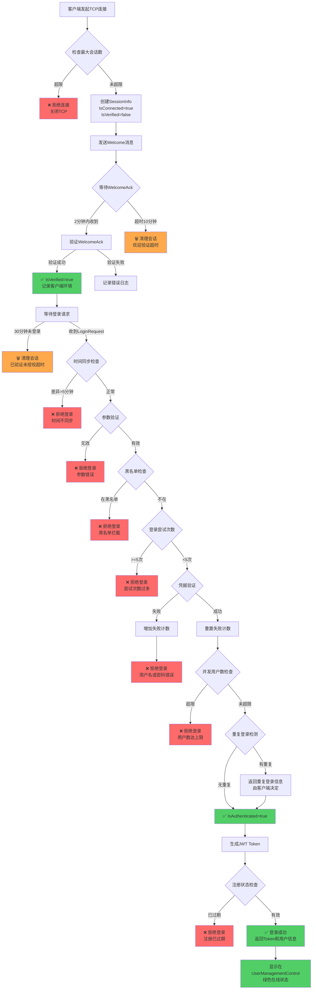

# RUINORERP 系统客户端连接、会话建立及用户登录授权完整流程分析

**文档版本**: v1.0  
**创建日期**: 2026-04-14  
**最后更新**: 2026-04-14  
**作者**: AI Code Review Team  

---

## 📋 目录

1. [整体架构概览](#整体架构概览)
2. [阶段一：连接与欢迎验证（初步筛选）](#阶段一连接与欢迎验证初步筛选)
3. [阶段二：身份认证与授权（正式登录）](#阶段二身份认证与授权正式登录)
4. [阶段三：会话状态与维护](#阶段三会话状态与维护)
5. [IP黑名单机制详解](#ip黑名单机制详解)
6. [非法用户拒绝 vs 合法连接授权失败](#非法用户拒绝-vs-合法连接授权失败)
7. [流程图总结](#流程图总结)
8. [代码优化建议](#代码优化建议)

---

## 整体架构概览

RUINORERP系统采用**三层会话管理机制**:

```
┌─────────────────────────────────────────────────────┐
│              客户端 (Client)                         │
│  TCP连接 → 发送WelcomeAck → 提交LoginRequest        │
└──────────────────┬──────────────────────────────────┘
                   │ SuperSocket通信
                   ▼
┌─────────────────────────────────────────────────────┐
│         服务器端网络层 (Network Layer)               │
│  ├─ SessionService.cs       ← 会话生命周期管理      │
│  ├─ ClientResponseHandler   ← 响应处理(WelcomeAck)  │
│  └─ LoginCommandHandler     ← 登录业务逻辑          │
└──────────────────┬──────────────────────────────────┘
                   │
                   ▼
┌─────────────────────────────────────────────────────┐
│         业务服务层 (Business Layer)                  │
│  ├─ UserService             ← 用户凭据验证          │
│  ├─ TokenService            ← JWT Token生成         │
│  ├─ RegistrationService     ← 注册信息验证          │
│  └─ BlacklistManager        ← IP黑名单管理          │
└─────────────────────────────────────────────────────┘
```

### 核心组件说明

| 组件 | 文件路径 | 职责 |
|------|---------|------|
| **SessionService** | `RUINORERP.Server/Network/Services/SessionService.cs` | 会话生命周期管理、超时清理、心跳检查 |
| **ClientResponseHandler** | `RUINORERP.Server/Network/Services/ClientResponseHandler.cs` | 处理客户端响应（WelcomeAck等） |
| **LoginCommandHandler** | `RUINORERP.Server/Network/CommandHandlers/LoginCommandHandler.cs` | 登录业务逻辑、凭据验证、重复登录检测 |
| **BlacklistManager** | `RUINORERP.Server/Comm/BlacklistManager.cs` | IP黑名单管理 |
| **UserManagementControl** | `RUINORERP.Server/Controls/UserManagementControl.cs` | UI显示在线用户列表 |

---

## 阶段一：连接与欢迎验证（初步筛选）

### 1.1 TCP连接建立

**触发点**: 客户端通过SuperSocket建立TCP连接到服务器

**代码位置**: [`SessionService.cs:468-536`](file://e:/CodeRepository/SynologyDrive/RUINORERP/RUINORERP.Server/Network/Services/SessionService.cs#L468-L536) `OnSessionConnectedAsync(IAppSession session)`

**处理流程**:

```csharp
// 1. 检查最大会话数限制
if (ActiveSessionCount >= MaxSessionCount) {
    await session.CloseAsync(CloseReason.ServerShutdown);
    return; // ← 直接拒绝，不创建会话
}

// 2. 创建SessionInfo对象
SessionInfo sessionInfo = session as SessionInfo;
sessionInfo.ConnectedTime = DateTime.Now;
sessionInfo.IsConnected = true;
sessionInfo.IsVerified = false;        // ← 初始状态：未验证
sessionInfo.IsAuthenticated = false;   // ← 初始状态：未认证

// 3. 存储到会话字典
_sessions.TryAdd(session.SessionID, sessionInfo);

// 4. 触发后续欢迎流程
await OnSessionConnectedAsync(sessionInfo);
```

**关键判定**:
- ✅ **合法连接**: 会话成功创建并加入 `_sessions` 字典
- ❌ **非法连接**: 
  - 达到最大会话数限制 (`MaxSessionCount`, 默认1000)
  - 会话转换失败 (`session as SessionInfo` 返回null)
  - SessionID已存在(重复连接)

---

### 1.2 发送欢迎消息（Welcome）

**代码位置**: [`SessionService.cs:543-605`](file://e:/CodeRepository/SynologyDrive/RUINORERP/RUINORERP.Server/Network/Services/SessionService.cs#L543-L605) `OnSessionConnectedAsync(SessionInfo sessionInfo)` + `SendWelcomeMessageAsync()`

**处理流程**:

```csharp
public async Task OnSessionConnectedAsync(SessionInfo sessionInfo)
{
    // 跳过已认证的会话（重连场景）
    if (sessionInfo.IsAuthenticated) return;

    // 初始化欢迎流程状态
    sessionInfo.IsVerified = false;
    sessionInfo.WelcomeSentTime = DateTime.Now;  // ← 记录发送时间
    sessionInfo.WelcomeAckReceived = false;

    // 发送欢迎消息（不等待响应）
    await SendWelcomeMessageAsync(sessionInfo);
}

private async Task SendWelcomeMessageAsync(SessionInfo sessionInfo)
{
    var serverConfig = Startup.GetFromFac<ServerGlobalConfig>();
    string announcement = serverConfig?.Announcement ?? "欢迎使用RUINORERP系统！";

    var welcomeRequest = WelcomeRequest.CreateWithAnnouncement(
        sessionInfo.SessionID,
        GetServerVersion(),
        announcement
    );

    // 发送即完成模式，避免阻塞
    await SendPacketCoreAsync(
        sessionInfo,
        SystemCommands.Welcome,
        welcomeRequest,
        5000,  // 5秒超时
        CancellationToken.None,
        PacketDirection.ServerRequest
    );
    
    // ⚠️ 注意：此时 IsVerified 仍为 false
    // 只有收到客户端的 WelcomeAck 后才会设置为 true
}
```

**数据包内容**:
```json
{
  "CommandId": "SystemCommands.Welcome",
  "Request": {
    "SessionId": "xxx-xxx-xxx",
    "ServerVersion": "1.0.0.0",
    "Announcement": "欢迎使用RUINORERP系统！"
  }
}
```

---

### 1.3 客户端响应欢迎确认（WelcomeAck）

**代码位置**: [`ClientResponseHandler.cs:189-262`](file://e:/CodeRepository/SynologyDrive/RUINORERP/RUINORERP.Server/Network/Services/ClientResponseHandler.cs#L189-L262) `HandleWelcomeAckAsync()`

**处理流程**:

```csharp
private ResponseProcessingResult HandleWelcomeAckAsync(PacketModel packet, SessionInfo sessionInfo)
{
    // 1. 验证响应类型
    if (!(packet.Response is WelcomeResponse welcomeResponse)) {
        return ResponseProcessingResult.Failure("响应类型不匹配");
    }

    // 2. 防止重复验证
    if (sessionInfo.IsVerified) {
        return ResponseProcessingResult.Success("会话已验证（重复确认）");
    }

    // 3. 检查欢迎消息是否已发送
    if (!sessionInfo.WelcomeSentTime.HasValue) {
        return ResponseProcessingResult.Failure("欢迎消息未发送");
    }

    // 4. 检查超时（2分钟）
    var welcomeTimeout = TimeSpan.FromMinutes(2);
    if (sessionInfo.WelcomeSentTime.Value.Add(welcomeTimeout) < DateTime.Now) {
        return ResponseProcessingResult.Failure("欢迎确认超时");
    }

    // 5. 记录客户端环境信息
    sessionInfo.UserInfo = new CurrentUserInfo();
    sessionInfo.UserInfo.客户端版本 = welcomeResponse.ClientVersion;
    sessionInfo.UserInfo.操作系统 = welcomeResponse.ClientOS;
    sessionInfo.UserInfo.机器名 = welcomeResponse.ClientMachineName;
    sessionInfo.UserInfo.CPU信息 = welcomeResponse.ClientCPU;
    sessionInfo.UserInfo.内存大小 = $"{welcomeResponse.ClientMemoryMB / 1024:F1} GB";

    // 6. ✅ 标记为已验证（关键步骤）
    sessionInfo.IsVerified = true;
    sessionInfo.WelcomeAckReceived = true;
    sessionInfo.Status = SessionStatus.Active;

    return ResponseProcessingResult.Success("欢迎握手成功");
}
```

**IsVerified 判定标准**:
- ✅ **true**: 客户端成功响应WelcomeAck，且在2分钟内
- ❌ **false**: 
  - 未收到WelcomeAck
  - WelcomeAck超时(>2分钟)
  - 响应类型错误
  - 欢迎消息未发送就收到响应

---

### 1.4 未通过欢迎验证的会话处理

**代码位置**: [`SessionService.cs:1380-1389`](file://e:/CodeRepository/SynologyDrive/RUINORERP/RUINORERP.Server/Network/Services/SessionService.cs#L1380-L1389) `CleanupTimeoutSessions()`

**清理策略**:

```csharp
// 定时清理任务（每5分钟执行一次）
public int CleanupTimeoutSessions()
{
    // 检查2: 未验证会话（欢迎回复超时10分钟后强制断开）
    if (!session.IsVerified &&
        !session.WelcomeAckReceived &&
        session.WelcomeSentTime.HasValue &&
        session.WelcomeSentTime.Value.AddMinutes(10) < currentTime)
    {
        timeoutSessions.Add(session);
        _logger.LogWarning($"[欢迎超时-定时检查] SessionID={session.SessionID}, IP={session.ClientIp}");
    }
}
```

**处理结果**:
- ⏱️ **超时时间**: 10分钟（从发送Welcome开始计算）
- 🗑️ **处理方式**: 调用 `RemoveSession()` 彻底移除会话
- 📝 **日志记录**: `[欢迎超时-定时检查]` 警告日志

---

### 1.5 IP黑名单机制（当前实现情况）

**代码位置**: [`BlacklistManager.cs`](file://e:/CodeRepository/SynologyDrive/RUINORERP/RUINORERP.Server/Comm/BlacklistManager.cs)

**功能状态**: ✅ **已实现但未在欢迎流程中启用**

**现有能力**:

```csharp
public class BlacklistManager
{
    private static readonly ConcurrentDictionary<string, DateTime> _bannedIPs;
    
    // 封禁IP（带过期时间）
    public static void BanIp(string ip, TimeSpan duration) { ... }
    
    // 检查IP是否被封禁
    public static bool IsIpBanned(string ip) { ... }
    
    // 解封IP
    public static void UnbanIp(string ip) { ... }
    
    // 清理过期的封禁
    public static void CleanupExpiredBans() { ... }
}
```

**⚠️ 问题**: 
- ❌ **未在欢迎流程中调用**: `OnSessionConnectedAsync` 中没有检查IP黑名单
- ❌ **无自动封禁逻辑**: 欢迎验证失败不会自动加入黑名单
- ✅ **手动管理界面**: 可通过 `BlacklistManagementControl` UI手动添加/移除

---

## 阶段二：身份认证与授权（正式登录）

### 2.1 前置条件检查

在进入登录流程前，必须满足:
- ✅ `IsVerified == true` (已通过欢迎验证)
- ✅ TCP连接正常 (`IsConnected == true`)
- ✅ 会话存在于 `_sessions` 字典中

**代码位置**: [`LoginCommandHandler.cs:254-441`](file://e:/CodeRepository/SynologyDrive/RUINORERP/RUINORERP.Server/Network/CommandHandlers/LoginCommandHandler.cs#L254-L441) `ProcessLoginAsync()`

---

### 2.2 登录验证流程（按顺序执行）

#### 步骤1: 时间同步检查

```csharp
var serverTime = DateTime.Now;
var clientTime = loginRequest.LoginTime;
var timeDifference = Math.Abs((serverTime - clientTime).TotalSeconds);

const double timeDifferenceThreshold = 300.0; // 5分钟
if (timeDifference > timeDifferenceThreshold)
{
    return ResponseFactory.CreateSpecificErrorResponse(
        executionContext, 
        $"客户端时间与服务器时间差异过大 ({timeDifference:F0}秒)，请校准系统时间"
    );
}
```

**判定**: ❌ 时间差 > 5分钟 → 拒绝登录

---

#### 步骤2: 参数验证

```csharp
if (!loginRequest.IsValid())
{
    return ResponseFactory.CreateSpecificErrorResponse(
        executionContext, 
        "用户名和密码不能为空"
    );
}
```

**判定**: ❌ 用户名为空或密码为空 → 拒绝登录

---

#### 步骤3: 黑名单检查

```csharp
if (IsUserBlacklisted(loginRequest.Username, loginRequest.ClientIp))
{
    logger?.LogWarning($"[登录失败] 用户或IP在黑名单中: Username={loginRequest.Username}, ClientIp={loginRequest.ClientIp}");
    return ResponseFactory.CreateSpecificErrorResponse(executionContext, "用户或IP在黑名单中");
}
```

**判定**: ❌ 用户名或IP在黑名单 → 拒绝登录

**黑名单来源**:
- 手动添加（通过UI管理界面）
- 登录失败次数过多（见步骤5）

---

#### 步骤4: 登录尝试次数检查

```csharp
if (GetLoginAttempts(loginRequest.Username) >= MaxLoginAttempts) // MaxLoginAttempts = 5
{
    logger?.LogWarning($"[登录失败] 登录尝试次数过多: Username={loginRequest.Username}, Attempts={GetLoginAttempts(loginRequest.Username)}");
    return ResponseFactory.CreateSpecificErrorResponse(executionContext, "登录尝试次数过多，请稍后再试");
}
```

**判定**: ❌ 失败次数 ≥ 5次 → 临时锁定30分钟

**清理机制**:
- 保守式清理：失败次数 < 3 且超过30分钟 → 自动清除记录
- 成功登录后 → 立即重置计数器

---

#### 步骤5: 用户凭据验证

```csharp
var userInfo = await ValidateUserCredentialsAsync(loginRequest, cancellationToken);
if (userInfo == null)
{
    IncrementLoginAttempts(loginRequest.Username); // ← 增加失败计数
    logger?.LogWarning($"[登录失败] 用户名或密码错误: Username={loginRequest.Username}, ClientIp={loginRequest.ClientIp}");
    return ResponseFactory.CreateSpecificErrorResponse(executionContext, "用户名或密码错误");
}

ResetLoginAttempts(loginRequest.Username); // ← 成功后重置
```

**验证内容**:
- 用户名是否存在
- 密码是否正确（加密比对）
- 账号是否被禁用
- 账号是否过期

**判定**: ❌ 凭据无效 → 增加失败计数，返回错误

---

#### 步骤6: 并发用户数检查

```csharp
var authenticatedUserCount = SessionService.GetAllUserSessions()
    .Select(s => s.UserId)
    .Distinct()
    .Count();

if (authenticatedUserCount >= MaxConcurrentUsers) // 从注册信息获取，默认1000
{
    logger?.LogWarning($"[登录失败] 并发用户数已达上限: CurrentCount={authenticatedUserCount}, MaxCount={MaxConcurrentUsers}");
    return ResponseFactory.CreateSpecificErrorResponse(executionContext, $"当前系统用户数已达到上限({MaxConcurrentUsers}人)，请稍后再试");
}
```

**判定**: ❌ 唯一用户数 ≥ 授权数量 → 拒绝登录

**关键点**:
- 统计的是**唯一用户数**（Distinct UserId），不是总会话数
- 允许同一用户多地点登录（通过重复登录检测处理）

---

#### 步骤7: 重复登录检测

```csharp
var (hasExistingSessions, authorizedSessions, duplicateResult) = 
    CheckUserLoginStatus(loginRequest.Username, executionContext.SessionId);

if (duplicateResult.HasDuplicateLogin)
{
    switch (duplicateResult.Type)
    {
        case DuplicateLoginType.LocalOnly:
            // 同一台机器的多个会话
            logger?.LogInformation($"[登录] 用户 {loginRequest.Username} 本地重复登录");
            break;
            
        case DuplicateLoginType.RemoteOnly:
        case DuplicateLoginType.Both:
            // 远程重复登录 - 返回给客户端决定
            logger?.LogWarning($"[登录] 用户 {loginRequest.Username} 存在远程重复登录");
            break;
    }
}
```

**设计原则**: 
- ⚠️ **服务器不主动踢人**，而是将重复登录信息返回给客户端
- 👤 **用户选择权**: 客户端弹出对话框，让用户决定是否强制对方下线
- 🔒 **避免误操作**: 防止服务器端因网络波动误判

**重复登录类型**:
| 类型 | 说明 | 处理方式 |
|------|------|---------|
| `LocalOnly` | 同一IP的多个会话 | 根据配置允许多会话 |
| `RemoteOnly` | 不同IP的会话 | 返回给客户端决定 |
| `Both` | 既有本地又有远程 | 返回给客户端决定 |

---

#### 步骤8: 更新会话状态（认证成功）

```csharp
// 更新会话信息
UpdateSessionInfo(sessionInfo, userInfo);

// ✅ 设置会话授权状态（关键步骤）
sessionInfo.IsAuthenticated = true;

// 持久化到会话服务
SessionService.UpdateSession(sessionInfo);
```

**IsAuthenticated 判定标准**:
- ✅ **true**: 所有验证步骤通过，凭据有效，通过业务规则检查
- ❌ **false**: 任何一步验证失败

---

#### 步骤9: 生成JWT Token

```csharp
var tokenInfo = await GenerateTokenInfoAsync(userInfo, sessionInfo.SessionID, loginRequest.ClientIp);
```

**Token包含信息**:
- UserId
- Username
- SessionId
- ClientIp
- 过期时间
- 签名

---

#### 步骤10: 注册状态检查

```csharp
var registrationStatus = await RegistrationService.GetRegistrationStatusAsync();

if (registrationStatus == RegistrationStatus.Expired)
{
    logger?.LogWarning($"[登录失败] 系统注册已过期: Username={loginRequest.Username}");
    return ResponseFactory.CreateSpecificErrorResponse(executionContext, 
        "系统注册已过期，请联系软件提供商续费");
}
```

**判定**: ❌ 注册过期 → 拒绝所有用户登录

---

#### 步骤11: 返回登录成功响应

```csharp
var loginResponse = new LoginResponse
{
    IsSuccess = true,
    Message = "登录成功",
    UserId = userInfo.User_ID,
    Username = userInfo.UserName,
    SessionId = sessionInfo.SessionID,
    Token = tokenInfo,
    HasDuplicateLogin = duplicateResult.HasDuplicateLogin,
    DuplicateLoginResult = duplicateResult,
    RegistrationStatus = registrationStatus,
    ExpirationReminder = expirationReminder
};

logger?.LogInformation($"[登录成功] Username={loginRequest.Username}, UserId={userInfo.User_ID}, SessionId={sessionInfo.SessionID}");

return loginResponse;
```

---

### 2.3 会话纳入管理范围

**认证成功后**:

1. **SessionService管理**:
   ```csharp
   // 会话已在 _sessions 字典中
   // IsAuthenticated = true 标记为已认证
   ```

2. **UserManagementControl显示**:
   ```csharp
   // GetAllUserSessions() 返回 IsAuthenticated == true 的会话
   var allSessions = _sessionService.GetAllUserSessions().ToList();
   lbl在线用户数.Text = $"在线用户: {allSessions.Count}";
   ```

3. **事件通知**:
   ```csharp
   SessionUpdated?.Invoke(sessionInfo); // ← 触发UI更新
   ```

---

## 阶段三：会话状态与维护

### 3.1 会话状态分类

| 状态 | IsConnected | IsVerified | IsAuthenticated | 说明 | UI表现 |
|------|-------------|------------|-----------------|------|--------|
| **刚连接** | true | false | false | TCP已建立，等待WelcomeAck | ❌ 不显示 |
| **已验证未登录** | true | true | false | 完成握手，但未提交登录 | ❌ 不显示 |
| **已认证在线** | true | true | true | 登录成功，正常使用 | ✅ 绿色显示 |
| **离线但保留** | false | true | true | 异常断开，短暂保留 | ⚪ 灰色显示 |
| **心跳异常** | true | true | true | 超过5分钟无心跳 | 🔴 红色警告 |

---

### 3.2 各组件协作关系

```
┌─────────────────────────────────────────────────────────┐
│                    会话生命周期                          │
└─────────────────────────────────────────────────────────┘

1. OnSessionConnectedAsync (SessionService)
   ├─ 创建SessionInfo
   ├─ IsConnected = true
   ├─ IsVerified = false
   └─ 发送Welcome消息

2. HandleWelcomeAckAsync (ClientResponseHandler)
   ├─ 验证WelcomeAck响应
   ├─ 记录客户端环境信息
   └─ IsVerified = true ✅

3. ProcessLoginAsync (LoginCommandHandler)
   ├─ 验证用户名密码
   ├─ 检查黑名单/并发限制/重复登录
   ├─ IsAuthenticated = true ✅
   └─ 生成JWT Token

4. UpdateStatistics (UserManagementControl)
   ├─ 调用 GetAllUserSessions()
   ├─ 过滤 IsAuthenticated == true
   └─ 更新UI显示

5. CleanupTimeoutSessions (SessionService)
   ├─ 每5分钟执行一次
   ├─ 清理未验证会话 (>10分钟)
   ├─ 清理未授权会话 (>30分钟)
   └─ 清理 inactive 会话 (>60分钟)
```

---

### 3.3 超时会话清理策略

**代码位置**: [`SessionService.cs:1346-1457`](file://e:/CodeRepository/SynologyDrive/RUINORERP/RUINORERP.Server/Network/Services/SessionService.cs#L1346-L1457)

**清理规则**:

```csharp
// 规则1: 活动超时（60分钟无活动）
if (inactiveTime.TotalMinutes > 60)
{
    // 已认证会话给予更宽容限期（120分钟）
    if (session.IsAuthenticated && inactiveTime.TotalMinutes < 120)
    {
        _logger.LogDebug($"[活动超时警告]"); // 仅警告，不清理
    }
    else
    {
        timeoutSessions.Add(session); // 清理
    }
}

// 规则2: 欢迎验证超时（10分钟）
if (!session.IsVerified && 
    !session.WelcomeAckReceived &&
    session.WelcomeSentTime.Value.AddMinutes(10) < currentTime)
{
    timeoutSessions.Add(session); // 清理
}

// 规则3: 已验证但未授权超时（30分钟）
if (session.IsVerified &&
    !session.IsAuthenticated &&
    session.ConnectedTime.AddMinutes(30) < currentTime)
{
    timeoutSessions.Add(session); // 清理
}
```

**心跳检查**:

```csharp
// 动态超时时间：基础10分钟 + 失败次数*2分钟（最多20分钟）
int timeoutMinutes = 10 + Math.Min(session.HeartbeatFailedCount * 2, 10);

if (timeSinceLastHeartbeat.TotalMinutes > timeoutMinutes)
{
    session.HeartbeatFailedCount++;
    
    // 连续3次超时且超过20分钟才清理
    if (session.HeartbeatFailedCount >= 3 && timeSinceLastHeartbeat.TotalMinutes > 20)
    {
        abnormalSessions.Add(session); // 清理
    }
}
```

---

## IP黑名单机制详解

### 当前实现状态

✅ **功能已实现**:
- `BlacklistManager` 类提供完整的IP封禁/解封功能
- UI管理界面: `BlacklistManagementControl`
- 支持带过期时间的封禁
- 自动清理过期封禁

❌ **未集成的环节**:
1. **欢迎流程未检查**: `OnSessionConnectedAsync` 中没有调用 `IsIpBanned()`
2. **登录流程已集成**: `ProcessLoginAsync` 中调用了 `IsUserBlacklisted()`
3. **无自动封禁**: 欢迎验证失败、登录失败不会自动加入黑名单

### 登录流程中的黑名单检查

**代码位置**: [`LoginCommandHandler.cs:308-312`](file://e:/CodeRepository/SynologyDrive/RUINORERP/RUINORERP.Server/Network/CommandHandlers/LoginCommandHandler.cs#L308-L312)

```csharp
// 检查黑名单
if (IsUserBlacklisted(loginRequest.Username, loginRequest.ClientIp))
{
    logger?.LogWarning($"[登录失败] 用户或IP在黑名单中: Username={loginRequest.Username}, ClientIp={loginRequest.ClientIp}");
    return ResponseFactory.CreateSpecificErrorResponse(executionContext, "用户或IP在黑名单中");
}
```

**检查维度**:
- 用户名黑名单
- IP地址黑名单

---

## 非法用户拒绝 vs 合法连接授权失败

### 分类对比表

| 类别 | 阶段 | 判定条件 | 处理方式 | 示例 |
|------|------|---------|---------|------|
| **非法用户直接拒绝** | 连接阶段 | 达到最大会话数 | 关闭TCP连接 | `ActiveSessionCount >= MaxSessionCount` |
| | 欢迎阶段 | IP在黑名单 | 关闭TCP连接 | `BlacklistManager.IsIpBanned(ip)` |
| | 欢迎阶段 | 欢迎验证超时10分钟 | 清理会话 | `!IsVerified && WelcomeSentTime + 10min` |
| **合法连接但授权失败** | 登录阶段 | 时间不同步 | 返回错误响应 | `时间差 > 5分钟` |
| | 登录阶段 | 参数无效 | 返回错误响应 | 用户名为空 |
| | 登录阶段 | 用户名/IP在黑名单 | 返回错误响应 | `IsUserBlacklisted()` |
| | 登录阶段 | 登录尝试过多 | 返回错误响应 | `失败次数 >= 5` |
| | 登录阶段 | 凭据错误 | 返回错误响应 | 密码错误 |
| | 登录阶段 | 并发用户数超限 | 返回错误响应 | `唯一用户数 >= MaxConcurrentUsers` |
| | 登录阶段 | 注册过期 | 返回错误响应 | `RegistrationStatus.Expired` |

### 关键区别

**非法用户直接拒绝**:
- 🔴 **发生在网络层**
- 🚫 **不创建会话或不进入登录流程**
- 💥 **直接关闭TCP连接**
- 📝 **日志级别**: Warning/Error

**合法连接但授权失败**:
- 🟡 **发生在应用层**
- ✅ **会话已创建且通过欢迎验证**
- 📨 **返回错误响应（保持连接）**
- 📝 **日志级别**: Warning

---

## 流程图总结



---

## 代码优化建议

### 优化1: 在欢迎流程中集成IP黑名单检查

**问题**: 当前欢迎流程未检查IP黑名单，恶意IP可以建立TCP连接但不登录

**优化方案**:

```csharp
// SessionService.cs: OnSessionConnectedAsync
public async ValueTask OnSessionConnectedAsync(IAppSession session)
{
    try
    {
        // ✅ 新增：获取客户端IP
        string clientIp = GetClientIp(session);
        
        // ✅ 新增：检查IP黑名单
        if (BlacklistManager.IsIpBanned(clientIp))
        {
            _logger.LogWarning($"[黑名单拦截] IP地址已被封禁: {clientIp}");
            await session.CloseAsync(CloseReason.ServerShutdown);
            return;
        }
        
        // ... 原有逻辑
    }
    catch (Exception ex)
    {
        _logger.LogError(ex, $"处理会话连接事件时出错: SessionID={session?.SessionID}");
    }
}
```

**优势**:
- 在网络层早期拦截恶意IP
- 减少无效会话创建
- 降低服务器资源消耗

---

### 优化2: 统一会话过滤条件

**问题**: UserManagementControl中LoadAllSessions和OnSessionConnected使用了不同的过滤条件

**已完成优化**:
- ✅ 统一使用 `IsAuthenticated` 作为过滤条件
- ✅ 确保UI显示与会话统计一致
- ✅ 添加了诊断日志便于排查

**相关文件**:
- `UserManagementControl.cs`: LoadAllSessions, OnSessionConnected, UpdateStatistics
- `SessionService.cs`: GetAllUserSessions (增强日志)

---

### 优化3: 增强会话状态变更日志

**建议**: 在关键状态变更时添加详细日志

```csharp
// SessionService.cs: HandleWelcomeAckAsync
sessionInfo.IsVerified = true;
_logger.LogInformation(
    "[会话状态变更] SessionID={SessionId}, IP={ClientIp}, IsVerified=true, WelcomeAckReceived=true, HandshakeDuration={Duration}ms",
    sessionInfo.SessionID,
    sessionInfo.ClientIp,
    handshakeDuration.TotalMilliseconds
);

// LoginCommandHandler.cs: ProcessLoginAsync
sessionInfo.IsAuthenticated = true;
_logger.LogInformation(
    "[会话状态变更] SessionID={SessionId}, Username={Username}, IsAuthenticated=true, UserId={UserId}",
    sessionInfo.SessionID,
    loginRequest.Username,
    userInfo.User_ID
);
```

**优势**:
- 便于追踪会话生命周期
- 快速定位问题会话
- 支持安全审计

---

### 优化4: 自动封禁机制

**建议**: 登录失败多次后自动加入IP黑名单

```csharp
// LoginCommandHandler.cs: ProcessLoginAsync
if (userInfo == null)
{
    IncrementLoginAttempts(loginRequest.Username);
    
    // ✅ 新增：失败5次后自动封禁IP
    if (GetLoginAttempts(loginRequest.Username) >= MaxLoginAttempts)
    {
        BlacklistManager.BanIp(loginRequest.ClientIp, TimeSpan.FromHours(1));
        logger?.LogWarning($"[自动封禁] IP地址 {loginRequest.ClientIp} 因登录失败次数过多被封禁1小时");
    }
    
    return ResponseFactory.CreateSpecificErrorResponse(executionContext, "用户名或密码错误");
}
```

**优势**:
- 自动化安全防护
- 减少暴力破解风险
- 可配置的封禁时长

---

### 优化5: 会话状态监控仪表板

**建议**: 添加实时监控页面显示各状态会话数量

```csharp
// 新增API端点
public class SessionMonitorController
{
    public SessionStats GetSessionStats()
    {
        var allSessions = _sessionService.GetAllSessions();
        
        return new SessionStats
        {
            TotalSessions = allSessions.Count,
            ConnectedButNotVerified = allSessions.Count(s => s.IsConnected && !s.IsVerified),
            VerifiedButNotAuthenticated = allSessions.Count(s => s.IsVerified && !s.IsAuthenticated),
            AuthenticatedAndOnline = allSessions.Count(s => s.IsAuthenticated && s.IsConnected),
            OfflineButRetained = allSessions.Count(s => s.IsAuthenticated && !s.IsConnected),
            HeartbeatAbnormal = allSessions.Count(s => s.IsConnected && (DateTime.Now - s.LastHeartbeat).TotalMinutes > 5)
        };
    }
}
```

**优势**:
- 实时监控系统健康状态
- 快速发现异常会话
- 支持容量规划

---

## 关键结论

### 1. IsVerified 判定标准
- ✅ **true**: 客户端在2分钟内正确响应WelcomeAck
- ❌ **false**: 超时、响应错误、未发送Welcome就收到响应

### 2. IsAuthenticated 判定标准
- ✅ **true**: 通过所有登录验证步骤（时间、参数、黑名单、凭据、并发、注册）
- ❌ **false**: 任何一步验证失败

### 3. UI显示规则
- 只显示 `IsAuthenticated == true` 的会话
- 确保ListView显示数 = 统计中的"在线用户数"

### 4. IP黑名单现状
- ✅ 功能已实现，可在登录流程中使用
- ❌ 欢迎流程未集成，无法在TCP连接阶段拦截
- ❌ 无自动封禁机制，需手动管理

### 5. 会话清理策略
- 未验证会话: 10分钟超时
- 已验证未授权: 30分钟超时
- 已认证inactive: 60-120分钟超时
- 心跳异常: 连续3次超时且>20分钟

---

## 附录

### A. 相关代码文件清单

| 文件 | 路径 | 作用 |
|------|------|------|
| SessionService.cs | `RUINORERP.Server/Network/Services/` | 会话生命周期管理 |
| ClientResponseHandler.cs | `RUINORERP.Server/Network/Services/` | 客户端响应处理 |
| LoginCommandHandler.cs | `RUINORERP.Server/Network/CommandHandlers/` | 登录业务逻辑 |
| BlacklistManager.cs | `RUINORERP.Server/Comm/` | IP黑名单管理 |
| UserManagementControl.cs | `RUINORERP.Server/Controls/` | UI用户管理 |
| SessionInfo.cs | `RUINORERP.Server/Network/Models/` | 会话信息模型 |

### B. 关键配置项

| 配置项 | 默认值 | 说明 |
|--------|--------|------|
| MaxSessionCount | 1000 | 最大会话数 |
| MaxLoginAttempts | 5 | 最大登录尝试次数 |
| WelcomeAckTimeout | 2分钟 | 欢迎确认超时时间 |
| UnverifiedSessionTimeout | 10分钟 | 未验证会话清理时间 |
| UnauthorizedSessionTimeout | 30分钟 | 已验证未授权会话清理时间 |
| InactiveSessionTimeout | 60-120分钟 | 非活跃会话清理时间 |
| HeartbeatTimeout | 10-20分钟 | 心跳超时时间（动态） |
| TimeSyncThreshold | 5分钟 | 客户端时间同步阈值 |

### C. 日志标签规范

| 标签 | 用途 | 示例 |
|------|------|------|
| `[黑名单拦截]` | IP黑名单拦截 | `[黑名单拦截] IP地址已被封禁: 192.168.1.100` |
| `[欢迎超时-定时检查]` | 欢迎验证超时 | `[欢迎超时-定时检查] SessionID=xxx, IP=192.168.1.100` |
| `[未授权超时]` | 已验证未授权超时 | `[未授权超时] SessionID=xxx, IP=192.168.1.100` |
| `[活动超时警告]` | 活动超时警告 | `[活动超时警告] SessionID=xxx, IP=192.168.1.100, 无活动时间=65.5分钟` |
| `[登录失败]` | 登录失败原因 | `[登录失败] 用户名或密码错误: Username=admin, ClientIp=192.168.1.100` |
| `[登录成功]` | 登录成功记录 | `[登录成功] Username=admin, UserId=1, SessionID=xxx` |
| `[会话状态变更]` | 会话状态变化 | `[会话状态变更] SessionID=xxx, IsVerified=true` |
| `[自动封禁]` | 自动封禁IP | `[自动封禁] IP地址 192.168.1.100 因登录失败次数过多被封禁1小时` |

---

**文档结束**

*本文档由AI Code Review Team自动生成，基于实际代码分析和最佳实践总结。*
*如需更新或补充，请联系系统维护团队。*
