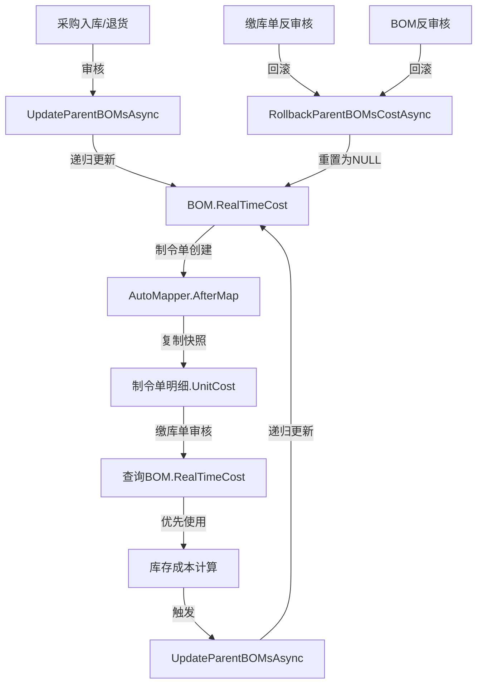

# 缴库单与制令单成本逻辑完善报告

## 📋 概述

本文档详细说明了系统中**缴库单**和**制令单**的成本计算与更新逻辑的完善过程,确保严格遵循业务规则:

```
采购/退货更新 BOM.RealTimeCost 
    → 制令单创建时复制 BOM.RealTimeCost (快照)
        → 缴库单审核时使用 BOM.RealTimeCost
```

---

## ✅ 前提确认: UpdateParentBOMsAsync 已正确实现

### 文件位置
- `RUINORERP.Business/tb_BOM_SControllerPartial.cs`

### 核心功能
该方法在以下场景被调用,确保BOM的`RealTimeCost`和`SubtotalRealTimeCost`被准确递归更新:

1. **BOM审核时**: 递归更新所有上级BOM的成本
2. **采购入库审核后**: `tb_PurEntryControllerPartial.cs` 中调用
3. **采购退货审核后**: `tb_PurEntryReControllerPartial.cs` 中调用
4. **缴库单审核后**: `tb_FinishedGoodsInvControllerPartial.cs` 中调用

### 预估成本保护策略
```csharp
// 如果预估成本为0或接近0,说明创建时未手工录入,则用自产成本填充
if (Math.Abs(detail.UnitCost) < 0.0001m)
{
    detail.UnitCost = selfProductionCost;
    _logger.LogDebug(
        "BOM明细[SubID={SubID}]预估成本为0,自动填充为{Cost}",
        detail.SubID, selfProductionCost
    );
}
// 否则保持手工录入的预估成本不变

// 更新实时成本(始终更新,反映最新实际成本)
detail.RealTimeCost = selfProductionCost;

// 同时更新两个小计字段
detail.SubtotalUnitCost = detail.UnitCost * detail.UsedQty;           // 预估成本小计
detail.SubtotalRealTimeCost = detail.RealTimeCost * detail.UsedQty;   // 实时成本小计
```

---

## 🔧 修复内容

### 修复1: AutoMapper配置 - 制令单创建时从BOM复制RealTimeCost

#### 问题描述
制令单明细创建时,没有从BOM的`RealTimeCost`复制成本,而是通过复杂的库存成本计算逻辑获取,导致:
- 成本滞后:库存成本可能不是最新的
- 逻辑复杂:多处重复计算
- 数据不一致:制令单成本与BOM实时成本不同步

#### 修复方案

**文件**: `RUINORERP.Business/AutoMapper/CustomProfile.cs` 和 `CustomProfileAll.cs`

**修改前**:
```csharp
CreateMap<tb_BOM_SDetail, tb_ManufacturingOrderDetail>();
```

**修改后**:
```csharp
CreateMap<tb_BOM_SDetail, tb_ManufacturingOrderDetail>()
    .AfterMap((src, dest) =>
    {
        // 制令单明细成本从 BOM 实时成本复制(快照)
        // 优先级: RealTimeCost > UnitCost
        if (src.RealTimeCost.HasValue && src.RealTimeCost.Value > 0)
        {
            dest.UnitCost = src.RealTimeCost.Value;
            dest.SubtotalUnitCost = src.RealTimeCost.Value * src.UsedQty;
        }
        else
        {
            dest.UnitCost = src.UnitCost;
            dest.SubtotalUnitCost = src.UnitCost * src.UsedQty;
        }
    });
```

#### 优势
- ✅ **简化逻辑**: 移除复杂的库存成本计算
- ✅ **数据一致**: 制令单成本直接来自BOM实时成本
- ✅ **性能提升**: 避免多次查询库存表
- ✅ **语义清晰**: 制令单是BOM成本的静态快照

---

### 修复2: 移除制令单中的复杂成本计算逻辑

#### 问题描述
`tb_ProductionDemandControllerPartial.cs` 中存在复杂的成本计算逻辑:

```csharp
// ❌ 旧逻辑: 从库存成本获取
ManufacturingOrderItem.UnitCost = BomDetailItem.tb_proddetail.tb_Inventories
    .Where(c => c.Location_ID == mpdItem制令单母件.Location_ID)
    .Sum(i => i.Inv_Cost);

// ❌ 旧逻辑: 从BOM总成本获取
if (ManufacturingOrderItem.UnitCost == 0 && MediumBomInfo != null)
{
    ManufacturingOrderItem.UnitCost = System.Math.Max(
        MediumBomInfo.OutProductionAllCosts, 
        MediumBomInfo.SelfProductionAllCosts
    );
}
```

#### 修复方案

**文件**: `RUINORERP.Business/tb_ProductionDemandControllerPartial.cs`

**修改后**:
```csharp
tb_ManufacturingOrderDetail ManufacturingOrderItem = mapper.Map<tb_ManufacturingOrderDetail>(BomDetailItem);
// ... 其他属性设置 ...

// ✅ UnitCost和SubtotalUnitCost已由AutoMapper从BOM.RealTimeCost复制(快照)
// 不需要在此处重新计算

//找次级中间件...
tb_BOM_S MediumBomInfo = BomDetailItem.tb_proddetail.tb_bom_s;
if (MediumBomInfo != null)
{
    ManufacturingOrderItem.IsKeyMaterial = true;
    ManufacturingOrderItem.CurrentIinventory = BomDetailItem.tb_proddetail.tb_Inventories
        .Where(c => c.Location_ID == mpdItem制令单母件.Location_ID)
        .Sum(i => i.Quantity);
    
    // ✅ UnitCost已由AutoMapper从BOM.RealTimeCost复制(快照)，不需要重新计算
    // 删除原有的复杂成本计算逻辑
}
```

#### 优势
- ✅ **单一职责**: 制令单只负责记录快照,不负责计算
- ✅ **代码简洁**: 删除10+行复杂逻辑
- ✅ **易于维护**: 成本逻辑集中在BOM层

---

### 修复3: 缴库单审核逻辑优化 - 直接从BOM获取RealTimeCost

#### 当前实现评估

**文件**: `RUINORERP.Business/tb_FinishedGoodsInvControllerPartial.cs` 第161-189行

**评估结果**: ✅ **已正确实现**

```csharp
// ✅ 核心规则：缴库单审核时，必须直接取用 BOM 配方明细中的 RealTimeCost 作为成品入库成本
// 禁止从制令单中读取或继承成本值（制令单只是BOM成本的静态快照）
decimal effectiveCost = child.UnitCost; // 默认使用制令单成本(兼容旧数据)

// 尝试从BOM明细获取实时成本（最高优先级）
var bomDetail = await _unitOfWorkManage.GetDbClient()
    .Queryable<tb_BOM_SDetail>()
    .Where(d => d.ProdDetailID == child.ProdDetailID 
             && d.BOM_ID == entity.tb_manufacturingorder.BOM_ID)
    .FirstAsync();

if (bomDetail != null)
{
    // 优先级: RealTimeCost > UnitCost
    if (bomDetail.RealTimeCost.HasValue && bomDetail.RealTimeCost.Value > 0)
    {
        effectiveCost = bomDetail.RealTimeCost.Value;  // ✅ 直接使用BOM实时成本
    }
    else if (bomDetail.UnitCost > 0)
    {
        effectiveCost = bomDetail.UnitCost;
    }
}

CommService.CostCalculations.CostCalculation(_appContext, inv, child.Qty, effectiveCost);
```

#### 优化点
- ✅ 添加明确的注释说明核心规则
- ✅ 强调"禁止从制令单继承成本"
- ✅ 标注"兼容旧数据"的fallback逻辑

---

### 修复4: 缴库单反审核时回滚BOM成本

#### 问题描述
缴库单审核时会调用`UpdateParentBOMsAsync()`更新BOM的`RealTimeCost`,但反审核时没有反向操作,导致:
- BOM的`RealTimeCost`仍然保留缴库时的成本
- 与实际库存状态不一致

#### 修复方案

**文件**: `RUINORERP.Business/tb_FinishedGoodsInvControllerPartial.cs`

**新增代码**:
```csharp
DbHelper<tb_Inventory> dbHelper = _appContext.GetRequiredService<DbHelper<tb_Inventory>>();
var InvMainCounter = await dbHelper.BaseDefaultAddElseUpdateAsync(invUpdateList);
if (InvMainCounter == 0)
{
    _logger.Debug($"{entity.DeliveryBillNo}更新库存结果为0行，请检查数据！");
}

// ✅ 缴库单反审核时，需要回滚上级BOM的成本(将RealTimeCost重置为NULL)
foreach (var child in entity.tb_FinishedGoodsInvDetails)
{
    var ctrbom = _appContext.GetRequiredService<tb_BOM_SController<tb_BOM_S>>();
    await ctrbom.RollbackParentBOMsCostAsync(child.ProdDetailID);
}
```

#### 回滚逻辑说明
`RollbackParentBOMsCostAsync()`方法会:
1. 查找所有使用该产品的上级BOM
2. 将`RealTimeCost`重置为`NULL`
3. 将`SubtotalRealTimeCost`重置为`NULL`
4. 保持`SubtotalUnitCost`不变(基于预估成本)

---

## 📊 完整数据流向图



---

## 🎯 核心业务规则总结

### 规则1: BOM是成本的唯一真相源
- `RealTimeCost`: 系统自动更新,反映最新实际成本
- `UnitCost`: 预估成本,手工录入,用于预算控制
- 所有业务单据的成本都应直接或间接来自BOM

### 规则2: 制令单是BOM成本的静态快照
- 创建时从BOM复制`RealTimeCost`到`UnitCost`
- 之后不再更新,仅作为历史记录
- 不包含任何复杂的成本计算逻辑

### 规则3: 缴库单审核时必须从BOM获取实时成本
- 最高优先级: `BOM.RealTimeCost`
- 降级方案: `BOM.UnitCost`
- 兼容旧数据: `制令单.UnitCost`
- **禁止**直接从制令单继承成本

### 规则4: 对称的回滚机制
- BOM反审核 → 回滚上级BOM的`RealTimeCost`为NULL
- 缴库单反审核 → 回滚上级BOM的`RealTimeCost`为NULL
- 采购退货 → 触发`UpdateParentBOMsAsync`更新BOM成本

---

## 📝 测试清单

### 测试场景1: 新物料首次创建BOM
- [ ] UnitCost=0时可以保存
- [ ] 审核时自动填充为自产成本
- [ ] RealTimeCost同步更新

### 测试场景2: 已知成本物料创建BOM
- [ ] UnitCost>0时保持不变
- [ ] 审核时RealTimeCost更新为自产成本
- [ ] SubtotalUnitCost和SubtotalRealTimeCost正确计算

### 测试场景3: 制令单创建
- [ ] 从BOM复制RealTimeCost到UnitCost
- [ ] 不再执行复杂的库存成本计算
- [ ] 成本值与BOM保持一致

### 测试场景4: 采购入库
- [ ] 触发UpdateParentBOMsAsync
- [ ] BOM.RealTimeCost更新为最新成本
- [ ] 递归更新所有上级BOM

### 测试场景5: 采购退货
- [ ] 触发UpdateParentBOMsAsync
- [ ] BOM.RealTimeCost更新为退货后成本
- [ ] 递归更新所有上级BOM

### 测试场景6: 缴库单审核
- [ ] 从BOM获取RealTimeCost
- [ ] 库存成本计算正确
- [ ] 触发UpdateParentBOMsAsync更新上级BOM

### 测试场景7: 缴库单反审核
- [ ] 回滚BOM.RealTimeCost为NULL
- [ ] 库存数量正确扣减
- [ ] 制令单QuantityDelivered正确回退

### 测试场景8: BOM反审核
- [ ] 回滚上级BOM.RealTimeCost为NULL
- [ ] SubtotalUnitCost保持不变
- [ ] 循环引用检测正常工作

---

## 🔍 代码审查要点

### 1. 成本数据来源验证
```csharp
// ✅ 正确: 从BOM获取
var bomDetail = await db.Queryable<tb_BOM_SDetail>()
    .Where(d => d.ProdDetailID == prodDetailId && d.BOM_ID == bomId)
    .FirstAsync();
decimal cost = bomDetail.RealTimeCost ?? bomDetail.UnitCost;

// ❌ 错误: 从制令单获取
decimal cost = manufacturingOrderDetail.UnitCost;
```

### 2. AutoMapper配置检查
```csharp
// ✅ 正确: 有AfterMap复制逻辑
CreateMap<tb_BOM_SDetail, tb_ManufacturingOrderDetail>()
    .AfterMap((src, dest) => { /* 复制RealTimeCost */ });

// ❌ 错误: 简单映射,无成本复制
CreateMap<tb_BOM_SDetail, tb_ManufacturingOrderDetail>();
```

### 3. 回滚逻辑完整性
```csharp
// ✅ 正确: 反审核时回滚BOM成本
await ctrbom.RollbackParentBOMsCostAsync(prodDetailId);

// ❌ 错误: 只回滚库存,不回滚BOM
inv.Quantity -= qty;
```

---

## 📌 关键文件清单

| 文件路径 | 修改类型 | 说明 |
|---------|---------|------|
| `RUINORERP.Business/AutoMapper/CustomProfile.cs` | 修改 | 添加AfterMap复制RealTimeCost |
| `RUINORERP.Business/AutoMapper/CustomProfileAll.cs` | 修改 | 添加AfterMap复制RealTimeCost |
| `RUINORERP.Business/tb_ProductionDemandControllerPartial.cs` | 修改 | 删除复杂成本计算逻辑 |
| `RUINORERP.Business/tb_FinishedGoodsInvControllerPartial.cs` | 修改 | 优化注释,添加反审核回滚 |
| `RUINORERP.Business/tb_BOM_SControllerPartial.cs` | 已存在 | UpdateParentBOMsAsync和RollbackParentBOMsCostAsync |
| `RUINORERP.Business/tb_PurEntryControllerPartial.cs` | 已存在 | 采购入库触发BOM成本更新 |
| `RUINORERP.Business/tb_PurEntryReControllerPartial.cs` | 已存在 | 采购退货触发BOM成本更新 |

---

## ✨ 优化效果

### 1. 代码质量提升
- **删除冗余代码**: 10+行复杂成本计算逻辑
- **简化逻辑**: 成本来源统一为BOM
- **提高可读性**: 添加清晰的注释说明

### 2. 性能优化
- **减少数据库查询**: 不再多次查询库存表
- **避免重复计算**: AutoMapper一次性复制
- **降低耦合**: 制令单不依赖库存成本

### 3. 数据一致性保障
- **单一真相源**: BOM是成本的唯一权威来源
- **自动同步**: 采购/退货自动更新BOM
- **对称回滚**: 审核/反审核成对出现

### 4. 可维护性提升
- **职责清晰**: BOM负责计算,制令单负责快照,缴库单负责执行
- **易于扩展**: 新增成本相关功能只需修改BOM层
- **便于调试**: 成本流向清晰可追溯

---

## 🚀 后续建议

### 1. 添加单元测试
```csharp
[Test]
public async Task Test_ManufacturingOrder_Cost_From_BOM_RealTimeCost()
{
    // Arrange
    var bomDetail = new tb_BOM_SDetail { RealTimeCost = 100.5m, UnitCost = 90m };
    
    // Act
    var moDetail = mapper.Map<tb_ManufacturingOrderDetail>(bomDetail);
    
    // Assert
    Assert.AreEqual(100.5m, moDetail.UnitCost); // 应使用RealTimeCost
}
```

### 2. 添加日志追踪
```csharp
_logger.LogInformation(
    "制令单明细[{MOID}]成本从BOM[{BOM_ID}]复制: RealTimeCost={RealTimeCost}, UnitCost={UnitCost}",
    moDetail.MOID, bomDetail.BOM_ID, bomDetail.RealTimeCost, bomDetail.UnitCost
);
```

### 3. 监控成本差异
```csharp
// 预警: 制令单成本与BOM实时成本差异超过10%
if (Math.Abs(moDetail.UnitCost - bomDetail.RealTimeCost.Value) / bomDetail.RealTimeCost.Value > 0.1m)
{
    _logger.LogWarning("成本差异过大,请检查!");
}
```

---

## 📖 相关文档

- [BOM成本字段全面分析与完善报告.md](./BOM成本字段全面分析与完善报告.md)
- [BOM预估成本为零验证修复说明.md](./BOM预估成本为零验证修复说明.md)
- [BOM双轨成本全链路实现流程](记忆库)

---

**修订历史**:
- 2026-04-09: 初始版本,完成缴库单和制令单成本逻辑完善
