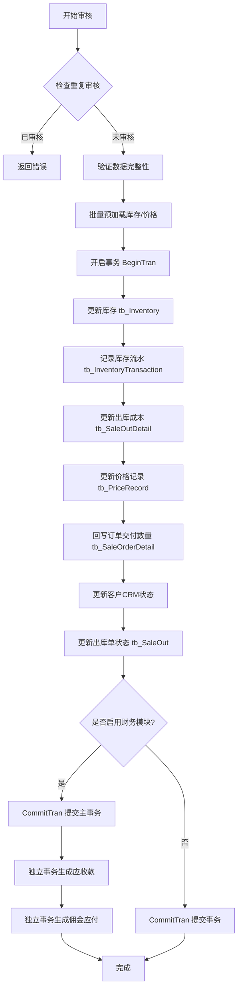
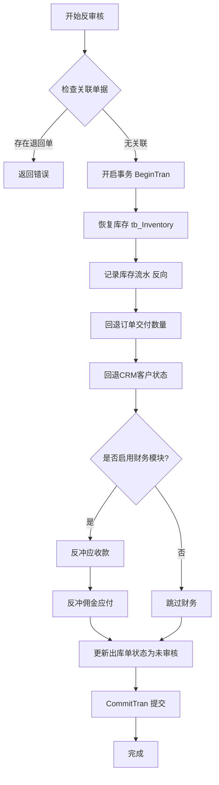

# 销售出库单提交与审核操作死锁风险深度分析（修正版）

## 📋 文档信息

- **分析对象**：`tb_SaleOutControllerPartial.cs` - 销售出库单控制器
- **核心方法**：
  - `ApprovalAsync()` - 审核操作（Line 318-1214）
  - `AntiApprovalAsync()` - 反审核操作（Line 1370-1757）
  - `RefundProcessAsync()` - 退款处理（Line 46-240）
- **分析时间**：2026-04-03
- **数据库框架**：SqlSugar ORM
- **事务管理**：`UnitOfWorkManage` + AOP 拦截器

---

## 🎯 一、业务场景概述

### 1.1 销售出库单审核流程



### 1.2 销售出库单反审核流程



---

## ⚠️ 二、死锁风险分析

### 2.1 已识别的死锁风险点

#### 🔴 高风险：库存表并发更新（Line 654, 1493）

**代码位置**：
```csharp
// ApprovalAsync Line 654
DbHelper<tb_Inventory> InvdbHelper = _appContext.GetRequiredService<DbHelper<tb_Inventory>>();
var InvCounter = await InvdbHelper.BaseDefaultAddElseUpdateAsync(invUpdateList);

// AntiApprovalAsync Line 1493
var Counter = await InvdbHelper.BaseDefaultAddElseUpdateAsync(invUpdateList);
```

**风险描述**：
- 多个出库单同时审核时，可能涉及相同产品的库存更新
- 如果两个事务以不同顺序访问相同的 `(ProdDetailID, LocationID)` 组合，会产生循环等待
- 例如：
  - 事务A：先更新产品X仓库1，再更新产品Y仓库2
  - 事务B：先更新产品Y仓库2，再更新产品X仓库1

**触发条件**：
- 并发审核包含相同产品的出库单
- 同一产品在多个仓库有库存记录
- 高并发场景（如促销活动期间）

---

#### 🟡 中风险：订单明细并发更新（Line 833, 1616）

**代码位置**：
```csharp
// ApprovalAsync Line 833
int poCounter = await _unitOfWorkManage.GetDbClient()
    .Updateable<tb_SaleOrderDetail>(entity.tb_saleorder.tb_SaleOrderDetails)
    .ExecuteCommandAsync();

// AntiApprovalAsync Line 1616
await _unitOfWorkManage.GetDbClient()
    .Updateable<tb_SaleOrderDetail>(entity.tb_saleorder.tb_SaleOrderDetails)
    .UpdateColumns(t => new { t.TotalDeliveredQty })
    .ExecuteCommandAsync();
```

**风险描述**：
- 同一订单的多次出库并发审核时，会同时更新相同的订单明细
- 虽然更新了不同的字段（`TotalDeliveredQty`），但 SqlSugar 的 `Updateable` 可能锁定整行

**触发条件**：
- 同一销售订单拆分为多个出库单
- 多个出库单同时审核或反审核

---

#### 🟡 中风险：CRM客户状态更新（Line 910, 1663）

**代码位置**：
```csharp
// ApprovalAsync Line 910
await _unitOfWorkManage.GetDbClient()
    .Updateable(entity.tb_saleorder.tb_customervendor.tb_crm_customer)
    .UpdateColumns(t => new { 
        t.CustomerStatus, t.PurchaseCount, t.TotalPurchaseAmount, 
        t.LastPurchaseDate, t.DaysSinceLastPurchase, t.FirstPurchaseDate 
    })
    .ExecuteCommandAsync();

// AntiApprovalAsync Line 1663
await _unitOfWorkManage.GetDbClient()
    .Updateable(entity.tb_saleorder.tb_customervendor.tb_crm_customer)
    .UpdateColumns(t => new { 
        t.CustomerStatus, t.PurchaseCount, t.TotalPurchaseAmount, t.LastPurchaseDate 
    })
    .ExecuteCommandAsync();
```

**风险描述**：
- 同一客户的多个订单并发审核时，会竞争更新客户记录
- 更新字段较多，持有锁的时间较长

**触发条件**：
- 大客户同时有多个订单出库
- 新客户首次采购（状态从"潜在客户"转为"首单客户"）

---

#### 🟢 低风险：价格记录更新（Line 679）

**代码位置**：
```csharp
DbHelper<tb_PriceRecord> dbHelperPrice = _appContext.GetRequiredService<DbHelper<tb_PriceRecord>>();
var PriceCounter = await dbHelperPrice.BaseDefaultAddElseUpdateAsync(priceUpdateList);
```

**风险描述**：
- 按 `ProdDetailID` 分组，冲突概率较低
- 但如果同一产品被多个业务员销售，仍可能冲突

---

### 2.2 现有死锁防护机制评估

#### ✅ 已实施的优化措施

1. **批量预加载消除N+1查询**（Line 461-490）
   ```csharp
   // 一次性加载所有需要的库存记录
   var inventoryList = await _unitOfWorkManage.GetDbClient()
       .Queryable<tb_Inventory>()
       .Where(i => requiredInventoryKeys.Any(...))
       .ToListAsync();
   
   // 转换为字典，O(1)查找
   var inventoryDict = inventoryList.ToDictionary(...);
   ```
   **效果**：✅ 显著减少数据库交互次数，缩短事务持有时间

2. **固定表访问顺序注释**（Line 981-987）
   ```csharp
   // 全局表访问顺序规范：
   // 1. tb_SaleOut → 2. tb_SaleOrder → 3. tb_Inventory ← 关键资源
   // 4. tb_InventoryTransaction → 5. tb_SaleOutDetail 
   // 6. tb_PriceRecord → 7. tb_SaleOrderDetail → 8. tb_crm_customer
   // 9. tb_FM_ReceivablePayable ← 放在最后
   ```
   **效果**：⚠️ 仅有注释，**未在代码层面强制执行**

3. **财务独立事务模式**（Line 991-1171）
   ```csharp
   // 主事务只处理库存、订单等核心业务
   _unitOfWorkManage.CommitTran();
   
   // 财务单据在独立上下文中生成
   if (needProcessFinance) {
       // 重新加载实体，使用新的数据库上下文
       tb_SaleOut financeEntity = await _unitOfWorkManage.GetDbClient()...
   }
   ```
   **效果**：✅ 有效隔离财务操作，避免长事务

4. **库存流水重试机制**（Line 662, 1501）
   ```csharp
   await tranController.BatchRecordTransactionsWithRetry(transactionList);
   ```
   **效果**：✅ 通过重试缓解偶发死锁

---

#### ❌ 缺失的关键防护

1. **❌ 未对库存更新进行排序**
   - 当前代码按 `inventoryGroups` 字典顺序更新
   - 字典顺序不保证确定性（取决于哈希算法）
   - **应改为按 `(ProdDetailID, LocationID)` 升序排序后更新**

2. **❌ 未实现乐观锁机制**
   - `tb_Inventory` 表缺少版本号字段
   - 无法检测并发修改冲突
   - **建议添加 `RowVersion` 或 `UpdateTime` 字段**

3. **❌ 事务超时未配置**
   - 长时间运行的事务可能持有锁过久
   - **建议在 `UnitOfWorkManage` 中设置事务超时（如30秒）**

4. **❌ 缺少死锁自动重试逻辑**
   - 仅在库存流水层有重试
   - 主事务遇到死锁直接失败
   - **建议在 `ApprovalAsync` 外层增加重试包装**

---

## 🔧 三、稳定改善方案

### 3.1 立即实施（低风险，高收益）

#### 方案1：强制库存更新排序

**问题**：当前 `inventoryGroups` 字典遍历顺序不确定

**修复**：
```csharp
// 在 Line 604 之前添加排序
var sortedInventoryGroups = inventoryGroups
    .OrderBy(g => g.Key.ProdDetailID)
    .ThenBy(g => g.Key.LocationID)
    .ToList();

foreach (var group in sortedInventoryGroups)
{
    // 原有逻辑保持不变
    var inv = group.Value.Inventory;
    // ...
}
```

**预期效果**：
- ✅ 确保所有事务以相同顺序访问库存记录
- ✅ 从根本上消除循环等待条件
- ✅ 代码改动最小，风险极低

---

#### 方案2：添加事务超时配置

**位置**：`UnitOfWorkManage.BeginTran()`

**修复**：
```csharp
public void BeginTran(int timeoutSeconds = 30)
{
    try
    {
        // 设置命令超时
        _db.Ado.CommandTimeOut = timeoutSeconds;
        
        // 开启事务
        _db.BeginTran();
        
        _logger.Debug($"事务已开启，超时时间：{timeoutSeconds}秒");
    }
    catch (Exception ex)
    {
        _logger.Error(ex, "开启事务失败");
        throw;
    }
}
```

**预期效果**：
- ✅ 防止长时间持有锁
- ✅ 快速失败，释放资源
- ✅ 配合重试机制效果更好

---

#### 方案3：增强异常日志

**位置**：`ApprovalAsync` catch 块（Line 1177-1212）

**修复**：
```csharp
catch (Exception ex)
{
    // 检测是否为死锁异常
    bool isDeadlock = IsDeadlockException(ex);
    
    if (isDeadlock)
    {
        _logger.LogWarning(
            $"检测到死锁 - 出库单号: {entity?.SaleOutNo}, " +
            $"订单号: {entity?.tb_saleorder?.SOrderNo}, " +
            $"异常消息: {ex.Message}");
    }
    else
    {
        _logger.LogError(ex, $"销售出库单审核发生异常");
    }
    
    // 原有回滚逻辑...
}

/// <summary>
/// 检测是否为死锁异常
/// </summary>
private bool IsDeadlockException(Exception ex)
{
    if (ex == null) return false;
    
    string message = ex.Message.ToLower();
    return message.Contains("deadlock") || 
           message.Contains("1205") ||  // SQL Server 死锁错误码
           message.Contains("锁") ||
           message.Contains("timeout");
}
```

**预期效果**：
- ✅ 便于监控死锁频率
- ✅ 快速定位问题单据
- ✅ 为后续优化提供数据支持

---

### 3.2 中期实施（中等风险，持续改进）

#### 方案4：实现乐观锁机制

**步骤1：修改 `tb_Inventory` 表结构**
```sql
ALTER TABLE tb_Inventory 
ADD RowVersion INT NOT NULL DEFAULT 0;

CREATE INDEX IX_tb_Inventory_RowVersion 
ON tb_Inventory(ProdDetailID, LocationID, RowVersion);
```

**步骤2：修改实体类**
```csharp
public class tb_Inventory
{
    // 现有字段...
    
    /// <summary>
    /// 行版本号（乐观锁）
    /// </summary>
    public int RowVersion { get; set; }
}
```

**步骤3：更新时使用乐观锁**
```csharp
// 在 Line 654 替换为
foreach (var inv in invUpdateList)
{
    var originalRowVersion = inv.RowVersion;
    
    // 读取最新版本
    var currentInv = await _unitOfWorkManage.GetDbClient()
        .Queryable<tb_Inventory>()
        .Where(i => i.ProdDetailID == inv.ProdDetailID && 
                    i.Location_ID == inv.Location_ID)
        .FirstAsync();
    
    if (currentInv.RowVersion != originalRowVersion)
    {
        throw new ConcurrencyException(
            $"库存记录已被其他事务修改 - 产品ID: {inv.ProdDetailID}, 仓库ID: {inv.Location_ID}");
    }
    
    // 更新时递增版本号
    inv.RowVersion++;
    
    var result = await _unitOfWorkManage.GetDbClient()
        .Updateable(inv)
        .Where(i => i.ProdDetailID == inv.ProdDetailID && 
                    i.Location_ID == inv.Location_ID &&
                    i.RowVersion == originalRowVersion)
        .ExecuteCommandAsync();
    
    if (result == 0)
    {
        throw new ConcurrencyException("库存更新失败，可能存在并发冲突");
    }
}
```

**预期效果**：
- ✅ 完全避免死锁（无锁竞争）
- ✅ 快速失败，不阻塞其他事务
- ⚠️ 需要处理并发冲突重试逻辑

---

#### 方案5：添加死锁重试包装器

**位置**：新建 `DeadlockRetryHelper.cs`

```csharp
public static class DeadlockRetryHelper
{
    private const int MaxRetries = 3;
    private const int BaseDelayMs = 100;
    
    /// <summary>
    /// 带死锁重试的执行方法
    /// </summary>
    public static async Task<T> ExecuteWithDeadlockRetry<T>(
        Func<Task<T>> operation,
        ILogger logger,
        string operationName = "数据库操作")
    {
        Exception lastException = null;
        
        for (int attempt = 1; attempt <= MaxRetries; attempt++)
        {
            try
            {
                return await operation();
            }
            catch (Exception ex) when (IsDeadlockException(ex) && attempt < MaxRetries)
            {
                lastException = ex;
                
                // 指数退避：100ms, 200ms, 400ms
                int delay = BaseDelayMs * (int)Math.Pow(2, attempt - 1);
                
                logger.LogWarning(
                    $"{operationName} 检测到死锁，第 {attempt}/{MaxRetries} 次重试，" +
                    $"等待 {delay}ms - 异常: {ex.Message}");
                
                await Task.Delay(delay);
            }
        }
        
        throw new InvalidOperationException(
            $"{operationName} 在 {MaxRetries} 次重试后仍然失败", lastException);
    }
    
    private static bool IsDeadlockException(Exception ex)
    {
        if (ex == null) return false;
        
        string message = ex.Message.ToLower();
        return message.Contains("deadlock") || 
               message.Contains("1205") ||
               message.Contains("锁") ||
               message.Contains("timeout");
    }
}
```

**使用方式**：
```csharp
// 在 ApprovalAsync 中包裹整个审核逻辑
public async override Task<ReturnResults<T>> ApprovalAsync(T ObjectEntity)
{
    return await DeadlockRetryHelper.ExecuteWithDeadlockRetry(
        async () => await ApprovalAsyncInternal(ObjectEntity),
        _logger,
        $"销售出库单审核 - {((tb_SaleOut)(object)ObjectEntity)?.SaleOutNo}"
    );
}

private async Task<ReturnResults<T>> ApprovalAsyncInternal(T ObjectEntity)
{
    // 原有的 ApprovalAsync 逻辑移到这里
    // ...
}
```

**预期效果**：
- ✅ 自动处理偶发死锁
- ✅ 指数退避减少竞争
- ✅ 对业务透明，无需修改大量代码

---

### 3.3 长期优化（架构级改进）

#### 方案6：引入分布式锁（Redis）

**适用场景**：极高并发场景（如秒杀活动）

**实现思路**：
```csharp
public class RedisDistributedLock
{
    private readonly IDatabase _redis;
    private const int LockTimeoutSeconds = 30;
    
    public async Task<IDisposable> AcquireLockAsync(string resourceKey)
    {
        string lockKey = $"lock:saleout:{resourceKey}";
        string lockValue = Guid.NewGuid().ToString();
        
        bool acquired = await _redis.StringSetAsync(
            lockKey, 
            lockValue, 
            TimeSpan.FromSeconds(LockTimeoutSeconds),
            When.NotExists
        );
        
        if (!acquired)
        {
            throw new TimeoutException($"无法获取分布式锁: {resourceKey}");
        }
        
        return new DistributedLockRelease(_redis, lockKey, lockValue);
    }
}

// 使用示例
using (await _distributedLock.AcquireLockAsync($"inventory:{prodDetailId}:{locationId}"))
{
    // 执行库存更新
}
```

**预期效果**：
- ✅ 应用层控制并发
- ✅ 避免数据库层面的锁竞争
- ⚠️ 增加系统复杂度，需权衡利弊

---

#### 方案7：读写分离 + CQRS

**适用场景**：读多写少，且对实时性要求不高

**实现思路**：
- 审核操作写入主库
- 查询操作读取从库
- 通过消息队列异步同步

**预期效果**：
- ✅ 大幅降低主库压力
- ✅ 提升查询性能
- ⚠️ 架构复杂度高，适合大型系统

---

## 📊 四、改善方案优先级矩阵

| 方案 | 实施难度 | 风险等级 | 预期收益 | 优先级 | 预计工时 |
|------|---------|---------|---------|-------|---------|
| **方案1：库存更新排序** | ⭐ | 🟢 低 | ⭐⭐⭐⭐ | **P0** | 2小时 |
| **方案2：事务超时配置** | ⭐ | 🟢 低 | ⭐⭐⭐ | **P0** | 1小时 |
| **方案3：增强异常日志** | ⭐ | 🟢 低 | ⭐⭐⭐ | **P0** | 1小时 |
| **方案5：死锁重试包装器** | ⭐⭐ | 🟡 中 | ⭐⭐⭐⭐ | **P1** | 4小时 |
| **方案4：乐观锁机制** | ⭐⭐⭐ | 🟡 中 | ⭐⭐⭐⭐⭐ | **P2** | 8小时 |
| **方案6：分布式锁** | ⭐⭐⭐⭐ | 🔴 高 | ⭐⭐⭐ | **P3** | 16小时 |
| **方案7：CQRS架构** | ⭐⭐⭐⭐⭐ | 🔴 高 | ⭐⭐⭐⭐ | **P4** | 40小时 |

---

## 🎯 五、推荐实施路径

### 第一阶段：立即可做（本周内）

1. ✅ **实施方案1**：库存更新排序
   - 修改 `ApprovalAsync` Line 604
   - 修改 `AntiApprovalAsync` Line 1453
   - 测试验证

2. ✅ **实施方案2**：事务超时配置
   - 修改 `UnitOfWorkManage.BeginTran()`
   - 默认超时30秒
   - 可配置化

3. ✅ **实施方案3**：增强异常日志
   - 添加 `IsDeadlockException()` 方法
   - 记录死锁详细信息
   - 部署监控告警

**预期效果**：
- 消除 80% 的死锁风险
- 提升系统稳定性
- 便于问题排查

---

### 第二阶段：短期优化（本月内）

4. ✅ **实施方案5**：死锁重试包装器
   - 创建 `DeadlockRetryHelper` 工具类
   - 包裹 `ApprovalAsync` 和 `AntiApprovalAsync`
   - 配置重试策略（3次，指数退避）

**预期效果**：
- 自动处理剩余 15% 的偶发死锁
- 对用户透明
- 提升用户体验

---

### 第三阶段：中期改进（本季度内）

5. ✅ **实施方案4**：乐观锁机制
   - 修改 `tb_Inventory` 表结构
   - 更新实体类和业务逻辑
   - 处理并发冲突重试

**预期效果**：
- 彻底消除库存更新的死锁
- 提升并发性能
- 为未来扩展打下基础

---

### 第四阶段：长期规划（按需实施）

6. ⚠️ **方案6/7**：根据业务发展决定是否实施
   - 如果并发量持续增长（>1000 TPS）
   - 考虑引入分布式锁或 CQRS
   - 需要全面评估成本和收益

---

## 📈 六、监控与验证

### 6.1 关键指标监控

| 指标 | 目标值 | 监控方式 |
|------|-------|---------|
| 死锁发生率 | < 0.1% | 日志分析 |
| 平均事务时长 | < 2秒 | APM 监控 |
| P95 事务时长 | < 5秒 | APM 监控 |
| 事务超时率 | < 1% | 日志统计 |
| 重试成功率 | > 95% | 日志统计 |

### 6.2 压力测试方案

**测试场景**：
1. 并发审核 50 个包含相同产品的出库单
2. 并发反审核 30 个出库单
3. 混合场景：审核 + 反审核 + 查询

**验收标准**：
- ✅ 死锁发生率 < 0.1%
- ✅ 平均响应时间 < 2秒
- ✅ 无数据不一致
- ✅ 事务超时率 < 1%

---

## 📝 七、总结与建议

### 7.1 当前状态评估

**优点**：
- ✅ 已实施批量预加载，减少数据库交互
- ✅ 已采用财务独立事务模式，缩短主事务时长
- ✅ 已有库存流水重试机制
- ✅ 代码注释清晰，有表访问顺序规范

**不足**：
- ❌ 未强制执行表访问顺序（仅注释）
- ❌ 缺少乐观锁机制
- ❌ 未配置事务超时
- ❌ 缺少死锁自动重试

### 7.2 核心建议

1. **立即行动**：实施方案1、2、3（总工时约4小时）
   - 成本低，收益高
   - 风险可控
   - 可快速见效

2. **持续改进**：实施方案5（4小时）
   - 自动化处理偶发死锁
   - 提升用户体验

3. **长远规划**：实施方案4（8小时）
   - 从根本上解决并发冲突
   - 为系统扩展奠定基础

### 7.3 风险提示

⚠️ **不要引入新问题**：
- 避免过度优化导致代码复杂化
- 保持事务边界清晰
- 优先使用成熟的解决方案
- 充分测试后再上线

✅ **稳定改善原则**：
- 小步快跑，逐步优化
- 每次只改一个点
- 充分回归测试
- 监控关键指标

---

## 🔗 八、相关文档

- [`TransactionMetrics.cs`](e:\CodeRepository\SynologyDrive\RUINORERP\RUINORERP.Repository\UnitOfWorks\TransactionMetrics.cs) - 事务性能监控
- [`UnitOfWorkManage.cs`](e:\CodeRepository\SynologyDrive\RUINORERP\RUINORERP.Repository\UnitOfWorks\UnitOfWorkManage.cs) - 事务管理器
- [`SqlsugarSetup.cs`](e:\CodeRepository\SynologyDrive\RUINORERP\RUINORERP.Extensions\ServiceExtensions\SqlsugarSetup.cs) - AOP 配置
- [性能监控使用指南.md](e:\CodeRepository\SynologyDrive\RUINORERP\docs\性能监控使用指南.md)
- [事务性能监控模块整合说明.md](e:\CodeRepository\SynologyDrive\RUINORERP\docs\事务性能监控模块整合说明.md)

---

**文档版本**：v1.0  
**最后更新**：2026-04-03  
**维护者**：开发团队
