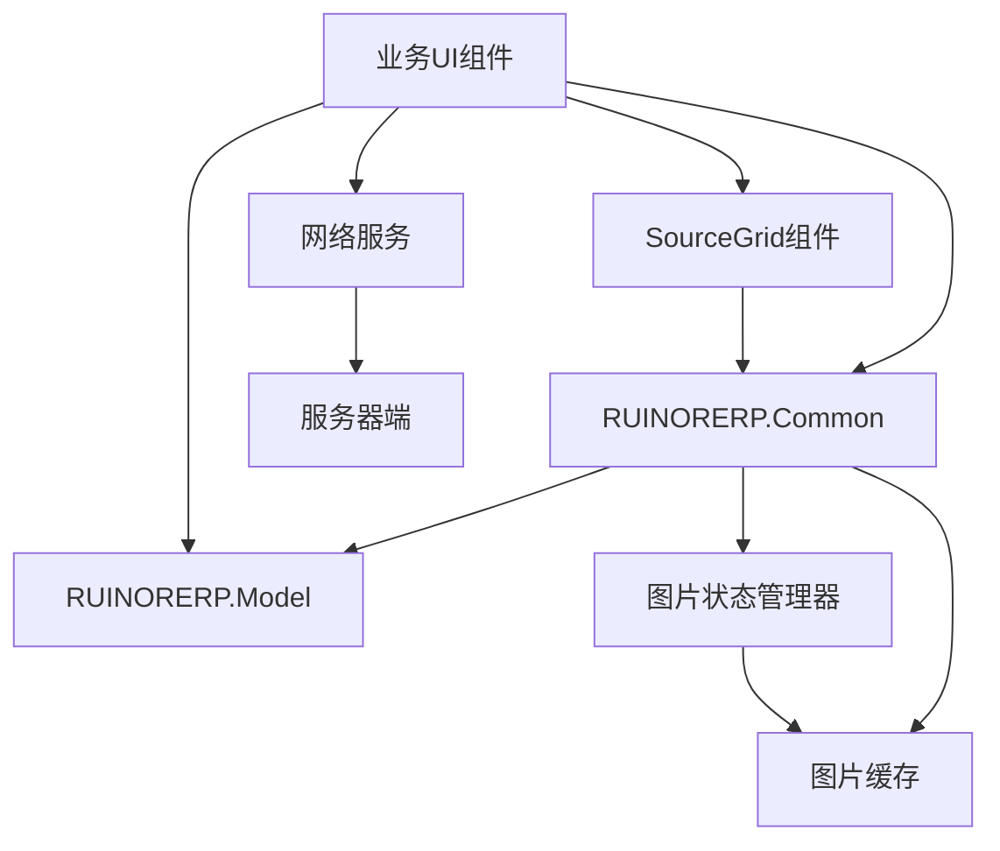
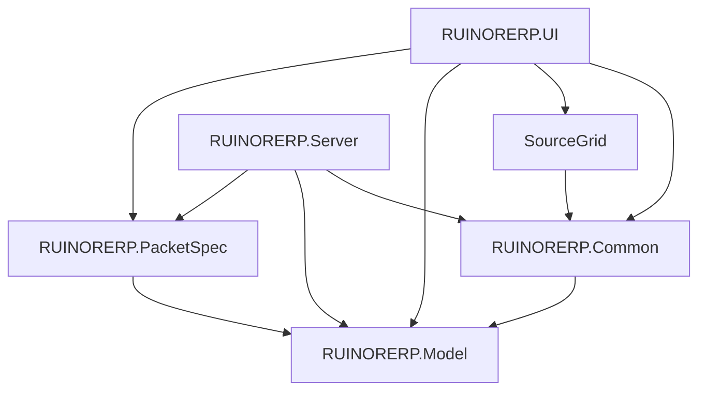

# 图片处理系统重构方案（优化版）

## 1. 项目现状分析

### 1.1 现有项目结构

| 项目 | 引用关系 | 说明 |
|------|---------|------|
| RUINORERP.Common | 无 | 基础公共库 |
| RUINORERP.Model | 引用Common | 数据模型 |
| RUINORERP.PacketSpec | 引用Model | 网络数据包定义 |
| RUINORERP.Server | 引用Common, Model, PacketSpec | 服务器端 |
| RUINORERP.UI | 引用Common, Model, PacketSpec, SourceGrid | 客户端UI |
| SourceGrid | 无 | 第三方表格组件 |

### 1.2 现有图片处理功能

- **ImageWebPickEditor**：第三方表格组件中用于在表格明细中获取图片值的编辑器，支持文件选择、剪贴板粘贴和拖放功能
- **FileCommandHandler**：服务器端处理文件上传、下载、删除等业务逻辑
- **FileBusinessService**：客户端提供文件与业务实体之间的关联操作
- **UCExpenseClaim**：费用报销单界面，处理明细报销凭证图片
- **PopupMenuForRemoteImageView**：为远程图片单元视图提供右键菜单

### 1.3 存在的问题

- **循环引用**：ImageService放在UI层，而SourceGrid需要引用它，导致循环引用
- **数据模型不一致**：表格单元对应列的值默认保存为图片ID，而通过Tag保存为对象值
- **缺乏统一设计标准**：涉及多个模型、多种cell类型、多个实体类型以及视图类型
- **图片ID生成策略不统一**：不同组件使用不同的方式生成图片ID
- **对象值结构不明确**：表格单元通过Tag保存的对象值的具体结构和内容不明确
- **代码重复**：不同组件中存在重复的图片处理逻辑
- **图片状态管理复杂**：图片状态流转不清晰

## 2. 优化后的架构设计

### 2.1 整体架构



### 2.2 核心模块

| 模块 | 职责 | 位置 |
|------|------|------|
| 图片服务接口 | 定义图片操作的统一接口 | RUINORERP.Common\BusinessImage\IImageService.cs |
| 图片服务实现 | 实现图片操作的具体逻辑 | RUINORERP.UI\Network\Services\ImageService.cs |
| 图片状态管理器 | 管理图片的状态流转 | RUINORERP.Common\BusinessImage\ImageStateManager.cs |
| 图片缓存 | 缓存图片数据 | RUINORERP.Common\BusinessImage\ImageCache.cs |
| 图片信息结构 | 统一的图片数据结构 | RUINORERP.Common\BusinessImage\ImageInfo.cs |
| 网络服务 | 处理与服务器的通信 | RUINORERP.UI\Network\Services\FileManagementService.cs |
| SourceGrid组件 | 表格中的图片编辑和显示 | SourceGrid\SourceGrid\Cells\Editors\ImageWebPickEditor.cs |
| 业务UI组件 | 业务场景中的图片处理 | 各业务UI文件 |

## 3. 数据模型设计

### 3.1 统一图片数据结构

```csharp
// RUINORERP.Common\BusinessImage\ImageInfo.cs
public class ImageInfo
{
    /// <summary>
    /// 图片ID
    /// </summary>
    public long FileId { get; set; }
    
    /// <summary>
    /// 原始文件名
    /// </summary>
    public string OriginalFileName { get; set; }
    
    /// <summary>
    /// 图片字节数据
    /// </summary>
    public byte[] ImageData { get; set; }
    
    /// <summary>
    /// 文件类型
    /// </summary>
    public string FileType { get; set; }
    
    /// <summary>
    /// 文件扩展名
    /// </summary>
    public string FileExtension { get; set; }
    
    /// <summary>
    /// 文件大小
    /// </summary>
    public long FileSize { get; set; }
    
    /// <summary>
    /// 存储路径
    /// </summary>
    public string StoragePath { get; set; }
    
    /// <summary>
    /// 存储文件名
    /// </summary>
    public string StorageFileName { get; set; }
    
    /// <summary>
    /// 业务ID
    /// </summary>
    public long BusinessId { get; set; }
    
    /// <summary>
    /// 业务表名
    /// </summary>
    public string OwnerTableName { get; set; }
    
    /// <summary>
    /// 图片状态
    /// </summary>
    public ImageStatus Status { get; set; }
    
    /// <summary>
    /// 关联字段
    /// </summary>
    public string RelatedField { get; set; }
}

/// <summary>
/// 图片状态枚举
/// </summary>
public enum ImageStatus
{
    /// <summary>
    /// 待上传
    /// </summary>
    PendingUpload,
    
    /// <summary>
    /// 已上传
    /// </summary>
    Uploaded,
    
    /// <summary>
    /// 待删除
    /// </summary>
    PendingDelete,
    
    /// <summary>
    /// 已删除
    /// </summary>
    Deleted
}

/// <summary>
/// 图片同步结果
/// </summary>
public class ImageSyncResult
{
    /// <summary>
    /// 业务ID
    /// </summary>
    public long BusinessId { get; set; }
    
    /// <summary>
    /// 图片ID列表
    /// </summary>
    public List<long> ImageIds { get; set; }
    
    /// <summary>
    /// 同步类型
    /// </summary>
    public ImageSyncType SyncType { get; set; }
}

/// <summary>
/// 图片同步类型
/// </summary>
public enum ImageSyncType
{
    /// <summary>
    /// 添加
    /// </summary>
    Add,
    
    /// <summary>
    /// 删除
    /// </summary>
    Delete
}
```

### 3.2 表格单元格数据结构

| 存储位置 | 存储内容 | 说明 |
|---------|---------|------|
| 单元格Value | 图片ID (long) | 唯一标识图片 |
| 单元格Tag | ImageInfo对象 | 包含图片的完整信息 |

## 4. 关键类设计

### 4.1 图片服务接口 (IImageService)

```csharp
// RUINORERP.Common\BusinessImage\IImageService.cs
public interface IImageService
{
    /// <summary>
    /// 上传图片
    /// </summary>
    /// <param name="imageInfo">图片信息</param>
    /// <returns>上传后的图片信息</returns>
    Task<ImageInfo> UploadImageAsync(ImageInfo imageInfo);
    
    /// <summary>
    /// 下载图片
    /// </summary>
    /// <param name="fileId">图片ID</param>
    /// <returns>图片信息</returns>
    Task<ImageInfo> DownloadImageAsync(long fileId);
    
    /// <summary>
    /// 批量下载图片
    /// </summary>
    /// <param name="fileIds">图片ID列表</param>
    /// <returns>图片信息列表</returns>
    Task<List<ImageInfo>> DownloadImagesAsync(List<long> fileIds);
    
    /// <summary>
    /// 删除图片
    /// </summary>
    /// <param name="fileId">图片ID</param>
    /// <param name="businessId">业务ID</param>
    /// <returns>是否删除成功</returns>
    Task<bool> DeleteImageAsync(long fileId, long businessId);
    
    /// <summary>
    /// 批量删除图片
    /// </summary>
    /// <param name="fileIds">图片ID列表</param>
    /// <param name="businessId">业务ID</param>
    /// <returns>删除结果</returns>
    Task<Dictionary<long, bool>> DeleteImagesAsync(List<long> fileIds, long businessId);
    
    /// <summary>
    /// 获取图片状态
    /// </summary>
    /// <param name="fileId">图片ID</param>
    /// <returns>图片状态</returns>
    ImageStatus GetImageStatus(long fileId);
    
    /// <summary>
    /// 同步图片
    /// </summary>
    /// <returns>同步结果</returns>
    Task<List<ImageSyncResult>> SyncImagesAsync();
    
    /// <summary>
    /// 清理图片缓存
    /// </summary>
    void ClearCache();
}
```

### 4.2 图片服务实现 (ImageService)

```csharp
// RUINORERP.UI\Network\Services\ImageService.cs
public class ImageService : IImageService
{
    private readonly FileManagementService _fileManagementService;
    private readonly ImageStateManager _stateManager;
    private readonly ImageCache _cache;
    private readonly ILogger<ImageService> _logger;

    /// <summary>
    /// 构造函数
    /// </summary>
    /// <param name="fileManagementService">文件管理服务</param>
    /// <param name="stateManager">图片状态管理器</param>
    /// <param name="cache">图片缓存</param>
    /// <param name="logger">日志记录器</param>
    public ImageService(
        FileManagementService fileManagementService,
        ImageStateManager stateManager,
        ImageCache cache,
        ILogger<ImageService> logger)
    {
        _fileManagementService = fileManagementService;
        _stateManager = stateManager;
        _cache = cache;
        _logger = logger;
    }

    // 实现接口方法...
}
```

### 4.3 图片状态管理器 (ImageStateManager)

```csharp
// RUINORERP.Common\BusinessImage\ImageStateManager.cs
public class ImageStateManager
{
    private static readonly ImageStateManager _instance = new ImageStateManager();
    private readonly Dictionary<long, ImageInfo> _images = new Dictionary<long, ImageInfo>();
    private readonly object _lock = new object();

    /// <summary>
    /// 单例实例
    /// </summary>
    public static ImageStateManager Instance => _instance;

    /// <summary>
    /// 添加图片
    /// </summary>
    /// <param name="imageInfo">图片信息</param>
    public void AddImage(ImageInfo imageInfo)
    {
        lock (_lock)
        {
            if (imageInfo != null && imageInfo.FileId > 0)
            {
                _images[imageInfo.FileId] = imageInfo;
            }
        }
    }
    
    /// <summary>
    /// 移除图片
    /// </summary>
    /// <param name="fileId">图片ID</param>
    public void RemoveImage(long fileId)
    {
        lock (_lock)
        {
            if (fileId > 0 && _images.ContainsKey(fileId))
            {
                _images.Remove(fileId);
            }
        }
    }
    
    /// <summary>
    /// 获取待上传图片
    /// </summary>
    /// <returns>待上传图片列表</returns>
    public List<ImageInfo> GetPendingUploadImages()
    {
        lock (_lock)
        {
            return _images.Values.Where(img => img.Status == ImageStatus.PendingUpload).ToList();
        }
    }
    
    /// <summary>
    /// 获取待删除图片
    /// </summary>
    /// <returns>待删除图片列表</returns>
    public List<ImageInfo> GetPendingDeleteImages()
    {
        lock (_lock)
        {
            return _images.Values.Where(img => img.Status == ImageStatus.PendingDelete).ToList();
        }
    }
    
    /// <summary>
    /// 获取图片状态
    /// </summary>
    /// <param name="fileId">图片ID</param>
    /// <returns>图片状态</returns>
    public ImageStatus GetImageStatus(long fileId)
    {
        lock (_lock)
        {
            if (fileId > 0 && _images.ContainsKey(fileId))
            {
                return _images[fileId].Status;
            }
            return ImageStatus.Deleted;
        }
    }
    
    /// <summary>
    /// 获取图片信息
    /// </summary>
    /// <param name="fileId">图片ID</param>
    /// <returns>图片信息</returns>
    public ImageInfo GetImageInfo(long fileId)
    {
        lock (_lock)
        {
            if (fileId > 0 && _images.ContainsKey(fileId))
            {
                return _images[fileId];
            }
            return null;
        }
    }
    
    /// <summary>
    /// 更新图片状态
    /// </summary>
    /// <param name="fileId">图片ID</param>
    /// <param name="status">新状态</param>
    public void UpdateImageStatus(long fileId, ImageStatus status)
    {
        lock (_lock)
        {
            if (fileId > 0 && _images.ContainsKey(fileId))
            {
                _images[fileId].Status = status;
            }
        }
    }
    
    /// <summary>
    /// 清空所有图片状态
    /// </summary>
    public void Clear()
    {
        lock (_lock)
        {
            _images.Clear();
        }
    }
}
```

### 4.4 图片缓存 (ImageCache)

```csharp
// RUINORERP.Common\BusinessImage\ImageCache.cs
public class ImageCache
{
    private readonly MemoryCache _cache = new MemoryCache(new MemoryCacheOptions
    {
        SizeLimit = 1024 * 1024 * 1024, // 1GB缓存
        ExpirationScanFrequency = TimeSpan.FromMinutes(5)
    });
    private readonly object _lock = new object();

    /// <summary>
    /// 获取图片
    /// </summary>
    /// <param name="fileId">图片ID</param>
    /// <returns>图片对象</returns>
    public Image GetImage(long fileId)
    {
        lock (_lock)
        {
            if (_cache.TryGetValue(fileId.ToString(), out Image image))
            {
                return image;
            }
            return null;
        }
    }
    
    /// <summary>
    /// 添加图片
    /// </summary>
    /// <param name="fileId">图片ID</param>
    /// <param name="image">图片对象</param>
    public void AddImage(long fileId, Image image)
    {
        lock (_lock)
        {
            if (fileId > 0 && image != null)
            {
                var cacheEntryOptions = new MemoryCacheEntryOptions()
                    .SetSize(image.Size.Width * image.Size.Height * 4) // 估算内存占用
                    .SetSlidingExpiration(TimeSpan.FromMinutes(30))
                    .SetAbsoluteExpiration(TimeSpan.FromHours(2));
                
                _cache.Set(fileId.ToString(), image, cacheEntryOptions);
            }
        }
    }
    
    /// <summary>
    /// 移除图片
    /// </summary>
    /// <param name="fileId">图片ID</param>
    public void RemoveImage(long fileId)
    {
        lock (_lock)
        {
            if (fileId > 0)
            {
                _cache.Remove(fileId.ToString());
            }
        }
    }
    
    /// <summary>
    /// 清空缓存
    /// </summary>
    public void ClearCache()
    {
        lock (_lock)
        {
            _cache.Clear();
        }
    }
    
    /// <summary>
    /// 获取缓存大小
    /// </summary>
    /// <returns>缓存大小（字节）</returns>
    public long GetCacheSize()
    {
        // 这里可以实现缓存大小的计算
        return 0;
    }
}
```

### 4.5 重构后的ImageWebPickEditor

```csharp
// SourceGrid\SourceGrid\Cells\Editors\ImageWebPickEditor.cs
public class ImageWebPickEditor : EditorControlBase
{
    private readonly IImageService _imageService;
    private readonly ImageStateManager _stateManager;
    private readonly ImageCache _cache;

    /// <summary>
    /// 构造函数
    /// </summary>
    /// <param name="p_Type">值类型</param>
    /// <param name="imageService">图片服务</param>
    /// <param name="stateManager">图片状态管理器</param>
    /// <param name="cache">图片缓存</param>
    public ImageWebPickEditor(Type p_Type, IImageService imageService, ImageStateManager stateManager, ImageCache cache) : base(p_Type)
    {
        _imageService = imageService;
        _stateManager = stateManager;
        _cache = cache;
    }

    // 处理图片选择
    private async Task<bool> HandleImageSelectionAsync(string filePath)
    {
        try
        {
            var image = System.Drawing.Image.FromFile(filePath);
            var imageBytes = ImageToBytes(image);
            var fileName = Path.GetFileName(filePath);
            
            var imageInfo = new ImageInfo
            {
                OriginalFileName = fileName,
                ImageData = imageBytes,
                FileExtension = Path.GetExtension(fileName),
                FileSize = imageBytes.Length,
                Status = ImageStatus.PendingUpload
            };
            
            var result = await _imageService.UploadImageAsync(imageInfo);
            if (result != null && result.FileId > 0)
            {
                // 更新单元格值
                Control.Value = result.FileId;
                Control.Tag = result;
                return true;
            }
            return false;
        }
        catch (Exception ex)
        {
            // 错误处理
            return false;
        }
    }
    
    // 其他方法...
}
```

### 4.6 重构后的RemoteImageView

```csharp
// SourceGrid\SourceGrid\Cells\Views\RemoteImageView.cs
public class RemoteImageView : CellView
{
    private readonly IImageService _imageService;
    private readonly ImageCache _cache;

    /// <summary>
    /// 构造函数
    /// </summary>
    /// <param name="imageService">图片服务</param>
    /// <param name="cache">图片缓存</param>
    public RemoteImageView(IImageService imageService, ImageCache cache)
    {
        _imageService = imageService;
        _cache = cache;
    }

    /// <summary>
    /// 上传图片
    /// </summary>
    /// <param name="imageBytes">图片字节数据</param>
    /// <param name="fileName">文件名</param>
    /// <returns>图片ID</returns>
    public async Task<string> UploadImageAsync(byte[] imageBytes, string fileName)
    {
        try
        {
            var imageInfo = new ImageInfo
            {
                OriginalFileName = fileName,
                ImageData = imageBytes,
                FileExtension = Path.GetExtension(fileName),
                FileSize = imageBytes.Length,
                Status = ImageStatus.PendingUpload
            };
            
            var result = await _imageService.UploadImageAsync(imageInfo);
            return result != null ? result.FileId.ToString() : string.Empty;
        }
        catch (Exception ex)
        {
            // 错误处理
            return string.Empty;
        }
    }
    
    /// <summary>
    /// 绘制单元格
    /// </summary>
    protected override void OnDraw(Graphics g, RectangleF cellRect, CellContext context)
    {
        // 绘制逻辑...
    }
}
```

## 5. 项目结构调整

### 5.1 新增文件

| 文件路径 | 说明 |
|---------|------|
| RUINORERP.Common\BusinessImage\ImageInfo.cs | 统一图片信息结构 |
| RUINORERP.Common\BusinessImage\IImageService.cs | 图片服务接口 |
| RUINORERP.Common\BusinessImage\ImageStateManager.cs | 图片状态管理器 |
| RUINORERP.Common\BusinessImage\ImageCache.cs | 图片缓存 |
| RUINORERP.UI\Network\Services\ImageService.cs | 图片服务实现 |

### 5.2 修改文件

| 文件路径 | 修改内容 |
|---------|---------|
| SourceGrid\SourceGrid\Cells\Editors\ImageWebPickEditor.cs | 重构为使用IImageService |
| SourceGrid\SourceGrid\Cells\Views\RemoteImageView.cs | 重构为使用IImageService |
| RUINORERP.UI\UCSourceGrid\PopupMenu.cs | 重构为使用IImageService |
| RUINORERP.UI\FM\UCExpenseClaim.cs | 重构为使用IImageService |
| RUINORERP.UI\Network\Services\FileBusinessService.cs | 重构为使用IImageService |
| RUINORERP.UI\Network\Services\FileManagementService.cs | 优化网络请求处理 |

### 5.3 引用关系



## 6. 关键实现细节

### 6.1 依赖注入配置

```csharp
// RUINORERP.UI\Startup.cs
public class Startup
{
    public static void ConfigureServices(IServiceCollection services)
    {
        // 注册图片相关服务
        services.AddSingleton<ImageStateManager>();
        services.AddSingleton<ImageCache>();
        services.AddTransient<IImageService, ImageService>();
        services.AddTransient<FileManagementService>();
        services.AddTransient<FileBusinessService>();
        
        // 其他服务注册...
    }
}
```

### 6.2 统一图片ID生成

- **服务器端**：使用Guid生成唯一ID
- **客户端**：使用临时ID（时间戳+随机数），上传后使用服务器返回的ID
- **避免冲突**：客户端临时ID使用负数值，服务器生成正数值

### 6.3 图片状态管理

- **状态流转**：PendingUpload → Uploaded → PendingDelete → Deleted
- **状态持久化**：使用内存存储，应用重启后状态重置
- **批量操作**：支持批量上传和删除

### 6.4 图片缓存策略

- **内存缓存**：缓存最近使用的图片，最大1GB
- **磁盘缓存**：缓存频繁使用的图片到临时目录
- **缓存过期**：30分钟无访问自动过期
- **缓存清理**：应用启动和关闭时清理

### 6.5 错误处理

- **统一错误处理**：使用try-catch包装所有图片操作
- **详细日志**：记录所有图片操作的详细日志
- **友好提示**：向用户显示友好的错误信息
- **重试机制**：网络操作失败时自动重试

### 6.6 性能优化

- **异步操作**：所有网络操作使用async/await
- **批量处理**：支持批量上传和下载
- **图片压缩**：上传前自动压缩图片
- **并行处理**：批量操作时使用并行处理
- **延迟加载**：图片按需加载

## 7. 重构步骤

1. **创建核心服务**：
   - 在Common项目中创建BusinessImage目录
   - 实现ImageInfo、IImageService、ImageStateManager和ImageCache
   - 在UI项目中实现ImageService

2. **配置依赖注入**：
   - 在Startup.cs中注册图片相关服务
   - 确保所有需要的服务都能正确注入

3. **重构SourceGrid组件**：
   - 修改ImageWebPickEditor构造函数，接受IImageService等依赖
   - 修改RemoteImageView构造函数，接受IImageService等依赖
   - 修改PopupMenu，使用IImageService处理图片操作

4. **重构业务UI**：
   - 修改UCExpenseClaim，使用IImageService处理图片操作
   - 修改其他业务UI组件，使用IImageService

5. **重构网络服务**：
   - 修改FileBusinessService，使用IImageService
   - 优化FileManagementService的网络请求处理

6. **测试和验证**：
   - 功能测试：确保所有图片操作正常工作
   - 性能测试：确保性能不劣于原系统
   - 兼容性测试：确保与现有系统兼容
   - 压力测试：确保系统在大量图片操作时稳定

## 8. 预期效果

- **统一的数据模型**：明确的ImageInfo结构，统一存储方式
- **统一的设计标准**：统一的图片处理接口和逻辑
- **统一的图片ID生成**：服务器统一生成，避免冲突
- **清晰的对象值结构**：单元格Value存储图片ID，Tag存储ImageInfo
- **减少代码重复**：集中的图片处理逻辑，避免重复代码
- **简化的状态管理**：统一的图片状态管理，清晰的状态流转
- **避免循环引用**：通过接口分离和依赖注入解决
- **提升性能**：优化的缓存策略和异步操作
- **增强可靠性**：完善的错误处理和重试机制

## 9. 风险评估

| 风险 | 影响 | 缓解措施 |
|------|------|---------|
| 重构过程中的功能回归 | 高 | 详细的测试计划，分阶段重构，保留备份 |
| 性能影响 | 中 | 性能测试，优化实现，监控系统资源使用 |
| 兼容性问题 | 中 | 保持接口兼容，渐进式重构，充分测试 |
| 部署风险 | 低 | 分阶段部署，回滚机制，详细的部署文档 |
| 内存占用增加 | 中 | 优化缓存策略，设置合理的缓存大小限制 |

## 10. 结论

通过本次重构，我们将建立一个统一、清晰、高效的图片处理系统，解决当前系统存在的不一致问题和循环引用问题，同时保持原有功能不变。重构后的系统将具有更好的可维护性、可扩展性和可靠性，为后续的功能扩展和性能优化奠定基础。

**关键改进点**：
- 将图片服务接口移至Common项目，避免循环引用
- 采用接口分离和依赖注入模式，提高代码可测试性
- 统一图片数据结构和状态管理，减少数据不一致
- 优化图片缓存策略，提升性能
- 完善错误处理和日志记录，增强系统可靠性
- 支持批量操作，提高处理效率

此方案确保了项目结构的清晰性和可维护性，同时保持了功能的完整性和性能的稳定性。